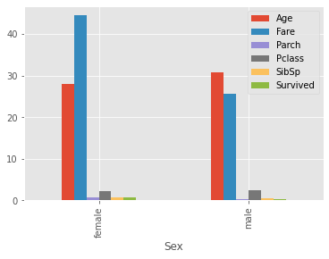

# RESHAPING AND PIVTOING

There are multiple ways to reshape a dataframe. We can choose the one that best fits the task at hand. The functions to reshape a dataframe:

 1. Melt

 2. Stack and unstack

 3. Pivot


```python
#importing numpy and pandas:
import pandas as pd
import numpy as np
```


##1.MELT
Melt is used to convert wide dataframes to narrow ones. What I mean by wide is a dataframe with a high number of columns. Some dataframes are structured in a way that consecutive measurements or variables are represented as columns. In some cases, representing these columns as rows may fit better to our task.

frame : DataFrame

**id_vars[tuple, list, or ndarray, optional] :** Column(s) to use as identifier variables.

**value_vars[tuple, list, or ndarray, optional]:** Column(s) to unpivot. If not specified, uses all columns that are not set as id_vars.

**var_name[scalar]:** Name to use for the ‘variable’ column. If None it uses frame.columns.name or ‘variable’.

**value_name[scalar, default ‘value’]**: Name to use for the ‘value’ column.

**col_level[int or string, optional]**: If columns are a MultiIndex then use this level to melt.

### EXAMPLE


```python
df1 = pd.DataFrame({'city':['A','B','C'],
                   'day1':[22,25,28],
                   'day2':[10,14,13],
                   'day3':[25,22,26],
                   'day4':[18,15,17],
                   'day5':[12,14,18]})
df1
```


  <div id="df-f7215f6b-1851-4a04-ac5f-f3b66fe1b696">
    <div class="colab-df-container">
      <div>
<style scoped>
    .dataframe tbody tr th:only-of-type {
        vertical-align: middle;
    }

    .dataframe tbody tr th {
        vertical-align: top;
    }

    .dataframe thead th {
        text-align: right;
    }
</style>
<table border="1" class="dataframe">
  <thead>
    <tr style="text-align: right;">
      <th></th>
      <th>city</th>
      <th>day1</th>
      <th>day2</th>
      <th>day3</th>
      <th>day4</th>
      <th>day5</th>
    </tr>
  </thead>
  <tbody>
    <tr>
      <th>0</th>
      <td>A</td>
      <td>22</td>
      <td>10</td>
      <td>25</td>
      <td>18</td>
      <td>12</td>
    </tr>
    <tr>
      <th>1</th>
      <td>B</td>
      <td>25</td>
      <td>14</td>
      <td>22</td>
      <td>15</td>
      <td>14</td>
    </tr>
    <tr>
      <th>2</th>
      <td>C</td>
      <td>28</td>
      <td>13</td>
      <td>26</td>
      <td>17</td>
      <td>18</td>
    </tr>
  </tbody>
</table>
</div>
      <button class="colab-df-convert" onclick="convertToInteractive('df-f7215f6b-1851-4a04-ac5f-f3b66fe1b696')"
              title="Convert this dataframe to an interactive table."
              style="display:none;">

  <svg xmlns="http://www.w3.org/2000/svg" height="24px"viewBox="0 0 24 24"
       width="24px">
    <path d="M0 0h24v24H0V0z" fill="none"/>
    <path d="M18.56 5.44l.94 2.06.94-2.06 2.06-.94-2.06-.94-.94-2.06-.94 2.06-2.06.94zm-11 1L8.5 8.5l.94-2.06 2.06-.94-2.06-.94L8.5 2.5l-.94 2.06-2.06.94zm10 10l.94 2.06.94-2.06 2.06-.94-2.06-.94-.94-2.06-.94 2.06-2.06.94z"/><path d="M17.41 7.96l-1.37-1.37c-.4-.4-.92-.59-1.43-.59-.52 0-1.04.2-1.43.59L10.3 9.45l-7.72 7.72c-.78.78-.78 2.05 0 2.83L4 21.41c.39.39.9.59 1.41.59.51 0 1.02-.2 1.41-.59l7.78-7.78 2.81-2.81c.8-.78.8-2.07 0-2.86zM5.41 20L4 18.59l7.72-7.72 1.47 1.35L5.41 20z"/>
  </svg>
      </button>

  <style>
    .colab-df-container {
      display:flex;
      flex-wrap:wrap;
      gap: 12px;
    }

    .colab-df-convert {
      background-color: #E8F0FE;
      border: none;
      border-radius: 50%;
      cursor: pointer;
      display: none;
      fill: #1967D2;
      height: 32px;
      padding: 0 0 0 0;
      width: 32px;
    }

    .colab-df-convert:hover {
      background-color: #E2EBFA;
      box-shadow: 0px 1px 2px rgba(60, 64, 67, 0.3), 0px 1px 3px 1px rgba(60, 64, 67, 0.15);
      fill: #174EA6;
    }

    [theme=dark] .colab-df-convert {
      background-color: #3B4455;
      fill: #D2E3FC;
    }

    [theme=dark] .colab-df-convert:hover {
      background-color: #434B5C;
      box-shadow: 0px 1px 3px 1px rgba(0, 0, 0, 0.15);
      filter: drop-shadow(0px 1px 2px rgba(0, 0, 0, 0.3));
      fill: #FFFFFF;
    }
  </style>

      <script>
        const buttonEl =
          document.querySelector('#df-f7215f6b-1851-4a04-ac5f-f3b66fe1b696 button.colab-df-convert');
        buttonEl.style.display =
          google.colab.kernel.accessAllowed ? 'block' : 'none';

        async function convertToInteractive(key) {
          const element = document.querySelector('#df-f7215f6b-1851-4a04-ac5f-f3b66fe1b696');
          const dataTable =
            await google.colab.kernel.invokeFunction('convertToInteractive',
                                                     [key], {});
          if (!dataTable) return;

          const docLinkHtml = 'Like what you see? Visit the ' +
            '<a target="_blank" href=https://colab.research.google.com/notebooks/data_table.ipynb>data table notebook</a>'
            + ' to learn more about interactive tables.';
          element.innerHTML = '';
          dataTable['output_type'] = 'display_data';
          await google.colab.output.renderOutput(dataTable, element);
          const docLink = document.createElement('div');
          docLink.innerHTML = docLinkHtml;
          element.appendChild(docLink);
        }
      </script>
    </div>
  </div>


```python
df1.melt(id_vars=['city'])
```


  <div id="df-73d91a5d-0766-49c0-8306-b137f98d99ab">
    <div class="colab-df-container">
      <div>
<style scoped>
    .dataframe tbody tr th:only-of-type {
        vertical-align: middle;
    }

    .dataframe tbody tr th {
        vertical-align: top;
    }

    .dataframe thead th {
        text-align: right;
    }
</style>
<table border="1" class="dataframe">
  <thead>
    <tr style="text-align: right;">
      <th></th>
      <th>city</th>
      <th>variable</th>
      <th>value</th>
    </tr>
  </thead>
  <tbody>
    <tr>
      <th>0</th>
      <td>A</td>
      <td>day1</td>
      <td>22</td>
    </tr>
    <tr>
      <th>1</th>
      <td>B</td>
      <td>day1</td>
      <td>25</td>
    </tr>
    <tr>
      <th>2</th>
      <td>C</td>
      <td>day1</td>
      <td>28</td>
    </tr>
    <tr>
      <th>3</th>
      <td>A</td>
      <td>day2</td>
      <td>10</td>
    </tr>
    <tr>
      <th>4</th>
      <td>B</td>
      <td>day2</td>
      <td>14</td>
    </tr>
    <tr>
      <th>5</th>
      <td>C</td>
      <td>day2</td>
      <td>13</td>
    </tr>
    <tr>
      <th>6</th>
      <td>A</td>
      <td>day3</td>
      <td>25</td>
    </tr>
    <tr>
      <th>7</th>
      <td>B</td>
      <td>day3</td>
      <td>22</td>
    </tr>
    <tr>
      <th>8</th>
      <td>C</td>
      <td>day3</td>
      <td>26</td>
    </tr>
    <tr>
      <th>9</th>
      <td>A</td>
      <td>day4</td>
      <td>18</td>
    </tr>
    <tr>
      <th>10</th>
      <td>B</td>
      <td>day4</td>
      <td>15</td>
    </tr>
    <tr>
      <th>11</th>
      <td>C</td>
      <td>day4</td>
      <td>17</td>
    </tr>
    <tr>
      <th>12</th>
      <td>A</td>
      <td>day5</td>
      <td>12</td>
    </tr>
    <tr>
      <th>13</th>
      <td>B</td>
      <td>day5</td>
      <td>14</td>
    </tr>
    <tr>
      <th>14</th>
      <td>C</td>
      <td>day5</td>
      <td>18</td>
    </tr>
  </tbody>
</table>
</div>
      <button class="colab-df-convert" onclick="convertToInteractive('df-73d91a5d-0766-49c0-8306-b137f98d99ab')"
              title="Convert this dataframe to an interactive table."
              style="display:none;">

  <svg xmlns="http://www.w3.org/2000/svg" height="24px"viewBox="0 0 24 24"
       width="24px">
    <path d="M0 0h24v24H0V0z" fill="none"/>
    <path d="M18.56 5.44l.94 2.06.94-2.06 2.06-.94-2.06-.94-.94-2.06-.94 2.06-2.06.94zm-11 1L8.5 8.5l.94-2.06 2.06-.94-2.06-.94L8.5 2.5l-.94 2.06-2.06.94zm10 10l.94 2.06.94-2.06 2.06-.94-2.06-.94-.94-2.06-.94 2.06-2.06.94z"/><path d="M17.41 7.96l-1.37-1.37c-.4-.4-.92-.59-1.43-.59-.52 0-1.04.2-1.43.59L10.3 9.45l-7.72 7.72c-.78.78-.78 2.05 0 2.83L4 21.41c.39.39.9.59 1.41.59.51 0 1.02-.2 1.41-.59l7.78-7.78 2.81-2.81c.8-.78.8-2.07 0-2.86zM5.41 20L4 18.59l7.72-7.72 1.47 1.35L5.41 20z"/>
  </svg>
      </button>

  <style>
    .colab-df-container {
      display:flex;
      flex-wrap:wrap;
      gap: 12px;
    }

    .colab-df-convert {
      background-color: #E8F0FE;
      border: none;
      border-radius: 50%;
      cursor: pointer;
      display: none;
      fill: #1967D2;
      height: 32px;
      padding: 0 0 0 0;
      width: 32px;
    }

    .colab-df-convert:hover {
      background-color: #E2EBFA;
      box-shadow: 0px 1px 2px rgba(60, 64, 67, 0.3), 0px 1px 3px 1px rgba(60, 64, 67, 0.15);
      fill: #174EA6;
    }

    [theme=dark] .colab-df-convert {
      background-color: #3B4455;
      fill: #D2E3FC;
    }

    [theme=dark] .colab-df-convert:hover {
      background-color: #434B5C;
      box-shadow: 0px 1px 3px 1px rgba(0, 0, 0, 0.15);
      filter: drop-shadow(0px 1px 2px rgba(0, 0, 0, 0.3));
      fill: #FFFFFF;
    }
  </style>

      <script>
        const buttonEl =
          document.querySelector('#df-73d91a5d-0766-49c0-8306-b137f98d99ab button.colab-df-convert');
        buttonEl.style.display =
          google.colab.kernel.accessAllowed ? 'block' : 'none';

        async function convertToInteractive(key) {
          const element = document.querySelector('#df-73d91a5d-0766-49c0-8306-b137f98d99ab');
          const dataTable =
            await google.colab.kernel.invokeFunction('convertToInteractive',
                                                     [key], {});
          if (!dataTable) return;

          const docLinkHtml = 'Like what you see? Visit the ' +
            '<a target="_blank" href=https://colab.research.google.com/notebooks/data_table.ipynb>data table notebook</a>'
            + ' to learn more about interactive tables.';
          element.innerHTML = '';
          dataTable['output_type'] = 'display_data';
          await google.colab.output.renderOutput(dataTable, element);
          const docLink = document.createElement('div');
          docLink.innerHTML = docLinkHtml;
          element.appendChild(docLink);
        }
      </script>
    </div>
  </div>


## 2.STACK - UNSTACK
Stack function kind of increases the index level of the dataframe. What I mean by increasing the level is:

If dataframe has a simple column index, stack returns a series whose indices consist of row-column pairs of original dataframe.

If dataframe has multi-level index, stack increases the index level.

df1 has 3 rows and 6 columns with simple integer column index. If stack function is applied to df1, it will return a series with 3 x 6 = 18 rows. The index of the series will be [(0, ‘city’), (0, ‘day1’), … , (2, ‘day5’)].

### EXAMPLE


```python
df1.stack()
```


    0  city     A
       day1    22
       day2    10
       day3    25
       day4    18
       day5    12
    1  city     B
       day1    25
       day2    14
       day3    22
       day4    15
       day5    14
    2  city     C
       day1    28
       day2    13
       day3    26
       day4    17
       day5    18
    dtype: object


```python
df1.shape
(3,6)
df1.stack().shape
(18,)
df1.stack().index[0] #multilevel index
```


    (0, 'city')


**Unstack** is just the opposite of stack. If we apply unstack to the stacked dataframe, we will get back the original dataframe:

 Let’s create a dataframe with multi-level index:


```python
tuples = [('A',1),('A',2),('A',3),('B',1),('C',2)]
index = pd.MultiIndex.from_tuples(tuples, names=['first','second'])
df2 = pd.DataFrame(np.random.randint(10, size=(5,2)), 
                   index=index, columns=['column_x', 'column_y'])
df2
```


  <div id="df-6960cc71-575d-4dce-be3c-d6f53fb866ad">
    <div class="colab-df-container">
      <div>
<style scoped>
    .dataframe tbody tr th:only-of-type {
        vertical-align: middle;
    }

    .dataframe tbody tr th {
        vertical-align: top;
    }

    .dataframe thead th {
        text-align: right;
    }
</style>
<table border="1" class="dataframe">
  <thead>
    <tr style="text-align: right;">
      <th></th>
      <th></th>
      <th>column_x</th>
      <th>column_y</th>
    </tr>
    <tr>
      <th>first</th>
      <th>second</th>
      <th></th>
      <th></th>
    </tr>
  </thead>
  <tbody>
    <tr>
      <th rowspan="3" valign="top">A</th>
      <th>1</th>
      <td>7</td>
      <td>1</td>
    </tr>
    <tr>
      <th>2</th>
      <td>2</td>
      <td>1</td>
    </tr>
    <tr>
      <th>3</th>
      <td>7</td>
      <td>2</td>
    </tr>
    <tr>
      <th>B</th>
      <th>1</th>
      <td>2</td>
      <td>8</td>
    </tr>
    <tr>
      <th>C</th>
      <th>2</th>
      <td>0</td>
      <td>2</td>
    </tr>
  </tbody>
</table>
</div>
      <button class="colab-df-convert" onclick="convertToInteractive('df-6960cc71-575d-4dce-be3c-d6f53fb866ad')"
              title="Convert this dataframe to an interactive table."
              style="display:none;">

  <svg xmlns="http://www.w3.org/2000/svg" height="24px"viewBox="0 0 24 24"
       width="24px">
    <path d="M0 0h24v24H0V0z" fill="none"/>
    <path d="M18.56 5.44l.94 2.06.94-2.06 2.06-.94-2.06-.94-.94-2.06-.94 2.06-2.06.94zm-11 1L8.5 8.5l.94-2.06 2.06-.94-2.06-.94L8.5 2.5l-.94 2.06-2.06.94zm10 10l.94 2.06.94-2.06 2.06-.94-2.06-.94-.94-2.06-.94 2.06-2.06.94z"/><path d="M17.41 7.96l-1.37-1.37c-.4-.4-.92-.59-1.43-.59-.52 0-1.04.2-1.43.59L10.3 9.45l-7.72 7.72c-.78.78-.78 2.05 0 2.83L4 21.41c.39.39.9.59 1.41.59.51 0 1.02-.2 1.41-.59l7.78-7.78 2.81-2.81c.8-.78.8-2.07 0-2.86zM5.41 20L4 18.59l7.72-7.72 1.47 1.35L5.41 20z"/>
  </svg>
      </button>

  <style>
    .colab-df-container {
      display:flex;
      flex-wrap:wrap;
      gap: 12px;
    }

    .colab-df-convert {
      background-color: #E8F0FE;
      border: none;
      border-radius: 50%;
      cursor: pointer;
      display: none;
      fill: #1967D2;
      height: 32px;
      padding: 0 0 0 0;
      width: 32px;
    }

    .colab-df-convert:hover {
      background-color: #E2EBFA;
      box-shadow: 0px 1px 2px rgba(60, 64, 67, 0.3), 0px 1px 3px 1px rgba(60, 64, 67, 0.15);
      fill: #174EA6;
    }

    [theme=dark] .colab-df-convert {
      background-color: #3B4455;
      fill: #D2E3FC;
    }

    [theme=dark] .colab-df-convert:hover {
      background-color: #434B5C;
      box-shadow: 0px 1px 3px 1px rgba(0, 0, 0, 0.15);
      filter: drop-shadow(0px 1px 2px rgba(0, 0, 0, 0.3));
      fill: #FFFFFF;
    }
  </style>

      <script>
        const buttonEl =
          document.querySelector('#df-6960cc71-575d-4dce-be3c-d6f53fb866ad button.colab-df-convert');
        buttonEl.style.display =
          google.colab.kernel.accessAllowed ? 'block' : 'none';

        async function convertToInteractive(key) {
          const element = document.querySelector('#df-6960cc71-575d-4dce-be3c-d6f53fb866ad');
          const dataTable =
            await google.colab.kernel.invokeFunction('convertToInteractive',
                                                     [key], {});
          if (!dataTable) return;

          const docLinkHtml = 'Like what you see? Visit the ' +
            '<a target="_blank" href=https://colab.research.google.com/notebooks/data_table.ipynb>data table notebook</a>'
            + ' to learn more about interactive tables.';
          element.innerHTML = '';
          dataTable['output_type'] = 'display_data';
          await google.colab.output.renderOutput(dataTable, element);
          const docLink = document.createElement('div');
          docLink.innerHTML = docLinkHtml;
          element.appendChild(docLink);
        }
      </script>
    </div>
  </div>


```python
#If we apply stack function on this dataframe, the level of index will be increased:

df_stacked = df2.stack().to_frame()
df_stacked
```


  <div id="df-a4304c73-bc4d-4eb3-82f7-cf2999e3886f">
    <div class="colab-df-container">
      <div>
<style scoped>
    .dataframe tbody tr th:only-of-type {
        vertical-align: middle;
    }

    .dataframe tbody tr th {
        vertical-align: top;
    }

    .dataframe thead th {
        text-align: right;
    }
</style>
<table border="1" class="dataframe">
  <thead>
    <tr style="text-align: right;">
      <th></th>
      <th></th>
      <th></th>
      <th>0</th>
    </tr>
    <tr>
      <th>first</th>
      <th>second</th>
      <th></th>
      <th></th>
    </tr>
  </thead>
  <tbody>
    <tr>
      <th rowspan="6" valign="top">A</th>
      <th rowspan="2" valign="top">1</th>
      <th>column_x</th>
      <td>7</td>
    </tr>
    <tr>
      <th>column_y</th>
      <td>1</td>
    </tr>
    <tr>
      <th rowspan="2" valign="top">2</th>
      <th>column_x</th>
      <td>2</td>
    </tr>
    <tr>
      <th>column_y</th>
      <td>1</td>
    </tr>
    <tr>
      <th rowspan="2" valign="top">3</th>
      <th>column_x</th>
      <td>7</td>
    </tr>
    <tr>
      <th>column_y</th>
      <td>2</td>
    </tr>
    <tr>
      <th rowspan="2" valign="top">B</th>
      <th rowspan="2" valign="top">1</th>
      <th>column_x</th>
      <td>2</td>
    </tr>
    <tr>
      <th>column_y</th>
      <td>8</td>
    </tr>
    <tr>
      <th rowspan="2" valign="top">C</th>
      <th rowspan="2" valign="top">2</th>
      <th>column_x</th>
      <td>0</td>
    </tr>
    <tr>
      <th>column_y</th>
      <td>2</td>
    </tr>
  </tbody>
</table>
</div>
      <button class="colab-df-convert" onclick="convertToInteractive('df-a4304c73-bc4d-4eb3-82f7-cf2999e3886f')"
              title="Convert this dataframe to an interactive table."
              style="display:none;">

  <svg xmlns="http://www.w3.org/2000/svg" height="24px"viewBox="0 0 24 24"
       width="24px">
    <path d="M0 0h24v24H0V0z" fill="none"/>
    <path d="M18.56 5.44l.94 2.06.94-2.06 2.06-.94-2.06-.94-.94-2.06-.94 2.06-2.06.94zm-11 1L8.5 8.5l.94-2.06 2.06-.94-2.06-.94L8.5 2.5l-.94 2.06-2.06.94zm10 10l.94 2.06.94-2.06 2.06-.94-2.06-.94-.94-2.06-.94 2.06-2.06.94z"/><path d="M17.41 7.96l-1.37-1.37c-.4-.4-.92-.59-1.43-.59-.52 0-1.04.2-1.43.59L10.3 9.45l-7.72 7.72c-.78.78-.78 2.05 0 2.83L4 21.41c.39.39.9.59 1.41.59.51 0 1.02-.2 1.41-.59l7.78-7.78 2.81-2.81c.8-.78.8-2.07 0-2.86zM5.41 20L4 18.59l7.72-7.72 1.47 1.35L5.41 20z"/>
  </svg>
      </button>

  <style>
    .colab-df-container {
      display:flex;
      flex-wrap:wrap;
      gap: 12px;
    }

    .colab-df-convert {
      background-color: #E8F0FE;
      border: none;
      border-radius: 50%;
      cursor: pointer;
      display: none;
      fill: #1967D2;
      height: 32px;
      padding: 0 0 0 0;
      width: 32px;
    }

    .colab-df-convert:hover {
      background-color: #E2EBFA;
      box-shadow: 0px 1px 2px rgba(60, 64, 67, 0.3), 0px 1px 3px 1px rgba(60, 64, 67, 0.15);
      fill: #174EA6;
    }

    [theme=dark] .colab-df-convert {
      background-color: #3B4455;
      fill: #D2E3FC;
    }

    [theme=dark] .colab-df-convert:hover {
      background-color: #434B5C;
      box-shadow: 0px 1px 3px 1px rgba(0, 0, 0, 0.15);
      filter: drop-shadow(0px 1px 2px rgba(0, 0, 0, 0.3));
      fill: #FFFFFF;
    }
  </style>

      <script>
        const buttonEl =
          document.querySelector('#df-a4304c73-bc4d-4eb3-82f7-cf2999e3886f button.colab-df-convert');
        buttonEl.style.display =
          google.colab.kernel.accessAllowed ? 'block' : 'none';

        async function convertToInteractive(key) {
          const element = document.querySelector('#df-a4304c73-bc4d-4eb3-82f7-cf2999e3886f');
          const dataTable =
            await google.colab.kernel.invokeFunction('convertToInteractive',
                                                     [key], {});
          if (!dataTable) return;

          const docLinkHtml = 'Like what you see? Visit the ' +
            '<a target="_blank" href=https://colab.research.google.com/notebooks/data_table.ipynb>data table notebook</a>'
            + ' to learn more about interactive tables.';
          element.innerHTML = '';
          dataTable['output_type'] = 'display_data';
          await google.colab.output.renderOutput(dataTable, element);
          const docLink = document.createElement('div');
          docLink.innerHTML = docLinkHtml;
          element.appendChild(docLink);
        }
      </script>
    </div>
  </div>


```python
len(df_stacked.index.levels)
```


    3


```python
len(df2.index.levels)
```


    2


```python
df_stacked.unstack()
```


  <div id="df-f5ba2615-9e24-4a52-80f6-05bb27c18c12">
    <div class="colab-df-container">
      <div>
<style scoped>
    .dataframe tbody tr th:only-of-type {
        vertical-align: middle;
    }

    .dataframe tbody tr th {
        vertical-align: top;
    }

    .dataframe thead tr th {
        text-align: left;
    }

    .dataframe thead tr:last-of-type th {
        text-align: right;
    }
</style>
<table border="1" class="dataframe">
  <thead>
    <tr>
      <th></th>
      <th></th>
      <th colspan="2" halign="left">0</th>
    </tr>
    <tr>
      <th></th>
      <th></th>
      <th>column_x</th>
      <th>column_y</th>
    </tr>
    <tr>
      <th>first</th>
      <th>second</th>
      <th></th>
      <th></th>
    </tr>
  </thead>
  <tbody>
    <tr>
      <th rowspan="3" valign="top">A</th>
      <th>1</th>
      <td>7</td>
      <td>1</td>
    </tr>
    <tr>
      <th>2</th>
      <td>2</td>
      <td>1</td>
    </tr>
    <tr>
      <th>3</th>
      <td>7</td>
      <td>2</td>
    </tr>
    <tr>
      <th>B</th>
      <th>1</th>
      <td>2</td>
      <td>8</td>
    </tr>
    <tr>
      <th>C</th>
      <th>2</th>
      <td>0</td>
      <td>2</td>
    </tr>
  </tbody>
</table>
</div>
      <button class="colab-df-convert" onclick="convertToInteractive('df-f5ba2615-9e24-4a52-80f6-05bb27c18c12')"
              title="Convert this dataframe to an interactive table."
              style="display:none;">

  <svg xmlns="http://www.w3.org/2000/svg" height="24px"viewBox="0 0 24 24"
       width="24px">
    <path d="M0 0h24v24H0V0z" fill="none"/>
    <path d="M18.56 5.44l.94 2.06.94-2.06 2.06-.94-2.06-.94-.94-2.06-.94 2.06-2.06.94zm-11 1L8.5 8.5l.94-2.06 2.06-.94-2.06-.94L8.5 2.5l-.94 2.06-2.06.94zm10 10l.94 2.06.94-2.06 2.06-.94-2.06-.94-.94-2.06-.94 2.06-2.06.94z"/><path d="M17.41 7.96l-1.37-1.37c-.4-.4-.92-.59-1.43-.59-.52 0-1.04.2-1.43.59L10.3 9.45l-7.72 7.72c-.78.78-.78 2.05 0 2.83L4 21.41c.39.39.9.59 1.41.59.51 0 1.02-.2 1.41-.59l7.78-7.78 2.81-2.81c.8-.78.8-2.07 0-2.86zM5.41 20L4 18.59l7.72-7.72 1.47 1.35L5.41 20z"/>
  </svg>
      </button>

  <style>
    .colab-df-container {
      display:flex;
      flex-wrap:wrap;
      gap: 12px;
    }

    .colab-df-convert {
      background-color: #E8F0FE;
      border: none;
      border-radius: 50%;
      cursor: pointer;
      display: none;
      fill: #1967D2;
      height: 32px;
      padding: 0 0 0 0;
      width: 32px;
    }

    .colab-df-convert:hover {
      background-color: #E2EBFA;
      box-shadow: 0px 1px 2px rgba(60, 64, 67, 0.3), 0px 1px 3px 1px rgba(60, 64, 67, 0.15);
      fill: #174EA6;
    }

    [theme=dark] .colab-df-convert {
      background-color: #3B4455;
      fill: #D2E3FC;
    }

    [theme=dark] .colab-df-convert:hover {
      background-color: #434B5C;
      box-shadow: 0px 1px 3px 1px rgba(0, 0, 0, 0.15);
      filter: drop-shadow(0px 1px 2px rgba(0, 0, 0, 0.3));
      fill: #FFFFFF;
    }
  </style>

      <script>
        const buttonEl =
          document.querySelector('#df-f5ba2615-9e24-4a52-80f6-05bb27c18c12 button.colab-df-convert');
        buttonEl.style.display =
          google.colab.kernel.accessAllowed ? 'block' : 'none';

        async function convertToInteractive(key) {
          const element = document.querySelector('#df-f5ba2615-9e24-4a52-80f6-05bb27c18c12');
          const dataTable =
            await google.colab.kernel.invokeFunction('convertToInteractive',
                                                     [key], {});
          if (!dataTable) return;

          const docLinkHtml = 'Like what you see? Visit the ' +
            '<a target="_blank" href=https://colab.research.google.com/notebooks/data_table.ipynb>data table notebook</a>'
            + ' to learn more about interactive tables.';
          element.innerHTML = '';
          dataTable['output_type'] = 'display_data';
          await google.colab.output.renderOutput(dataTable, element);
          const docLink = document.createElement('div');
          docLink.innerHTML = docLinkHtml;
          element.appendChild(docLink);
        }
      </script>
    </div>
  </div>


```python
df_stacked.unstack().index
```


    MultiIndex([('A', 1),
                ('A', 2),
                ('A', 3),
                ('B', 1),
                ('C', 2)],
               names=['first', 'second'])


```python
df2.index
```


    MultiIndex([('A', 1),
                ('A', 2),
                ('A', 3),
                ('B', 1),
                ('C', 2)],
               names=['first', 'second'])


## 3.PIVOT

The pivot function is used to create a new derived table out of a given one. Pivot takes 3 arguements with the following names: index, columns, and values. As a value for each of these parameters you need to specify a column name in the original table. Then the pivot function will create a new table, whose row and column indices are the unique values of the respective parameters. The cell values of the new table are taken from column given as the values parameter.

### EXAMPLE


```python
np.random.seed(100)

df=pd.DataFrame({"Date":pd.Index(pd.date_range(start='2/2/2019',periods=3)).repeat(3), "Class":["1A","2B","3C","1A","2B","3C","1A","2B","3C"], "Numbers":np.random.randn(9)})

df['Numbers2'] = df['Numbers'] * 2

df
```


  <div id="df-6907f008-a048-4d0e-9183-487119393499">
    <div class="colab-df-container">
      <div>
<style scoped>
    .dataframe tbody tr th:only-of-type {
        vertical-align: middle;
    }

    .dataframe tbody tr th {
        vertical-align: top;
    }

    .dataframe thead th {
        text-align: right;
    }
</style>
<table border="1" class="dataframe">
  <thead>
    <tr style="text-align: right;">
      <th></th>
      <th>Date</th>
      <th>Class</th>
      <th>Numbers</th>
      <th>Numbers2</th>
    </tr>
  </thead>
  <tbody>
    <tr>
      <th>0</th>
      <td>2019-02-02</td>
      <td>1A</td>
      <td>-1.749765</td>
      <td>-3.499531</td>
    </tr>
    <tr>
      <th>1</th>
      <td>2019-02-02</td>
      <td>2B</td>
      <td>0.342680</td>
      <td>0.685361</td>
    </tr>
    <tr>
      <th>2</th>
      <td>2019-02-02</td>
      <td>3C</td>
      <td>1.153036</td>
      <td>2.306072</td>
    </tr>
    <tr>
      <th>3</th>
      <td>2019-02-03</td>
      <td>1A</td>
      <td>-0.252436</td>
      <td>-0.504872</td>
    </tr>
    <tr>
      <th>4</th>
      <td>2019-02-03</td>
      <td>2B</td>
      <td>0.981321</td>
      <td>1.962642</td>
    </tr>
    <tr>
      <th>5</th>
      <td>2019-02-03</td>
      <td>3C</td>
      <td>0.514219</td>
      <td>1.028438</td>
    </tr>
    <tr>
      <th>6</th>
      <td>2019-02-04</td>
      <td>1A</td>
      <td>0.221180</td>
      <td>0.442359</td>
    </tr>
    <tr>
      <th>7</th>
      <td>2019-02-04</td>
      <td>2B</td>
      <td>-1.070043</td>
      <td>-2.140087</td>
    </tr>
    <tr>
      <th>8</th>
      <td>2019-02-04</td>
      <td>3C</td>
      <td>-0.189496</td>
      <td>-0.378992</td>
    </tr>
  </tbody>
</table>
</div>
      <button class="colab-df-convert" onclick="convertToInteractive('df-6907f008-a048-4d0e-9183-487119393499')"
              title="Convert this dataframe to an interactive table."
              style="display:none;">

  <svg xmlns="http://www.w3.org/2000/svg" height="24px"viewBox="0 0 24 24"
       width="24px">
    <path d="M0 0h24v24H0V0z" fill="none"/>
    <path d="M18.56 5.44l.94 2.06.94-2.06 2.06-.94-2.06-.94-.94-2.06-.94 2.06-2.06.94zm-11 1L8.5 8.5l.94-2.06 2.06-.94-2.06-.94L8.5 2.5l-.94 2.06-2.06.94zm10 10l.94 2.06.94-2.06 2.06-.94-2.06-.94-.94-2.06-.94 2.06-2.06.94z"/><path d="M17.41 7.96l-1.37-1.37c-.4-.4-.92-.59-1.43-.59-.52 0-1.04.2-1.43.59L10.3 9.45l-7.72 7.72c-.78.78-.78 2.05 0 2.83L4 21.41c.39.39.9.59 1.41.59.51 0 1.02-.2 1.41-.59l7.78-7.78 2.81-2.81c.8-.78.8-2.07 0-2.86zM5.41 20L4 18.59l7.72-7.72 1.47 1.35L5.41 20z"/>
  </svg>
      </button>

  <style>
    .colab-df-container {
      display:flex;
      flex-wrap:wrap;
      gap: 12px;
    }

    .colab-df-convert {
      background-color: #E8F0FE;
      border: none;
      border-radius: 50%;
      cursor: pointer;
      display: none;
      fill: #1967D2;
      height: 32px;
      padding: 0 0 0 0;
      width: 32px;
    }

    .colab-df-convert:hover {
      background-color: #E2EBFA;
      box-shadow: 0px 1px 2px rgba(60, 64, 67, 0.3), 0px 1px 3px 1px rgba(60, 64, 67, 0.15);
      fill: #174EA6;
    }

    [theme=dark] .colab-df-convert {
      background-color: #3B4455;
      fill: #D2E3FC;
    }

    [theme=dark] .colab-df-convert:hover {
      background-color: #434B5C;
      box-shadow: 0px 1px 3px 1px rgba(0, 0, 0, 0.15);
      filter: drop-shadow(0px 1px 2px rgba(0, 0, 0, 0.3));
      fill: #FFFFFF;
    }
  </style>

      <script>
        const buttonEl =
          document.querySelector('#df-6907f008-a048-4d0e-9183-487119393499 button.colab-df-convert');
        buttonEl.style.display =
          google.colab.kernel.accessAllowed ? 'block' : 'none';

        async function convertToInteractive(key) {
          const element = document.querySelector('#df-6907f008-a048-4d0e-9183-487119393499');
          const dataTable =
            await google.colab.kernel.invokeFunction('convertToInteractive',
                                                     [key], {});
          if (!dataTable) return;

          const docLinkHtml = 'Like what you see? Visit the ' +
            '<a target="_blank" href=https://colab.research.google.com/notebooks/data_table.ipynb>data table notebook</a>'
            + ' to learn more about interactive tables.';
          element.innerHTML = '';
          dataTable['output_type'] = 'display_data';
          await google.colab.output.renderOutput(dataTable, element);
          const docLink = document.createElement('div');
          docLink.innerHTML = docLinkHtml;
          element.appendChild(docLink);
        }
      </script>
    </div>
  </div>


```python
df.pivot(index='Date', columns='Class', values='Numbers')
```


  <div id="df-7fed4869-da77-4319-b2f2-c937f21235bb">
    <div class="colab-df-container">
      <div>
<style scoped>
    .dataframe tbody tr th:only-of-type {
        vertical-align: middle;
    }

    .dataframe tbody tr th {
        vertical-align: top;
    }

    .dataframe thead th {
        text-align: right;
    }
</style>
<table border="1" class="dataframe">
  <thead>
    <tr style="text-align: right;">
      <th>Class</th>
      <th>1A</th>
      <th>2B</th>
      <th>3C</th>
    </tr>
    <tr>
      <th>Date</th>
      <th></th>
      <th></th>
      <th></th>
    </tr>
  </thead>
  <tbody>
    <tr>
      <th>2019-02-02</th>
      <td>-1.749765</td>
      <td>0.342680</td>
      <td>1.153036</td>
    </tr>
    <tr>
      <th>2019-02-03</th>
      <td>-0.252436</td>
      <td>0.981321</td>
      <td>0.514219</td>
    </tr>
    <tr>
      <th>2019-02-04</th>
      <td>0.221180</td>
      <td>-1.070043</td>
      <td>-0.189496</td>
    </tr>
  </tbody>
</table>
</div>
      <button class="colab-df-convert" onclick="convertToInteractive('df-7fed4869-da77-4319-b2f2-c937f21235bb')"
              title="Convert this dataframe to an interactive table."
              style="display:none;">

  <svg xmlns="http://www.w3.org/2000/svg" height="24px"viewBox="0 0 24 24"
       width="24px">
    <path d="M0 0h24v24H0V0z" fill="none"/>
    <path d="M18.56 5.44l.94 2.06.94-2.06 2.06-.94-2.06-.94-.94-2.06-.94 2.06-2.06.94zm-11 1L8.5 8.5l.94-2.06 2.06-.94-2.06-.94L8.5 2.5l-.94 2.06-2.06.94zm10 10l.94 2.06.94-2.06 2.06-.94-2.06-.94-.94-2.06-.94 2.06-2.06.94z"/><path d="M17.41 7.96l-1.37-1.37c-.4-.4-.92-.59-1.43-.59-.52 0-1.04.2-1.43.59L10.3 9.45l-7.72 7.72c-.78.78-.78 2.05 0 2.83L4 21.41c.39.39.9.59 1.41.59.51 0 1.02-.2 1.41-.59l7.78-7.78 2.81-2.81c.8-.78.8-2.07 0-2.86zM5.41 20L4 18.59l7.72-7.72 1.47 1.35L5.41 20z"/>
  </svg>
      </button>

  <style>
    .colab-df-container {
      display:flex;
      flex-wrap:wrap;
      gap: 12px;
    }

    .colab-df-convert {
      background-color: #E8F0FE;
      border: none;
      border-radius: 50%;
      cursor: pointer;
      display: none;
      fill: #1967D2;
      height: 32px;
      padding: 0 0 0 0;
      width: 32px;
    }

    .colab-df-convert:hover {
      background-color: #E2EBFA;
      box-shadow: 0px 1px 2px rgba(60, 64, 67, 0.3), 0px 1px 3px 1px rgba(60, 64, 67, 0.15);
      fill: #174EA6;
    }

    [theme=dark] .colab-df-convert {
      background-color: #3B4455;
      fill: #D2E3FC;
    }

    [theme=dark] .colab-df-convert:hover {
      background-color: #434B5C;
      box-shadow: 0px 1px 3px 1px rgba(0, 0, 0, 0.15);
      filter: drop-shadow(0px 1px 2px rgba(0, 0, 0, 0.3));
      fill: #FFFFFF;
    }
  </style>

      <script>
        const buttonEl =
          document.querySelector('#df-7fed4869-da77-4319-b2f2-c937f21235bb button.colab-df-convert');
        buttonEl.style.display =
          google.colab.kernel.accessAllowed ? 'block' : 'none';

        async function convertToInteractive(key) {
          const element = document.querySelector('#df-7fed4869-da77-4319-b2f2-c937f21235bb');
          const dataTable =
            await google.colab.kernel.invokeFunction('convertToInteractive',
                                                     [key], {});
          if (!dataTable) return;

          const docLinkHtml = 'Like what you see? Visit the ' +
            '<a target="_blank" href=https://colab.research.google.com/notebooks/data_table.ipynb>data table notebook</a>'
            + ' to learn more about interactive tables.';
          element.innerHTML = '';
          dataTable['output_type'] = 'display_data';
          await google.colab.output.renderOutput(dataTable, element);
          const docLink = document.createElement('div');
          docLink.innerHTML = docLinkHtml;
          element.appendChild(docLink);
        }
      </script>
    </div>
  </div>


```python
#Let us look at what would happen if we do not declare values parameter.
df.pivot(index='Date', columns='Class')
```


  <div id="df-54659b6a-0388-47a7-bd37-4dad8e1f37d7">
    <div class="colab-df-container">
      <div>
<style scoped>
    .dataframe tbody tr th:only-of-type {
        vertical-align: middle;
    }

    .dataframe tbody tr th {
        vertical-align: top;
    }

    .dataframe thead tr th {
        text-align: left;
    }

    .dataframe thead tr:last-of-type th {
        text-align: right;
    }
</style>
<table border="1" class="dataframe">
  <thead>
    <tr>
      <th></th>
      <th colspan="3" halign="left">Numbers</th>
      <th colspan="3" halign="left">Numbers2</th>
    </tr>
    <tr>
      <th>Class</th>
      <th>1A</th>
      <th>2B</th>
      <th>3C</th>
      <th>1A</th>
      <th>2B</th>
      <th>3C</th>
    </tr>
    <tr>
      <th>Date</th>
      <th></th>
      <th></th>
      <th></th>
      <th></th>
      <th></th>
      <th></th>
    </tr>
  </thead>
  <tbody>
    <tr>
      <th>2019-02-02</th>
      <td>-1.749765</td>
      <td>0.342680</td>
      <td>1.153036</td>
      <td>-3.499531</td>
      <td>0.685361</td>
      <td>2.306072</td>
    </tr>
    <tr>
      <th>2019-02-03</th>
      <td>-0.252436</td>
      <td>0.981321</td>
      <td>0.514219</td>
      <td>-0.504872</td>
      <td>1.962642</td>
      <td>1.028438</td>
    </tr>
    <tr>
      <th>2019-02-04</th>
      <td>0.221180</td>
      <td>-1.070043</td>
      <td>-0.189496</td>
      <td>0.442359</td>
      <td>-2.140087</td>
      <td>-0.378992</td>
    </tr>
  </tbody>
</table>
</div>
      <button class="colab-df-convert" onclick="convertToInteractive('df-54659b6a-0388-47a7-bd37-4dad8e1f37d7')"
              title="Convert this dataframe to an interactive table."
              style="display:none;">

  <svg xmlns="http://www.w3.org/2000/svg" height="24px"viewBox="0 0 24 24"
       width="24px">
    <path d="M0 0h24v24H0V0z" fill="none"/>
    <path d="M18.56 5.44l.94 2.06.94-2.06 2.06-.94-2.06-.94-.94-2.06-.94 2.06-2.06.94zm-11 1L8.5 8.5l.94-2.06 2.06-.94-2.06-.94L8.5 2.5l-.94 2.06-2.06.94zm10 10l.94 2.06.94-2.06 2.06-.94-2.06-.94-.94-2.06-.94 2.06-2.06.94z"/><path d="M17.41 7.96l-1.37-1.37c-.4-.4-.92-.59-1.43-.59-.52 0-1.04.2-1.43.59L10.3 9.45l-7.72 7.72c-.78.78-.78 2.05 0 2.83L4 21.41c.39.39.9.59 1.41.59.51 0 1.02-.2 1.41-.59l7.78-7.78 2.81-2.81c.8-.78.8-2.07 0-2.86zM5.41 20L4 18.59l7.72-7.72 1.47 1.35L5.41 20z"/>
  </svg>
      </button>

  <style>
    .colab-df-container {
      display:flex;
      flex-wrap:wrap;
      gap: 12px;
    }

    .colab-df-convert {
      background-color: #E8F0FE;
      border: none;
      border-radius: 50%;
      cursor: pointer;
      display: none;
      fill: #1967D2;
      height: 32px;
      padding: 0 0 0 0;
      width: 32px;
    }

    .colab-df-convert:hover {
      background-color: #E2EBFA;
      box-shadow: 0px 1px 2px rgba(60, 64, 67, 0.3), 0px 1px 3px 1px rgba(60, 64, 67, 0.15);
      fill: #174EA6;
    }

    [theme=dark] .colab-df-convert {
      background-color: #3B4455;
      fill: #D2E3FC;
    }

    [theme=dark] .colab-df-convert:hover {
      background-color: #434B5C;
      box-shadow: 0px 1px 3px 1px rgba(0, 0, 0, 0.15);
      filter: drop-shadow(0px 1px 2px rgba(0, 0, 0, 0.3));
      fill: #FFFFFF;
    }
  </style>

      <script>
        const buttonEl =
          document.querySelector('#df-54659b6a-0388-47a7-bd37-4dad8e1f37d7 button.colab-df-convert');
        buttonEl.style.display =
          google.colab.kernel.accessAllowed ? 'block' : 'none';

        async function convertToInteractive(key) {
          const element = document.querySelector('#df-54659b6a-0388-47a7-bd37-4dad8e1f37d7');
          const dataTable =
            await google.colab.kernel.invokeFunction('convertToInteractive',
                                                     [key], {});
          if (!dataTable) return;

          const docLinkHtml = 'Like what you see? Visit the ' +
            '<a target="_blank" href=https://colab.research.google.com/notebooks/data_table.ipynb>data table notebook</a>'
            + ' to learn more about interactive tables.';
          element.innerHTML = '';
          dataTable['output_type'] = 'display_data';
          await google.colab.output.renderOutput(dataTable, element);
          const docLink = document.createElement('div');
          docLink.innerHTML = docLinkHtml;
          element.appendChild(docLink);
        }
      </script>
    </div>
  </div>


If we do not specify values parameter, pandas would create all the various possible views while taking all column names apart from what were specified as index and columns as above. Hence, for a big dataset having multiple columns, it is suggested to specify value parameter as well.

There is, however, another way to extract information about one column using the above code and tweaking it a little. It would be as follows.


```python
df.pivot(index='Date', columns='Class')['Numbers']
```


  <div id="df-480fb541-db5e-4135-9c5e-8f22f06b13ce">
    <div class="colab-df-container">
      <div>
<style scoped>
    .dataframe tbody tr th:only-of-type {
        vertical-align: middle;
    }

    .dataframe tbody tr th {
        vertical-align: top;
    }

    .dataframe thead th {
        text-align: right;
    }
</style>
<table border="1" class="dataframe">
  <thead>
    <tr style="text-align: right;">
      <th>Class</th>
      <th>1A</th>
      <th>2B</th>
      <th>3C</th>
    </tr>
    <tr>
      <th>Date</th>
      <th></th>
      <th></th>
      <th></th>
    </tr>
  </thead>
  <tbody>
    <tr>
      <th>2019-02-02</th>
      <td>-1.749765</td>
      <td>0.342680</td>
      <td>1.153036</td>
    </tr>
    <tr>
      <th>2019-02-03</th>
      <td>-0.252436</td>
      <td>0.981321</td>
      <td>0.514219</td>
    </tr>
    <tr>
      <th>2019-02-04</th>
      <td>0.221180</td>
      <td>-1.070043</td>
      <td>-0.189496</td>
    </tr>
  </tbody>
</table>
</div>
      <button class="colab-df-convert" onclick="convertToInteractive('df-480fb541-db5e-4135-9c5e-8f22f06b13ce')"
              title="Convert this dataframe to an interactive table."
              style="display:none;">

  <svg xmlns="http://www.w3.org/2000/svg" height="24px"viewBox="0 0 24 24"
       width="24px">
    <path d="M0 0h24v24H0V0z" fill="none"/>
    <path d="M18.56 5.44l.94 2.06.94-2.06 2.06-.94-2.06-.94-.94-2.06-.94 2.06-2.06.94zm-11 1L8.5 8.5l.94-2.06 2.06-.94-2.06-.94L8.5 2.5l-.94 2.06-2.06.94zm10 10l.94 2.06.94-2.06 2.06-.94-2.06-.94-.94-2.06-.94 2.06-2.06.94z"/><path d="M17.41 7.96l-1.37-1.37c-.4-.4-.92-.59-1.43-.59-.52 0-1.04.2-1.43.59L10.3 9.45l-7.72 7.72c-.78.78-.78 2.05 0 2.83L4 21.41c.39.39.9.59 1.41.59.51 0 1.02-.2 1.41-.59l7.78-7.78 2.81-2.81c.8-.78.8-2.07 0-2.86zM5.41 20L4 18.59l7.72-7.72 1.47 1.35L5.41 20z"/>
  </svg>
      </button>

  <style>
    .colab-df-container {
      display:flex;
      flex-wrap:wrap;
      gap: 12px;
    }

    .colab-df-convert {
      background-color: #E8F0FE;
      border: none;
      border-radius: 50%;
      cursor: pointer;
      display: none;
      fill: #1967D2;
      height: 32px;
      padding: 0 0 0 0;
      width: 32px;
    }

    .colab-df-convert:hover {
      background-color: #E2EBFA;
      box-shadow: 0px 1px 2px rgba(60, 64, 67, 0.3), 0px 1px 3px 1px rgba(60, 64, 67, 0.15);
      fill: #174EA6;
    }

    [theme=dark] .colab-df-convert {
      background-color: #3B4455;
      fill: #D2E3FC;
    }

    [theme=dark] .colab-df-convert:hover {
      background-color: #434B5C;
      box-shadow: 0px 1px 3px 1px rgba(0, 0, 0, 0.15);
      filter: drop-shadow(0px 1px 2px rgba(0, 0, 0, 0.3));
      fill: #FFFFFF;
    }
  </style>

      <script>
        const buttonEl =
          document.querySelector('#df-480fb541-db5e-4135-9c5e-8f22f06b13ce button.colab-df-convert');
        buttonEl.style.display =
          google.colab.kernel.accessAllowed ? 'block' : 'none';

        async function convertToInteractive(key) {
          const element = document.querySelector('#df-480fb541-db5e-4135-9c5e-8f22f06b13ce');
          const dataTable =
            await google.colab.kernel.invokeFunction('convertToInteractive',
                                                     [key], {});
          if (!dataTable) return;

          const docLinkHtml = 'Like what you see? Visit the ' +
            '<a target="_blank" href=https://colab.research.google.com/notebooks/data_table.ipynb>data table notebook</a>'
            + ' to learn more about interactive tables.';
          element.innerHTML = '';
          dataTable['output_type'] = 'display_data';
          await google.colab.output.renderOutput(dataTable, element);
          const docLink = document.createElement('div');
          docLink.innerHTML = docLinkHtml;
          element.appendChild(docLink);
        }
      </script>
    </div>
  </div>


# **EXERCISE-1**

Apply reshaping and pivoting in the given dataset .


```python
# import pandas module
import pandas as pd
  
# making dataframe
df = pd.read_csv("https://drive.google.com/uc?id=1P7IAtrzridKSYxoL5gUl6bqE1uojQSIZ")
  
# it was print the first 5-rows
df 
```


  <div id="df-5d680d87-4622-49bd-8999-91cb36d4425c">
    <div class="colab-df-container">
      <div>
<style scoped>
    .dataframe tbody tr th:only-of-type {
        vertical-align: middle;
    }

    .dataframe tbody tr th {
        vertical-align: top;
    }

    .dataframe thead th {
        text-align: right;
    }
</style>
<table border="1" class="dataframe">
  <thead>
    <tr style="text-align: right;">
      <th></th>
      <th>Name</th>
      <th>Team</th>
      <th>Number</th>
      <th>Position</th>
      <th>Age</th>
      <th>Height</th>
      <th>Weight</th>
      <th>College</th>
      <th>Salary</th>
    </tr>
  </thead>
  <tbody>
    <tr>
      <th>0</th>
      <td>Avery Bradley</td>
      <td>Boston Celtics</td>
      <td>0.0</td>
      <td>PG</td>
      <td>25.0</td>
      <td>6-2</td>
      <td>180.0</td>
      <td>Texas</td>
      <td>7730337.0</td>
    </tr>
    <tr>
      <th>1</th>
      <td>Jae Crowder</td>
      <td>Boston Celtics</td>
      <td>99.0</td>
      <td>SF</td>
      <td>25.0</td>
      <td>6-6</td>
      <td>235.0</td>
      <td>Marquette</td>
      <td>6796117.0</td>
    </tr>
    <tr>
      <th>2</th>
      <td>John Holland</td>
      <td>Boston Celtics</td>
      <td>30.0</td>
      <td>SG</td>
      <td>27.0</td>
      <td>6-5</td>
      <td>205.0</td>
      <td>Boston University</td>
      <td>NaN</td>
    </tr>
    <tr>
      <th>3</th>
      <td>R.J. Hunter</td>
      <td>Boston Celtics</td>
      <td>28.0</td>
      <td>SG</td>
      <td>22.0</td>
      <td>6-5</td>
      <td>185.0</td>
      <td>Georgia State</td>
      <td>1148640.0</td>
    </tr>
    <tr>
      <th>4</th>
      <td>Jonas Jerebko</td>
      <td>Boston Celtics</td>
      <td>8.0</td>
      <td>PF</td>
      <td>29.0</td>
      <td>6-10</td>
      <td>231.0</td>
      <td>NaN</td>
      <td>5000000.0</td>
    </tr>
    <tr>
      <th>...</th>
      <td>...</td>
      <td>...</td>
      <td>...</td>
      <td>...</td>
      <td>...</td>
      <td>...</td>
      <td>...</td>
      <td>...</td>
      <td>...</td>
    </tr>
    <tr>
      <th>453</th>
      <td>Shelvin Mack</td>
      <td>Utah Jazz</td>
      <td>8.0</td>
      <td>PG</td>
      <td>26.0</td>
      <td>6-3</td>
      <td>203.0</td>
      <td>Butler</td>
      <td>2433333.0</td>
    </tr>
    <tr>
      <th>454</th>
      <td>Raul Neto</td>
      <td>Utah Jazz</td>
      <td>25.0</td>
      <td>PG</td>
      <td>24.0</td>
      <td>6-1</td>
      <td>179.0</td>
      <td>NaN</td>
      <td>900000.0</td>
    </tr>
    <tr>
      <th>455</th>
      <td>Tibor Pleiss</td>
      <td>Utah Jazz</td>
      <td>21.0</td>
      <td>C</td>
      <td>26.0</td>
      <td>7-3</td>
      <td>256.0</td>
      <td>NaN</td>
      <td>2900000.0</td>
    </tr>
    <tr>
      <th>456</th>
      <td>Jeff Withey</td>
      <td>Utah Jazz</td>
      <td>24.0</td>
      <td>C</td>
      <td>26.0</td>
      <td>7-0</td>
      <td>231.0</td>
      <td>Kansas</td>
      <td>947276.0</td>
    </tr>
    <tr>
      <th>457</th>
      <td>NaN</td>
      <td>NaN</td>
      <td>NaN</td>
      <td>NaN</td>
      <td>NaN</td>
      <td>NaN</td>
      <td>NaN</td>
      <td>NaN</td>
      <td>NaN</td>
    </tr>
  </tbody>
</table>
<p>458 rows × 9 columns</p>
</div>
      <button class="colab-df-convert" onclick="convertToInteractive('df-5d680d87-4622-49bd-8999-91cb36d4425c')"
              title="Convert this dataframe to an interactive table."
              style="display:none;">

  <svg xmlns="http://www.w3.org/2000/svg" height="24px"viewBox="0 0 24 24"
       width="24px">
    <path d="M0 0h24v24H0V0z" fill="none"/>
    <path d="M18.56 5.44l.94 2.06.94-2.06 2.06-.94-2.06-.94-.94-2.06-.94 2.06-2.06.94zm-11 1L8.5 8.5l.94-2.06 2.06-.94-2.06-.94L8.5 2.5l-.94 2.06-2.06.94zm10 10l.94 2.06.94-2.06 2.06-.94-2.06-.94-.94-2.06-.94 2.06-2.06.94z"/><path d="M17.41 7.96l-1.37-1.37c-.4-.4-.92-.59-1.43-.59-.52 0-1.04.2-1.43.59L10.3 9.45l-7.72 7.72c-.78.78-.78 2.05 0 2.83L4 21.41c.39.39.9.59 1.41.59.51 0 1.02-.2 1.41-.59l7.78-7.78 2.81-2.81c.8-.78.8-2.07 0-2.86zM5.41 20L4 18.59l7.72-7.72 1.47 1.35L5.41 20z"/>
  </svg>
      </button>

  <style>
    .colab-df-container {
      display:flex;
      flex-wrap:wrap;
      gap: 12px;
    }

    .colab-df-convert {
      background-color: #E8F0FE;
      border: none;
      border-radius: 50%;
      cursor: pointer;
      display: none;
      fill: #1967D2;
      height: 32px;
      padding: 0 0 0 0;
      width: 32px;
    }

    .colab-df-convert:hover {
      background-color: #E2EBFA;
      box-shadow: 0px 1px 2px rgba(60, 64, 67, 0.3), 0px 1px 3px 1px rgba(60, 64, 67, 0.15);
      fill: #174EA6;
    }

    [theme=dark] .colab-df-convert {
      background-color: #3B4455;
      fill: #D2E3FC;
    }

    [theme=dark] .colab-df-convert:hover {
      background-color: #434B5C;
      box-shadow: 0px 1px 3px 1px rgba(0, 0, 0, 0.15);
      filter: drop-shadow(0px 1px 2px rgba(0, 0, 0, 0.3));
      fill: #FFFFFF;
    }
  </style>

      <script>
        const buttonEl =
          document.querySelector('#df-5d680d87-4622-49bd-8999-91cb36d4425c button.colab-df-convert');
        buttonEl.style.display =
          google.colab.kernel.accessAllowed ? 'block' : 'none';

        async function convertToInteractive(key) {
          const element = document.querySelector('#df-5d680d87-4622-49bd-8999-91cb36d4425c');
          const dataTable =
            await google.colab.kernel.invokeFunction('convertToInteractive',
                                                     [key], {});
          if (!dataTable) return;

          const docLinkHtml = 'Like what you see? Visit the ' +
            '<a target="_blank" href=https://colab.research.google.com/notebooks/data_table.ipynb>data table notebook</a>'
            + ' to learn more about interactive tables.';
          element.innerHTML = '';
          dataTable['output_type'] = 'display_data';
          await google.colab.output.renderOutput(dataTable, element);
          const docLink = document.createElement('div');
          docLink.innerHTML = docLinkHtml;
          element.appendChild(docLink);
        }
      </script>
    </div>
  </div>


## Q1. MELT
Reshape dataframe from wide format to long format.


```python
df_melt = df.melt(id_vars =['Name', 'Team']) 
print(df_melt.head(10))
```

                Name            Team variable value
    0  Avery Bradley  Boston Celtics   Number   0.0
    1    Jae Crowder  Boston Celtics   Number  99.0
    2   John Holland  Boston Celtics   Number  30.0
    3    R.J. Hunter  Boston Celtics   Number  28.0
    4  Jonas Jerebko  Boston Celtics   Number   8.0
    5   Amir Johnson  Boston Celtics   Number  90.0
    6  Jordan Mickey  Boston Celtics   Number  55.0
    7   Kelly Olynyk  Boston Celtics   Number  41.0
    8   Terry Rozier  Boston Celtics   Number  12.0
    9   Marcus Smart  Boston Celtics   Number  36.0


```python
from IPython.core.display import display, HTML
display(HTML("<style>.container {width:90% !important;}</style>"))
```


<style>.container {width:90% !important;}</style>


## Q2. STACKING

Use stacking in the given dataset


```python
import pandas as pd
  
# reshape the dataframe using stack() method
df_stacked = df.stack()
  
df_stacked
```


    0    Name         Avery Bradley
         Team        Boston Celtics
         Number                 0.0
         Position                PG
         Age                   25.0
                          ...      
    456  Age                   26.0
         Height                 7-0
         Weight               231.0
         College             Kansas
         Salary            947276.0
    Length: 4018, dtype: object


## Q3.UNSTACKING
Obtain the original dataset from the stacked dataframe.


```python
df_unstacked = df_stacked.unstack()
df_unstacked
```


  <div id="df-690006ef-89f6-4c7a-81c2-2480740e8589">
    <div class="colab-df-container">
      <div>
<style scoped>
    .dataframe tbody tr th:only-of-type {
        vertical-align: middle;
    }

    .dataframe tbody tr th {
        vertical-align: top;
    }

    .dataframe thead th {
        text-align: right;
    }
</style>
<table border="1" class="dataframe">
  <thead>
    <tr style="text-align: right;">
      <th></th>
      <th>Name</th>
      <th>Team</th>
      <th>Number</th>
      <th>Position</th>
      <th>Age</th>
      <th>Height</th>
      <th>Weight</th>
      <th>College</th>
      <th>Salary</th>
    </tr>
  </thead>
  <tbody>
    <tr>
      <th>0</th>
      <td>Avery Bradley</td>
      <td>Boston Celtics</td>
      <td>0.0</td>
      <td>PG</td>
      <td>25.0</td>
      <td>6-2</td>
      <td>180.0</td>
      <td>Texas</td>
      <td>7730337.0</td>
    </tr>
    <tr>
      <th>1</th>
      <td>Jae Crowder</td>
      <td>Boston Celtics</td>
      <td>99.0</td>
      <td>SF</td>
      <td>25.0</td>
      <td>6-6</td>
      <td>235.0</td>
      <td>Marquette</td>
      <td>6796117.0</td>
    </tr>
    <tr>
      <th>2</th>
      <td>John Holland</td>
      <td>Boston Celtics</td>
      <td>30.0</td>
      <td>SG</td>
      <td>27.0</td>
      <td>6-5</td>
      <td>205.0</td>
      <td>Boston University</td>
      <td>NaN</td>
    </tr>
    <tr>
      <th>3</th>
      <td>R.J. Hunter</td>
      <td>Boston Celtics</td>
      <td>28.0</td>
      <td>SG</td>
      <td>22.0</td>
      <td>6-5</td>
      <td>185.0</td>
      <td>Georgia State</td>
      <td>1148640.0</td>
    </tr>
    <tr>
      <th>4</th>
      <td>Jonas Jerebko</td>
      <td>Boston Celtics</td>
      <td>8.0</td>
      <td>PF</td>
      <td>29.0</td>
      <td>6-10</td>
      <td>231.0</td>
      <td>NaN</td>
      <td>5000000.0</td>
    </tr>
    <tr>
      <th>...</th>
      <td>...</td>
      <td>...</td>
      <td>...</td>
      <td>...</td>
      <td>...</td>
      <td>...</td>
      <td>...</td>
      <td>...</td>
      <td>...</td>
    </tr>
    <tr>
      <th>452</th>
      <td>Trey Lyles</td>
      <td>Utah Jazz</td>
      <td>41.0</td>
      <td>PF</td>
      <td>20.0</td>
      <td>6-10</td>
      <td>234.0</td>
      <td>Kentucky</td>
      <td>2239800.0</td>
    </tr>
    <tr>
      <th>453</th>
      <td>Shelvin Mack</td>
      <td>Utah Jazz</td>
      <td>8.0</td>
      <td>PG</td>
      <td>26.0</td>
      <td>6-3</td>
      <td>203.0</td>
      <td>Butler</td>
      <td>2433333.0</td>
    </tr>
    <tr>
      <th>454</th>
      <td>Raul Neto</td>
      <td>Utah Jazz</td>
      <td>25.0</td>
      <td>PG</td>
      <td>24.0</td>
      <td>6-1</td>
      <td>179.0</td>
      <td>NaN</td>
      <td>900000.0</td>
    </tr>
    <tr>
      <th>455</th>
      <td>Tibor Pleiss</td>
      <td>Utah Jazz</td>
      <td>21.0</td>
      <td>C</td>
      <td>26.0</td>
      <td>7-3</td>
      <td>256.0</td>
      <td>NaN</td>
      <td>2900000.0</td>
    </tr>
    <tr>
      <th>456</th>
      <td>Jeff Withey</td>
      <td>Utah Jazz</td>
      <td>24.0</td>
      <td>C</td>
      <td>26.0</td>
      <td>7-0</td>
      <td>231.0</td>
      <td>Kansas</td>
      <td>947276.0</td>
    </tr>
  </tbody>
</table>
<p>457 rows × 9 columns</p>
</div>
      <button class="colab-df-convert" onclick="convertToInteractive('df-690006ef-89f6-4c7a-81c2-2480740e8589')"
              title="Convert this dataframe to an interactive table."
              style="display:none;">

  <svg xmlns="http://www.w3.org/2000/svg" height="24px"viewBox="0 0 24 24"
       width="24px">
    <path d="M0 0h24v24H0V0z" fill="none"/>
    <path d="M18.56 5.44l.94 2.06.94-2.06 2.06-.94-2.06-.94-.94-2.06-.94 2.06-2.06.94zm-11 1L8.5 8.5l.94-2.06 2.06-.94-2.06-.94L8.5 2.5l-.94 2.06-2.06.94zm10 10l.94 2.06.94-2.06 2.06-.94-2.06-.94-.94-2.06-.94 2.06-2.06.94z"/><path d="M17.41 7.96l-1.37-1.37c-.4-.4-.92-.59-1.43-.59-.52 0-1.04.2-1.43.59L10.3 9.45l-7.72 7.72c-.78.78-.78 2.05 0 2.83L4 21.41c.39.39.9.59 1.41.59.51 0 1.02-.2 1.41-.59l7.78-7.78 2.81-2.81c.8-.78.8-2.07 0-2.86zM5.41 20L4 18.59l7.72-7.72 1.47 1.35L5.41 20z"/>
  </svg>
      </button>

  <style>
    .colab-df-container {
      display:flex;
      flex-wrap:wrap;
      gap: 12px;
    }

    .colab-df-convert {
      background-color: #E8F0FE;
      border: none;
      border-radius: 50%;
      cursor: pointer;
      display: none;
      fill: #1967D2;
      height: 32px;
      padding: 0 0 0 0;
      width: 32px;
    }

    .colab-df-convert:hover {
      background-color: #E2EBFA;
      box-shadow: 0px 1px 2px rgba(60, 64, 67, 0.3), 0px 1px 3px 1px rgba(60, 64, 67, 0.15);
      fill: #174EA6;
    }

    [theme=dark] .colab-df-convert {
      background-color: #3B4455;
      fill: #D2E3FC;
    }

    [theme=dark] .colab-df-convert:hover {
      background-color: #434B5C;
      box-shadow: 0px 1px 3px 1px rgba(0, 0, 0, 0.15);
      filter: drop-shadow(0px 1px 2px rgba(0, 0, 0, 0.3));
      fill: #FFFFFF;
    }
  </style>

      <script>
        const buttonEl =
          document.querySelector('#df-690006ef-89f6-4c7a-81c2-2480740e8589 button.colab-df-convert');
        buttonEl.style.display =
          google.colab.kernel.accessAllowed ? 'block' : 'none';

        async function convertToInteractive(key) {
          const element = document.querySelector('#df-690006ef-89f6-4c7a-81c2-2480740e8589');
          const dataTable =
            await google.colab.kernel.invokeFunction('convertToInteractive',
                                                     [key], {});
          if (!dataTable) return;

          const docLinkHtml = 'Like what you see? Visit the ' +
            '<a target="_blank" href=https://colab.research.google.com/notebooks/data_table.ipynb>data table notebook</a>'
            + ' to learn more about interactive tables.';
          element.innerHTML = '';
          dataTable['output_type'] = 'display_data';
          await google.colab.output.renderOutput(dataTable, element);
          const docLink = document.createElement('div');
          docLink.innerHTML = docLinkHtml;
          element.appendChild(docLink);
        }
      </script>
    </div>
  </div>


## Q4.PIVOT


```python
df.pivot(index='Name', columns='College',values='Team')
```


  <div id="df-5c14048b-5739-4366-be22-1b81085eeb1f">
    <div class="colab-df-container">
      <div>
<style scoped>
    .dataframe tbody tr th:only-of-type {
        vertical-align: middle;
    }

    .dataframe tbody tr th {
        vertical-align: top;
    }

    .dataframe thead th {
        text-align: right;
    }
</style>
<table border="1" class="dataframe">
  <thead>
    <tr style="text-align: right;">
      <th>College</th>
      <th>NaN</th>
      <th>Alabama</th>
      <th>Arizona</th>
      <th>Arizona State</th>
      <th>Arkansas</th>
      <th>Baylor</th>
      <th>Belmont</th>
      <th>Blinn College</th>
      <th>Boston College</th>
      <th>Boston University</th>
      <th>...</th>
      <th>Washington State</th>
      <th>Weber State</th>
      <th>Westchester CC</th>
      <th>Western Carolina</th>
      <th>Western Kentucky</th>
      <th>Western Michigan</th>
      <th>Wichita State</th>
      <th>Wisconsin</th>
      <th>Wyoming</th>
      <th>Xavier</th>
    </tr>
    <tr>
      <th>Name</th>
      <th></th>
      <th></th>
      <th></th>
      <th></th>
      <th></th>
      <th></th>
      <th></th>
      <th></th>
      <th></th>
      <th></th>
      <th></th>
      <th></th>
      <th></th>
      <th></th>
      <th></th>
      <th></th>
      <th></th>
      <th></th>
      <th></th>
      <th></th>
      <th></th>
    </tr>
  </thead>
  <tbody>
    <tr>
      <th>NaN</th>
      <td>NaN</td>
      <td>NaN</td>
      <td>NaN</td>
      <td>NaN</td>
      <td>NaN</td>
      <td>NaN</td>
      <td>NaN</td>
      <td>NaN</td>
      <td>NaN</td>
      <td>NaN</td>
      <td>...</td>
      <td>NaN</td>
      <td>NaN</td>
      <td>NaN</td>
      <td>NaN</td>
      <td>NaN</td>
      <td>NaN</td>
      <td>NaN</td>
      <td>NaN</td>
      <td>NaN</td>
      <td>NaN</td>
    </tr>
    <tr>
      <th>Aaron Brooks</th>
      <td>NaN</td>
      <td>NaN</td>
      <td>NaN</td>
      <td>NaN</td>
      <td>NaN</td>
      <td>NaN</td>
      <td>NaN</td>
      <td>NaN</td>
      <td>NaN</td>
      <td>NaN</td>
      <td>...</td>
      <td>NaN</td>
      <td>NaN</td>
      <td>NaN</td>
      <td>NaN</td>
      <td>NaN</td>
      <td>NaN</td>
      <td>NaN</td>
      <td>NaN</td>
      <td>NaN</td>
      <td>NaN</td>
    </tr>
    <tr>
      <th>Aaron Gordon</th>
      <td>NaN</td>
      <td>NaN</td>
      <td>Orlando Magic</td>
      <td>NaN</td>
      <td>NaN</td>
      <td>NaN</td>
      <td>NaN</td>
      <td>NaN</td>
      <td>NaN</td>
      <td>NaN</td>
      <td>...</td>
      <td>NaN</td>
      <td>NaN</td>
      <td>NaN</td>
      <td>NaN</td>
      <td>NaN</td>
      <td>NaN</td>
      <td>NaN</td>
      <td>NaN</td>
      <td>NaN</td>
      <td>NaN</td>
    </tr>
    <tr>
      <th>Aaron Harrison</th>
      <td>NaN</td>
      <td>NaN</td>
      <td>NaN</td>
      <td>NaN</td>
      <td>NaN</td>
      <td>NaN</td>
      <td>NaN</td>
      <td>NaN</td>
      <td>NaN</td>
      <td>NaN</td>
      <td>...</td>
      <td>NaN</td>
      <td>NaN</td>
      <td>NaN</td>
      <td>NaN</td>
      <td>NaN</td>
      <td>NaN</td>
      <td>NaN</td>
      <td>NaN</td>
      <td>NaN</td>
      <td>NaN</td>
    </tr>
    <tr>
      <th>Adreian Payne</th>
      <td>NaN</td>
      <td>NaN</td>
      <td>NaN</td>
      <td>NaN</td>
      <td>NaN</td>
      <td>NaN</td>
      <td>NaN</td>
      <td>NaN</td>
      <td>NaN</td>
      <td>NaN</td>
      <td>...</td>
      <td>NaN</td>
      <td>NaN</td>
      <td>NaN</td>
      <td>NaN</td>
      <td>NaN</td>
      <td>NaN</td>
      <td>NaN</td>
      <td>NaN</td>
      <td>NaN</td>
      <td>NaN</td>
    </tr>
    <tr>
      <th>...</th>
      <td>...</td>
      <td>...</td>
      <td>...</td>
      <td>...</td>
      <td>...</td>
      <td>...</td>
      <td>...</td>
      <td>...</td>
      <td>...</td>
      <td>...</td>
      <td>...</td>
      <td>...</td>
      <td>...</td>
      <td>...</td>
      <td>...</td>
      <td>...</td>
      <td>...</td>
      <td>...</td>
      <td>...</td>
      <td>...</td>
      <td>...</td>
    </tr>
    <tr>
      <th>Wilson Chandler</th>
      <td>NaN</td>
      <td>NaN</td>
      <td>NaN</td>
      <td>NaN</td>
      <td>NaN</td>
      <td>NaN</td>
      <td>NaN</td>
      <td>NaN</td>
      <td>NaN</td>
      <td>NaN</td>
      <td>...</td>
      <td>NaN</td>
      <td>NaN</td>
      <td>NaN</td>
      <td>NaN</td>
      <td>NaN</td>
      <td>NaN</td>
      <td>NaN</td>
      <td>NaN</td>
      <td>NaN</td>
      <td>NaN</td>
    </tr>
    <tr>
      <th>Xavier Munford</th>
      <td>NaN</td>
      <td>NaN</td>
      <td>NaN</td>
      <td>NaN</td>
      <td>NaN</td>
      <td>NaN</td>
      <td>NaN</td>
      <td>NaN</td>
      <td>NaN</td>
      <td>NaN</td>
      <td>...</td>
      <td>NaN</td>
      <td>NaN</td>
      <td>NaN</td>
      <td>NaN</td>
      <td>NaN</td>
      <td>NaN</td>
      <td>NaN</td>
      <td>NaN</td>
      <td>NaN</td>
      <td>NaN</td>
    </tr>
    <tr>
      <th>Zach LaVine</th>
      <td>NaN</td>
      <td>NaN</td>
      <td>NaN</td>
      <td>NaN</td>
      <td>NaN</td>
      <td>NaN</td>
      <td>NaN</td>
      <td>NaN</td>
      <td>NaN</td>
      <td>NaN</td>
      <td>...</td>
      <td>NaN</td>
      <td>NaN</td>
      <td>NaN</td>
      <td>NaN</td>
      <td>NaN</td>
      <td>NaN</td>
      <td>NaN</td>
      <td>NaN</td>
      <td>NaN</td>
      <td>NaN</td>
    </tr>
    <tr>
      <th>Zach Randolph</th>
      <td>NaN</td>
      <td>NaN</td>
      <td>NaN</td>
      <td>NaN</td>
      <td>NaN</td>
      <td>NaN</td>
      <td>NaN</td>
      <td>NaN</td>
      <td>NaN</td>
      <td>NaN</td>
      <td>...</td>
      <td>NaN</td>
      <td>NaN</td>
      <td>NaN</td>
      <td>NaN</td>
      <td>NaN</td>
      <td>NaN</td>
      <td>NaN</td>
      <td>NaN</td>
      <td>NaN</td>
      <td>NaN</td>
    </tr>
    <tr>
      <th>Zaza Pachulia</th>
      <td>Dallas Mavericks</td>
      <td>NaN</td>
      <td>NaN</td>
      <td>NaN</td>
      <td>NaN</td>
      <td>NaN</td>
      <td>NaN</td>
      <td>NaN</td>
      <td>NaN</td>
      <td>NaN</td>
      <td>...</td>
      <td>NaN</td>
      <td>NaN</td>
      <td>NaN</td>
      <td>NaN</td>
      <td>NaN</td>
      <td>NaN</td>
      <td>NaN</td>
      <td>NaN</td>
      <td>NaN</td>
      <td>NaN</td>
    </tr>
  </tbody>
</table>
<p>458 rows × 119 columns</p>
</div>
      <button class="colab-df-convert" onclick="convertToInteractive('df-5c14048b-5739-4366-be22-1b81085eeb1f')"
              title="Convert this dataframe to an interactive table."
              style="display:none;">

  <svg xmlns="http://www.w3.org/2000/svg" height="24px"viewBox="0 0 24 24"
       width="24px">
    <path d="M0 0h24v24H0V0z" fill="none"/>
    <path d="M18.56 5.44l.94 2.06.94-2.06 2.06-.94-2.06-.94-.94-2.06-.94 2.06-2.06.94zm-11 1L8.5 8.5l.94-2.06 2.06-.94-2.06-.94L8.5 2.5l-.94 2.06-2.06.94zm10 10l.94 2.06.94-2.06 2.06-.94-2.06-.94-.94-2.06-.94 2.06-2.06.94z"/><path d="M17.41 7.96l-1.37-1.37c-.4-.4-.92-.59-1.43-.59-.52 0-1.04.2-1.43.59L10.3 9.45l-7.72 7.72c-.78.78-.78 2.05 0 2.83L4 21.41c.39.39.9.59 1.41.59.51 0 1.02-.2 1.41-.59l7.78-7.78 2.81-2.81c.8-.78.8-2.07 0-2.86zM5.41 20L4 18.59l7.72-7.72 1.47 1.35L5.41 20z"/>
  </svg>
      </button>

  <style>
    .colab-df-container {
      display:flex;
      flex-wrap:wrap;
      gap: 12px;
    }

    .colab-df-convert {
      background-color: #E8F0FE;
      border: none;
      border-radius: 50%;
      cursor: pointer;
      display: none;
      fill: #1967D2;
      height: 32px;
      padding: 0 0 0 0;
      width: 32px;
    }

    .colab-df-convert:hover {
      background-color: #E2EBFA;
      box-shadow: 0px 1px 2px rgba(60, 64, 67, 0.3), 0px 1px 3px 1px rgba(60, 64, 67, 0.15);
      fill: #174EA6;
    }

    [theme=dark] .colab-df-convert {
      background-color: #3B4455;
      fill: #D2E3FC;
    }

    [theme=dark] .colab-df-convert:hover {
      background-color: #434B5C;
      box-shadow: 0px 1px 3px 1px rgba(0, 0, 0, 0.15);
      filter: drop-shadow(0px 1px 2px rgba(0, 0, 0, 0.3));
      fill: #FFFFFF;
    }
  </style>

      <script>
        const buttonEl =
          document.querySelector('#df-5c14048b-5739-4366-be22-1b81085eeb1f button.colab-df-convert');
        buttonEl.style.display =
          google.colab.kernel.accessAllowed ? 'block' : 'none';

        async function convertToInteractive(key) {
          const element = document.querySelector('#df-5c14048b-5739-4366-be22-1b81085eeb1f');
          const dataTable =
            await google.colab.kernel.invokeFunction('convertToInteractive',
                                                     [key], {});
          if (!dataTable) return;

          const docLinkHtml = 'Like what you see? Visit the ' +
            '<a target="_blank" href=https://colab.research.google.com/notebooks/data_table.ipynb>data table notebook</a>'
            + ' to learn more about interactive tables.';
          element.innerHTML = '';
          dataTable['output_type'] = 'display_data';
          await google.colab.output.renderOutput(dataTable, element);
          const docLink = document.createElement('div');
          docLink.innerHTML = docLinkHtml;
          element.appendChild(docLink);
        }
      </script>
    </div>
  </div>


# **EXERCISE-2**
Apply reshaping and pivoting on the data set given below.


```python
invoices = pd.read_csv('https://raw.githubusercontent.com/FBosler/you-datascientist/master/invoices.csv')
```


```python
invoices.head()
```


  <div id="df-d50fc9aa-dbcc-4d5f-ac09-53e98f47aa4d">
    <div class="colab-df-container">
      <div>
<style scoped>
    .dataframe tbody tr th:only-of-type {
        vertical-align: middle;
    }

    .dataframe tbody tr th {
        vertical-align: top;
    }

    .dataframe thead th {
        text-align: right;
    }
</style>
<table border="1" class="dataframe">
  <thead>
    <tr style="text-align: right;">
      <th></th>
      <th>Order Id</th>
      <th>Date</th>
      <th>Meal Id</th>
      <th>Company Id</th>
      <th>Date of Meal</th>
      <th>Participants</th>
      <th>Meal Price</th>
      <th>Type of Meal</th>
      <th>Heroes Adjustment</th>
    </tr>
  </thead>
  <tbody>
    <tr>
      <th>0</th>
      <td>839FKFW2LLX4LMBB</td>
      <td>2016-05-27</td>
      <td>INBUX904GIHI8YBD</td>
      <td>LJKS5NK6788CYMUU</td>
      <td>2016-05-31 07:00:00+02:00</td>
      <td>['David Bishop']</td>
      <td>469.0</td>
      <td>Breakfast</td>
      <td>False</td>
    </tr>
    <tr>
      <th>1</th>
      <td>97OX39BGVMHODLJM</td>
      <td>2018-09-27</td>
      <td>J0MMOOPP709DIDIE</td>
      <td>LJKS5NK6788CYMUU</td>
      <td>2018-10-01 20:00:00+02:00</td>
      <td>['David Bishop']</td>
      <td>22.0</td>
      <td>Dinner</td>
      <td>False</td>
    </tr>
    <tr>
      <th>2</th>
      <td>041ORQM5OIHTIU6L</td>
      <td>2014-08-24</td>
      <td>E4UJLQNCI16UX5CS</td>
      <td>LJKS5NK6788CYMUU</td>
      <td>2014-08-23 14:00:00+02:00</td>
      <td>['Karen Stansell']</td>
      <td>314.0</td>
      <td>Lunch</td>
      <td>False</td>
    </tr>
    <tr>
      <th>3</th>
      <td>YT796QI18WNGZ7ZJ</td>
      <td>2014-04-12</td>
      <td>C9SDFHF7553BE247</td>
      <td>LJKS5NK6788CYMUU</td>
      <td>2014-04-07 21:00:00+02:00</td>
      <td>['Addie Patino']</td>
      <td>438.0</td>
      <td>Dinner</td>
      <td>False</td>
    </tr>
    <tr>
      <th>4</th>
      <td>6YLROQT27B6HRF4E</td>
      <td>2015-07-28</td>
      <td>48EQXS6IHYNZDDZ5</td>
      <td>LJKS5NK6788CYMUU</td>
      <td>2015-07-27 14:00:00+02:00</td>
      <td>['Addie Patino' 'Susan Guerrero']</td>
      <td>690.0</td>
      <td>Lunch</td>
      <td>False</td>
    </tr>
  </tbody>
</table>
</div>
      <button class="colab-df-convert" onclick="convertToInteractive('df-d50fc9aa-dbcc-4d5f-ac09-53e98f47aa4d')"
              title="Convert this dataframe to an interactive table."
              style="display:none;">

  <svg xmlns="http://www.w3.org/2000/svg" height="24px"viewBox="0 0 24 24"
       width="24px">
    <path d="M0 0h24v24H0V0z" fill="none"/>
    <path d="M18.56 5.44l.94 2.06.94-2.06 2.06-.94-2.06-.94-.94-2.06-.94 2.06-2.06.94zm-11 1L8.5 8.5l.94-2.06 2.06-.94-2.06-.94L8.5 2.5l-.94 2.06-2.06.94zm10 10l.94 2.06.94-2.06 2.06-.94-2.06-.94-.94-2.06-.94 2.06-2.06.94z"/><path d="M17.41 7.96l-1.37-1.37c-.4-.4-.92-.59-1.43-.59-.52 0-1.04.2-1.43.59L10.3 9.45l-7.72 7.72c-.78.78-.78 2.05 0 2.83L4 21.41c.39.39.9.59 1.41.59.51 0 1.02-.2 1.41-.59l7.78-7.78 2.81-2.81c.8-.78.8-2.07 0-2.86zM5.41 20L4 18.59l7.72-7.72 1.47 1.35L5.41 20z"/>
  </svg>
      </button>

  <style>
    .colab-df-container {
      display:flex;
      flex-wrap:wrap;
      gap: 12px;
    }

    .colab-df-convert {
      background-color: #E8F0FE;
      border: none;
      border-radius: 50%;
      cursor: pointer;
      display: none;
      fill: #1967D2;
      height: 32px;
      padding: 0 0 0 0;
      width: 32px;
    }

    .colab-df-convert:hover {
      background-color: #E2EBFA;
      box-shadow: 0px 1px 2px rgba(60, 64, 67, 0.3), 0px 1px 3px 1px rgba(60, 64, 67, 0.15);
      fill: #174EA6;
    }

    [theme=dark] .colab-df-convert {
      background-color: #3B4455;
      fill: #D2E3FC;
    }

    [theme=dark] .colab-df-convert:hover {
      background-color: #434B5C;
      box-shadow: 0px 1px 3px 1px rgba(0, 0, 0, 0.15);
      filter: drop-shadow(0px 1px 2px rgba(0, 0, 0, 0.3));
      fill: #FFFFFF;
    }
  </style>

      <script>
        const buttonEl =
          document.querySelector('#df-d50fc9aa-dbcc-4d5f-ac09-53e98f47aa4d button.colab-df-convert');
        buttonEl.style.display =
          google.colab.kernel.accessAllowed ? 'block' : 'none';

        async function convertToInteractive(key) {
          const element = document.querySelector('#df-d50fc9aa-dbcc-4d5f-ac09-53e98f47aa4d');
          const dataTable =
            await google.colab.kernel.invokeFunction('convertToInteractive',
                                                     [key], {});
          if (!dataTable) return;

          const docLinkHtml = 'Like what you see? Visit the ' +
            '<a target="_blank" href=https://colab.research.google.com/notebooks/data_table.ipynb>data table notebook</a>'
            + ' to learn more about interactive tables.';
          element.innerHTML = '';
          dataTable['output_type'] = 'display_data';
          await google.colab.output.renderOutput(dataTable, element);
          const docLink = document.createElement('div');
          docLink.innerHTML = docLinkHtml;
          element.appendChild(docLink);
        }
      </script>
    </div>
  </div>


```python
invoices.info()
```

    <class 'pandas.core.frame.DataFrame'>
    RangeIndex: 50017 entries, 0 to 50016
    Data columns (total 9 columns):
     #   Column             Non-Null Count  Dtype  
    ---  ------             --------------  -----  
     0   Order Id           50017 non-null  object 
     1   Date               50017 non-null  object 
     2   Meal Id            50017 non-null  object 
     3   Company Id         50017 non-null  object 
     4   Date of Meal       50017 non-null  object 
     5   Participants       50017 non-null  object 
     6   Meal Price         50017 non-null  float64
     7   Type of Meal       50017 non-null  object 
     8   Heroes Adjustment  50017 non-null  bool   
    dtypes: bool(1), float64(1), object(7)
    memory usage: 3.1+ MB


##Q1.MELT
Turn the *Type of Meal* into columns and assigned the prices into the corresponding rows.


```python
melt_experiment = pd.merge(
    invoices,
    pd.get_dummies(invoices['Type of Meal']).mul(invoices['Meal Price'].values,axis=0),
    left_index=True,
    right_index=True
)
del melt_experiment['Type of Meal']
del melt_experiment['Meal Price']
melt_experiment.head()
```


  <div id="df-1fbb9486-7d33-42b8-8078-15ce98167ee8">
    <div class="colab-df-container">
      <div>
<style scoped>
    .dataframe tbody tr th:only-of-type {
        vertical-align: middle;
    }

    .dataframe tbody tr th {
        vertical-align: top;
    }

    .dataframe thead th {
        text-align: right;
    }
</style>
<table border="1" class="dataframe">
  <thead>
    <tr style="text-align: right;">
      <th></th>
      <th>Order Id</th>
      <th>Date</th>
      <th>Meal Id</th>
      <th>Company Id</th>
      <th>Date of Meal</th>
      <th>Participants</th>
      <th>Heroes Adjustment</th>
      <th>Breakfast</th>
      <th>Dinner</th>
      <th>Lunch</th>
    </tr>
  </thead>
  <tbody>
    <tr>
      <th>0</th>
      <td>839FKFW2LLX4LMBB</td>
      <td>2016-05-27</td>
      <td>INBUX904GIHI8YBD</td>
      <td>LJKS5NK6788CYMUU</td>
      <td>2016-05-31 07:00:00+02:00</td>
      <td>['David Bishop']</td>
      <td>False</td>
      <td>469.0</td>
      <td>0.0</td>
      <td>0.0</td>
    </tr>
    <tr>
      <th>1</th>
      <td>97OX39BGVMHODLJM</td>
      <td>2018-09-27</td>
      <td>J0MMOOPP709DIDIE</td>
      <td>LJKS5NK6788CYMUU</td>
      <td>2018-10-01 20:00:00+02:00</td>
      <td>['David Bishop']</td>
      <td>False</td>
      <td>0.0</td>
      <td>22.0</td>
      <td>0.0</td>
    </tr>
    <tr>
      <th>2</th>
      <td>041ORQM5OIHTIU6L</td>
      <td>2014-08-24</td>
      <td>E4UJLQNCI16UX5CS</td>
      <td>LJKS5NK6788CYMUU</td>
      <td>2014-08-23 14:00:00+02:00</td>
      <td>['Karen Stansell']</td>
      <td>False</td>
      <td>0.0</td>
      <td>0.0</td>
      <td>314.0</td>
    </tr>
    <tr>
      <th>3</th>
      <td>YT796QI18WNGZ7ZJ</td>
      <td>2014-04-12</td>
      <td>C9SDFHF7553BE247</td>
      <td>LJKS5NK6788CYMUU</td>
      <td>2014-04-07 21:00:00+02:00</td>
      <td>['Addie Patino']</td>
      <td>False</td>
      <td>0.0</td>
      <td>438.0</td>
      <td>0.0</td>
    </tr>
    <tr>
      <th>4</th>
      <td>6YLROQT27B6HRF4E</td>
      <td>2015-07-28</td>
      <td>48EQXS6IHYNZDDZ5</td>
      <td>LJKS5NK6788CYMUU</td>
      <td>2015-07-27 14:00:00+02:00</td>
      <td>['Addie Patino' 'Susan Guerrero']</td>
      <td>False</td>
      <td>0.0</td>
      <td>0.0</td>
      <td>690.0</td>
    </tr>
  </tbody>
</table>
</div>
      <button class="colab-df-convert" onclick="convertToInteractive('df-1fbb9486-7d33-42b8-8078-15ce98167ee8')"
              title="Convert this dataframe to an interactive table."
              style="display:none;">

  <svg xmlns="http://www.w3.org/2000/svg" height="24px"viewBox="0 0 24 24"
       width="24px">
    <path d="M0 0h24v24H0V0z" fill="none"/>
    <path d="M18.56 5.44l.94 2.06.94-2.06 2.06-.94-2.06-.94-.94-2.06-.94 2.06-2.06.94zm-11 1L8.5 8.5l.94-2.06 2.06-.94-2.06-.94L8.5 2.5l-.94 2.06-2.06.94zm10 10l.94 2.06.94-2.06 2.06-.94-2.06-.94-.94-2.06-.94 2.06-2.06.94z"/><path d="M17.41 7.96l-1.37-1.37c-.4-.4-.92-.59-1.43-.59-.52 0-1.04.2-1.43.59L10.3 9.45l-7.72 7.72c-.78.78-.78 2.05 0 2.83L4 21.41c.39.39.9.59 1.41.59.51 0 1.02-.2 1.41-.59l7.78-7.78 2.81-2.81c.8-.78.8-2.07 0-2.86zM5.41 20L4 18.59l7.72-7.72 1.47 1.35L5.41 20z"/>
  </svg>
      </button>

  <style>
    .colab-df-container {
      display:flex;
      flex-wrap:wrap;
      gap: 12px;
    }

    .colab-df-convert {
      background-color: #E8F0FE;
      border: none;
      border-radius: 50%;
      cursor: pointer;
      display: none;
      fill: #1967D2;
      height: 32px;
      padding: 0 0 0 0;
      width: 32px;
    }

    .colab-df-convert:hover {
      background-color: #E2EBFA;
      box-shadow: 0px 1px 2px rgba(60, 64, 67, 0.3), 0px 1px 3px 1px rgba(60, 64, 67, 0.15);
      fill: #174EA6;
    }

    [theme=dark] .colab-df-convert {
      background-color: #3B4455;
      fill: #D2E3FC;
    }

    [theme=dark] .colab-df-convert:hover {
      background-color: #434B5C;
      box-shadow: 0px 1px 3px 1px rgba(0, 0, 0, 0.15);
      filter: drop-shadow(0px 1px 2px rgba(0, 0, 0, 0.3));
      fill: #FFFFFF;
    }
  </style>

      <script>
        const buttonEl =
          document.querySelector('#df-1fbb9486-7d33-42b8-8078-15ce98167ee8 button.colab-df-convert');
        buttonEl.style.display =
          google.colab.kernel.accessAllowed ? 'block' : 'none';

        async function convertToInteractive(key) {
          const element = document.querySelector('#df-1fbb9486-7d33-42b8-8078-15ce98167ee8');
          const dataTable =
            await google.colab.kernel.invokeFunction('convertToInteractive',
                                                     [key], {});
          if (!dataTable) return;

          const docLinkHtml = 'Like what you see? Visit the ' +
            '<a target="_blank" href=https://colab.research.google.com/notebooks/data_table.ipynb>data table notebook</a>'
            + ' to learn more about interactive tables.';
          element.innerHTML = '';
          dataTable['output_type'] = 'display_data';
          await google.colab.output.renderOutput(dataTable, element);
          const docLink = document.createElement('div');
          docLink.innerHTML = docLinkHtml;
          element.appendChild(docLink);
        }
      </script>
    </div>
  </div>


```python
melt_experiment.info()
```

    <class 'pandas.core.frame.DataFrame'>
    RangeIndex: 50017 entries, 0 to 50016
    Data columns (total 10 columns):
     #   Column             Non-Null Count  Dtype  
    ---  ------             --------------  -----  
     0   Order Id           50017 non-null  object 
     1   Date               50017 non-null  object 
     2   Meal Id            50017 non-null  object 
     3   Company Id         50017 non-null  object 
     4   Date of Meal       50017 non-null  object 
     5   Participants       50017 non-null  object 
     6   Heroes Adjustment  50017 non-null  bool   
     7   Breakfast          50017 non-null  float64
     8   Dinner             50017 non-null  float64
     9   Lunch              50017 non-null  float64
    dtypes: bool(1), float64(3), object(6)
    memory usage: 3.5+ MB


**QUES-**Now turn it back into a version where the *Type of Meal* is a column and the value is the price,just like the original given dataframe.


```python
pd.melt(
    frame=melt_experiment,
    id_vars=['Order Id', 'Date', 'Meal Id', 'Company Id', 'Date of Meal','Participants', 'Heroes Adjustment'],
    value_vars=['Breakfast', 'Dinner', 'Lunch'],
    var_name='Type of Meal',
    value_name='Expenses'
)
```


  <div id="df-bacbbbc3-bdbb-4163-b3ce-abfec40af8d0">
    <div class="colab-df-container">
      <div>
<style scoped>
    .dataframe tbody tr th:only-of-type {
        vertical-align: middle;
    }

    .dataframe tbody tr th {
        vertical-align: top;
    }

    .dataframe thead th {
        text-align: right;
    }
</style>
<table border="1" class="dataframe">
  <thead>
    <tr style="text-align: right;">
      <th></th>
      <th>Order Id</th>
      <th>Date</th>
      <th>Meal Id</th>
      <th>Company Id</th>
      <th>Date of Meal</th>
      <th>Participants</th>
      <th>Heroes Adjustment</th>
      <th>Type of Meal</th>
      <th>Expenses</th>
    </tr>
  </thead>
  <tbody>
    <tr>
      <th>0</th>
      <td>839FKFW2LLX4LMBB</td>
      <td>2016-05-27</td>
      <td>INBUX904GIHI8YBD</td>
      <td>LJKS5NK6788CYMUU</td>
      <td>2016-05-31 07:00:00+02:00</td>
      <td>['David Bishop']</td>
      <td>False</td>
      <td>Breakfast</td>
      <td>469.0</td>
    </tr>
    <tr>
      <th>1</th>
      <td>97OX39BGVMHODLJM</td>
      <td>2018-09-27</td>
      <td>J0MMOOPP709DIDIE</td>
      <td>LJKS5NK6788CYMUU</td>
      <td>2018-10-01 20:00:00+02:00</td>
      <td>['David Bishop']</td>
      <td>False</td>
      <td>Breakfast</td>
      <td>0.0</td>
    </tr>
    <tr>
      <th>2</th>
      <td>041ORQM5OIHTIU6L</td>
      <td>2014-08-24</td>
      <td>E4UJLQNCI16UX5CS</td>
      <td>LJKS5NK6788CYMUU</td>
      <td>2014-08-23 14:00:00+02:00</td>
      <td>['Karen Stansell']</td>
      <td>False</td>
      <td>Breakfast</td>
      <td>0.0</td>
    </tr>
    <tr>
      <th>3</th>
      <td>YT796QI18WNGZ7ZJ</td>
      <td>2014-04-12</td>
      <td>C9SDFHF7553BE247</td>
      <td>LJKS5NK6788CYMUU</td>
      <td>2014-04-07 21:00:00+02:00</td>
      <td>['Addie Patino']</td>
      <td>False</td>
      <td>Breakfast</td>
      <td>0.0</td>
    </tr>
    <tr>
      <th>4</th>
      <td>6YLROQT27B6HRF4E</td>
      <td>2015-07-28</td>
      <td>48EQXS6IHYNZDDZ5</td>
      <td>LJKS5NK6788CYMUU</td>
      <td>2015-07-27 14:00:00+02:00</td>
      <td>['Addie Patino' 'Susan Guerrero']</td>
      <td>False</td>
      <td>Breakfast</td>
      <td>0.0</td>
    </tr>
    <tr>
      <th>...</th>
      <td>...</td>
      <td>...</td>
      <td>...</td>
      <td>...</td>
      <td>...</td>
      <td>...</td>
      <td>...</td>
      <td>...</td>
      <td>...</td>
    </tr>
    <tr>
      <th>150046</th>
      <td>4OMS8ZSA0UX8LHWI</td>
      <td>2017-09-20</td>
      <td>1TD5MROATV1NHZ4Y</td>
      <td>E4K99D4JR9E40VE1</td>
      <td>2017-09-21 08:00:00+02:00</td>
      <td>['Regina Shirley']</td>
      <td>False</td>
      <td>Lunch</td>
      <td>0.0</td>
    </tr>
    <tr>
      <th>150047</th>
      <td>RR0VKJN8V0KHNKGG</td>
      <td>2018-03-19</td>
      <td>22EX9VZSJKHP4AIP</td>
      <td>E4K99D4JR9E40VE1</td>
      <td>2018-03-18 09:00:00+01:00</td>
      <td>['Robin Ramos' 'Chester Mortimer']</td>
      <td>False</td>
      <td>Lunch</td>
      <td>0.0</td>
    </tr>
    <tr>
      <th>150048</th>
      <td>STJ6QJC30WPRM93H</td>
      <td>2017-09-21</td>
      <td>LMX18PNGWCIMG1QW</td>
      <td>E4K99D4JR9E40VE1</td>
      <td>2017-09-22 21:00:00+02:00</td>
      <td>['Robin Ramos']</td>
      <td>False</td>
      <td>Lunch</td>
      <td>0.0</td>
    </tr>
    <tr>
      <th>150049</th>
      <td>QHEUIYNC0XQX7GDR</td>
      <td>2018-01-28</td>
      <td>4U0VH2TGQL30X23X</td>
      <td>E4K99D4JR9E40VE1</td>
      <td>2018-02-01 21:00:00+01:00</td>
      <td>['Chester Mortimer' 'Robin Ramos']</td>
      <td>False</td>
      <td>Lunch</td>
      <td>0.0</td>
    </tr>
    <tr>
      <th>150050</th>
      <td>NKHFWT5I2J9LPAPG</td>
      <td>2017-09-06</td>
      <td>ORWFRT5TUSYGNYG7</td>
      <td>E4K99D4JR9E40VE1</td>
      <td>2017-09-09 14:00:00+02:00</td>
      <td>['Chester Mortimer' 'Robin Ramos']</td>
      <td>False</td>
      <td>Lunch</td>
      <td>365.0</td>
    </tr>
  </tbody>
</table>
<p>150051 rows × 9 columns</p>
</div>
      <button class="colab-df-convert" onclick="convertToInteractive('df-bacbbbc3-bdbb-4163-b3ce-abfec40af8d0')"
              title="Convert this dataframe to an interactive table."
              style="display:none;">

  <svg xmlns="http://www.w3.org/2000/svg" height="24px"viewBox="0 0 24 24"
       width="24px">
    <path d="M0 0h24v24H0V0z" fill="none"/>
    <path d="M18.56 5.44l.94 2.06.94-2.06 2.06-.94-2.06-.94-.94-2.06-.94 2.06-2.06.94zm-11 1L8.5 8.5l.94-2.06 2.06-.94-2.06-.94L8.5 2.5l-.94 2.06-2.06.94zm10 10l.94 2.06.94-2.06 2.06-.94-2.06-.94-.94-2.06-.94 2.06-2.06.94z"/><path d="M17.41 7.96l-1.37-1.37c-.4-.4-.92-.59-1.43-.59-.52 0-1.04.2-1.43.59L10.3 9.45l-7.72 7.72c-.78.78-.78 2.05 0 2.83L4 21.41c.39.39.9.59 1.41.59.51 0 1.02-.2 1.41-.59l7.78-7.78 2.81-2.81c.8-.78.8-2.07 0-2.86zM5.41 20L4 18.59l7.72-7.72 1.47 1.35L5.41 20z"/>
  </svg>
      </button>

  <style>
    .colab-df-container {
      display:flex;
      flex-wrap:wrap;
      gap: 12px;
    }

    .colab-df-convert {
      background-color: #E8F0FE;
      border: none;
      border-radius: 50%;
      cursor: pointer;
      display: none;
      fill: #1967D2;
      height: 32px;
      padding: 0 0 0 0;
      width: 32px;
    }

    .colab-df-convert:hover {
      background-color: #E2EBFA;
      box-shadow: 0px 1px 2px rgba(60, 64, 67, 0.3), 0px 1px 3px 1px rgba(60, 64, 67, 0.15);
      fill: #174EA6;
    }

    [theme=dark] .colab-df-convert {
      background-color: #3B4455;
      fill: #D2E3FC;
    }

    [theme=dark] .colab-df-convert:hover {
      background-color: #434B5C;
      box-shadow: 0px 1px 3px 1px rgba(0, 0, 0, 0.15);
      filter: drop-shadow(0px 1px 2px rgba(0, 0, 0, 0.3));
      fill: #FFFFFF;
    }
  </style>

      <script>
        const buttonEl =
          document.querySelector('#df-bacbbbc3-bdbb-4163-b3ce-abfec40af8d0 button.colab-df-convert');
        buttonEl.style.display =
          google.colab.kernel.accessAllowed ? 'block' : 'none';

        async function convertToInteractive(key) {
          const element = document.querySelector('#df-bacbbbc3-bdbb-4163-b3ce-abfec40af8d0');
          const dataTable =
            await google.colab.kernel.invokeFunction('convertToInteractive',
                                                     [key], {});
          if (!dataTable) return;

          const docLinkHtml = 'Like what you see? Visit the ' +
            '<a target="_blank" href=https://colab.research.google.com/notebooks/data_table.ipynb>data table notebook</a>'
            + ' to learn more about interactive tables.';
          element.innerHTML = '';
          dataTable['output_type'] = 'display_data';
          await google.colab.output.renderOutput(dataTable, element);
          const docLink = document.createElement('div');
          docLink.innerHTML = docLinkHtml;
          element.appendChild(docLink);
        }
      </script>
    </div>
  </div>


## Q3.STACKING

Use stacking for the melt_experiment.


```python
df_stacked = melt_experiment.stack().to_frame()
df_stacked
```


  <div id="df-9b6ce35a-c44e-44e2-98f5-54ec1057369c">
    <div class="colab-df-container">
      <div>
<style scoped>
    .dataframe tbody tr th:only-of-type {
        vertical-align: middle;
    }

    .dataframe tbody tr th {
        vertical-align: top;
    }

    .dataframe thead th {
        text-align: right;
    }
</style>
<table border="1" class="dataframe">
  <thead>
    <tr style="text-align: right;">
      <th></th>
      <th></th>
      <th>0</th>
    </tr>
  </thead>
  <tbody>
    <tr>
      <th rowspan="5" valign="top">0</th>
      <th>Order Id</th>
      <td>839FKFW2LLX4LMBB</td>
    </tr>
    <tr>
      <th>Date</th>
      <td>2016-05-27</td>
    </tr>
    <tr>
      <th>Meal Id</th>
      <td>INBUX904GIHI8YBD</td>
    </tr>
    <tr>
      <th>Company Id</th>
      <td>LJKS5NK6788CYMUU</td>
    </tr>
    <tr>
      <th>Date of Meal</th>
      <td>2016-05-31 07:00:00+02:00</td>
    </tr>
    <tr>
      <th>...</th>
      <th>...</th>
      <td>...</td>
    </tr>
    <tr>
      <th rowspan="5" valign="top">50016</th>
      <th>Participants</th>
      <td>['Chester Mortimer' 'Robin Ramos']</td>
    </tr>
    <tr>
      <th>Heroes Adjustment</th>
      <td>False</td>
    </tr>
    <tr>
      <th>Breakfast</th>
      <td>0.0</td>
    </tr>
    <tr>
      <th>Dinner</th>
      <td>0.0</td>
    </tr>
    <tr>
      <th>Lunch</th>
      <td>365.0</td>
    </tr>
  </tbody>
</table>
<p>500170 rows × 1 columns</p>
</div>
      <button class="colab-df-convert" onclick="convertToInteractive('df-9b6ce35a-c44e-44e2-98f5-54ec1057369c')"
              title="Convert this dataframe to an interactive table."
              style="display:none;">

  <svg xmlns="http://www.w3.org/2000/svg" height="24px"viewBox="0 0 24 24"
       width="24px">
    <path d="M0 0h24v24H0V0z" fill="none"/>
    <path d="M18.56 5.44l.94 2.06.94-2.06 2.06-.94-2.06-.94-.94-2.06-.94 2.06-2.06.94zm-11 1L8.5 8.5l.94-2.06 2.06-.94-2.06-.94L8.5 2.5l-.94 2.06-2.06.94zm10 10l.94 2.06.94-2.06 2.06-.94-2.06-.94-.94-2.06-.94 2.06-2.06.94z"/><path d="M17.41 7.96l-1.37-1.37c-.4-.4-.92-.59-1.43-.59-.52 0-1.04.2-1.43.59L10.3 9.45l-7.72 7.72c-.78.78-.78 2.05 0 2.83L4 21.41c.39.39.9.59 1.41.59.51 0 1.02-.2 1.41-.59l7.78-7.78 2.81-2.81c.8-.78.8-2.07 0-2.86zM5.41 20L4 18.59l7.72-7.72 1.47 1.35L5.41 20z"/>
  </svg>
      </button>

  <style>
    .colab-df-container {
      display:flex;
      flex-wrap:wrap;
      gap: 12px;
    }

    .colab-df-convert {
      background-color: #E8F0FE;
      border: none;
      border-radius: 50%;
      cursor: pointer;
      display: none;
      fill: #1967D2;
      height: 32px;
      padding: 0 0 0 0;
      width: 32px;
    }

    .colab-df-convert:hover {
      background-color: #E2EBFA;
      box-shadow: 0px 1px 2px rgba(60, 64, 67, 0.3), 0px 1px 3px 1px rgba(60, 64, 67, 0.15);
      fill: #174EA6;
    }

    [theme=dark] .colab-df-convert {
      background-color: #3B4455;
      fill: #D2E3FC;
    }

    [theme=dark] .colab-df-convert:hover {
      background-color: #434B5C;
      box-shadow: 0px 1px 3px 1px rgba(0, 0, 0, 0.15);
      filter: drop-shadow(0px 1px 2px rgba(0, 0, 0, 0.3));
      fill: #FFFFFF;
    }
  </style>

      <script>
        const buttonEl =
          document.querySelector('#df-9b6ce35a-c44e-44e2-98f5-54ec1057369c button.colab-df-convert');
        buttonEl.style.display =
          google.colab.kernel.accessAllowed ? 'block' : 'none';

        async function convertToInteractive(key) {
          const element = document.querySelector('#df-9b6ce35a-c44e-44e2-98f5-54ec1057369c');
          const dataTable =
            await google.colab.kernel.invokeFunction('convertToInteractive',
                                                     [key], {});
          if (!dataTable) return;

          const docLinkHtml = 'Like what you see? Visit the ' +
            '<a target="_blank" href=https://colab.research.google.com/notebooks/data_table.ipynb>data table notebook</a>'
            + ' to learn more about interactive tables.';
          element.innerHTML = '';
          dataTable['output_type'] = 'display_data';
          await google.colab.output.renderOutput(dataTable, element);
          const docLink = document.createElement('div');
          docLink.innerHTML = docLinkHtml;
          element.appendChild(docLink);
        }
      </script>
    </div>
  </div>


    Warning: total number of rows (500170) exceeds max_rows (20000). Limiting to first (20000) rows.


## Q4.UNSTACKING

Convert the stacked data into original dataset .


```python
df_unstacked = df_stacked.unstack()
df_unstacked
```


  <div id="df-bd192859-e755-409b-a3aa-b995d95a4c86">
    <div class="colab-df-container">
      <div>
<style scoped>
    .dataframe tbody tr th:only-of-type {
        vertical-align: middle;
    }

    .dataframe tbody tr th {
        vertical-align: top;
    }

    .dataframe thead tr th {
        text-align: left;
    }
</style>
<table border="1" class="dataframe">
  <thead>
    <tr>
      <th></th>
      <th colspan="10" halign="left">0</th>
    </tr>
    <tr>
      <th></th>
      <th>Order Id</th>
      <th>Date</th>
      <th>Meal Id</th>
      <th>Company Id</th>
      <th>Date of Meal</th>
      <th>Participants</th>
      <th>Heroes Adjustment</th>
      <th>Breakfast</th>
      <th>Dinner</th>
      <th>Lunch</th>
    </tr>
  </thead>
  <tbody>
    <tr>
      <th>0</th>
      <td>839FKFW2LLX4LMBB</td>
      <td>2016-05-27</td>
      <td>INBUX904GIHI8YBD</td>
      <td>LJKS5NK6788CYMUU</td>
      <td>2016-05-31 07:00:00+02:00</td>
      <td>['David Bishop']</td>
      <td>False</td>
      <td>469.0</td>
      <td>0.0</td>
      <td>0.0</td>
    </tr>
    <tr>
      <th>1</th>
      <td>97OX39BGVMHODLJM</td>
      <td>2018-09-27</td>
      <td>J0MMOOPP709DIDIE</td>
      <td>LJKS5NK6788CYMUU</td>
      <td>2018-10-01 20:00:00+02:00</td>
      <td>['David Bishop']</td>
      <td>False</td>
      <td>0.0</td>
      <td>22.0</td>
      <td>0.0</td>
    </tr>
    <tr>
      <th>2</th>
      <td>041ORQM5OIHTIU6L</td>
      <td>2014-08-24</td>
      <td>E4UJLQNCI16UX5CS</td>
      <td>LJKS5NK6788CYMUU</td>
      <td>2014-08-23 14:00:00+02:00</td>
      <td>['Karen Stansell']</td>
      <td>False</td>
      <td>0.0</td>
      <td>0.0</td>
      <td>314.0</td>
    </tr>
    <tr>
      <th>3</th>
      <td>YT796QI18WNGZ7ZJ</td>
      <td>2014-04-12</td>
      <td>C9SDFHF7553BE247</td>
      <td>LJKS5NK6788CYMUU</td>
      <td>2014-04-07 21:00:00+02:00</td>
      <td>['Addie Patino']</td>
      <td>False</td>
      <td>0.0</td>
      <td>438.0</td>
      <td>0.0</td>
    </tr>
    <tr>
      <th>4</th>
      <td>6YLROQT27B6HRF4E</td>
      <td>2015-07-28</td>
      <td>48EQXS6IHYNZDDZ5</td>
      <td>LJKS5NK6788CYMUU</td>
      <td>2015-07-27 14:00:00+02:00</td>
      <td>['Addie Patino' 'Susan Guerrero']</td>
      <td>False</td>
      <td>0.0</td>
      <td>0.0</td>
      <td>690.0</td>
    </tr>
    <tr>
      <th>...</th>
      <td>...</td>
      <td>...</td>
      <td>...</td>
      <td>...</td>
      <td>...</td>
      <td>...</td>
      <td>...</td>
      <td>...</td>
      <td>...</td>
      <td>...</td>
    </tr>
    <tr>
      <th>50012</th>
      <td>4OMS8ZSA0UX8LHWI</td>
      <td>2017-09-20</td>
      <td>1TD5MROATV1NHZ4Y</td>
      <td>E4K99D4JR9E40VE1</td>
      <td>2017-09-21 08:00:00+02:00</td>
      <td>['Regina Shirley']</td>
      <td>False</td>
      <td>9.0</td>
      <td>0.0</td>
      <td>0.0</td>
    </tr>
    <tr>
      <th>50013</th>
      <td>RR0VKJN8V0KHNKGG</td>
      <td>2018-03-19</td>
      <td>22EX9VZSJKHP4AIP</td>
      <td>E4K99D4JR9E40VE1</td>
      <td>2018-03-18 09:00:00+01:00</td>
      <td>['Robin Ramos' 'Chester Mortimer']</td>
      <td>False</td>
      <td>25.0</td>
      <td>0.0</td>
      <td>0.0</td>
    </tr>
    <tr>
      <th>50014</th>
      <td>STJ6QJC30WPRM93H</td>
      <td>2017-09-21</td>
      <td>LMX18PNGWCIMG1QW</td>
      <td>E4K99D4JR9E40VE1</td>
      <td>2017-09-22 21:00:00+02:00</td>
      <td>['Robin Ramos']</td>
      <td>False</td>
      <td>0.0</td>
      <td>160.0</td>
      <td>0.0</td>
    </tr>
    <tr>
      <th>50015</th>
      <td>QHEUIYNC0XQX7GDR</td>
      <td>2018-01-28</td>
      <td>4U0VH2TGQL30X23X</td>
      <td>E4K99D4JR9E40VE1</td>
      <td>2018-02-01 21:00:00+01:00</td>
      <td>['Chester Mortimer' 'Robin Ramos']</td>
      <td>False</td>
      <td>0.0</td>
      <td>497.0</td>
      <td>0.0</td>
    </tr>
    <tr>
      <th>50016</th>
      <td>NKHFWT5I2J9LPAPG</td>
      <td>2017-09-06</td>
      <td>ORWFRT5TUSYGNYG7</td>
      <td>E4K99D4JR9E40VE1</td>
      <td>2017-09-09 14:00:00+02:00</td>
      <td>['Chester Mortimer' 'Robin Ramos']</td>
      <td>False</td>
      <td>0.0</td>
      <td>0.0</td>
      <td>365.0</td>
    </tr>
  </tbody>
</table>
<p>50017 rows × 10 columns</p>
</div>
      <button class="colab-df-convert" onclick="convertToInteractive('df-bd192859-e755-409b-a3aa-b995d95a4c86')"
              title="Convert this dataframe to an interactive table."
              style="display:none;">

  <svg xmlns="http://www.w3.org/2000/svg" height="24px"viewBox="0 0 24 24"
       width="24px">
    <path d="M0 0h24v24H0V0z" fill="none"/>
    <path d="M18.56 5.44l.94 2.06.94-2.06 2.06-.94-2.06-.94-.94-2.06-.94 2.06-2.06.94zm-11 1L8.5 8.5l.94-2.06 2.06-.94-2.06-.94L8.5 2.5l-.94 2.06-2.06.94zm10 10l.94 2.06.94-2.06 2.06-.94-2.06-.94-.94-2.06-.94 2.06-2.06.94z"/><path d="M17.41 7.96l-1.37-1.37c-.4-.4-.92-.59-1.43-.59-.52 0-1.04.2-1.43.59L10.3 9.45l-7.72 7.72c-.78.78-.78 2.05 0 2.83L4 21.41c.39.39.9.59 1.41.59.51 0 1.02-.2 1.41-.59l7.78-7.78 2.81-2.81c.8-.78.8-2.07 0-2.86zM5.41 20L4 18.59l7.72-7.72 1.47 1.35L5.41 20z"/>
  </svg>
      </button>

  <style>
    .colab-df-container {
      display:flex;
      flex-wrap:wrap;
      gap: 12px;
    }

    .colab-df-convert {
      background-color: #E8F0FE;
      border: none;
      border-radius: 50%;
      cursor: pointer;
      display: none;
      fill: #1967D2;
      height: 32px;
      padding: 0 0 0 0;
      width: 32px;
    }

    .colab-df-convert:hover {
      background-color: #E2EBFA;
      box-shadow: 0px 1px 2px rgba(60, 64, 67, 0.3), 0px 1px 3px 1px rgba(60, 64, 67, 0.15);
      fill: #174EA6;
    }

    [theme=dark] .colab-df-convert {
      background-color: #3B4455;
      fill: #D2E3FC;
    }

    [theme=dark] .colab-df-convert:hover {
      background-color: #434B5C;
      box-shadow: 0px 1px 3px 1px rgba(0, 0, 0, 0.15);
      filter: drop-shadow(0px 1px 2px rgba(0, 0, 0, 0.3));
      fill: #FFFFFF;
    }
  </style>

      <script>
        const buttonEl =
          document.querySelector('#df-bd192859-e755-409b-a3aa-b995d95a4c86 button.colab-df-convert');
        buttonEl.style.display =
          google.colab.kernel.accessAllowed ? 'block' : 'none';

        async function convertToInteractive(key) {
          const element = document.querySelector('#df-bd192859-e755-409b-a3aa-b995d95a4c86');
          const dataTable =
            await google.colab.kernel.invokeFunction('convertToInteractive',
                                                     [key], {});
          if (!dataTable) return;

          const docLinkHtml = 'Like what you see? Visit the ' +
            '<a target="_blank" href=https://colab.research.google.com/notebooks/data_table.ipynb>data table notebook</a>'
            + ' to learn more about interactive tables.';
          element.innerHTML = '';
          dataTable['output_type'] = 'display_data';
          await google.colab.output.renderOutput(dataTable, element);
          const docLink = document.createElement('div');
          docLink.innerHTML = docLinkHtml;
          element.appendChild(docLink);
        }
      </script>
    </div>
  </div>


```python

```

# EXERCISE-3:


```python
import pandas as pd 
data = pd.read_csv('https://drive.google.com/uc?id=1we0vhotGTQXIofpzULU9SYtYg6FXByk8')
data.head()
```


  <div id="df-f9e2c27c-31ad-4031-941a-19fead9d1fbd">
    <div class="colab-df-container">
      <div>
<style scoped>
    .dataframe tbody tr th:only-of-type {
        vertical-align: middle;
    }

    .dataframe tbody tr th {
        vertical-align: top;
    }

    .dataframe thead th {
        text-align: right;
    }
</style>
<table border="1" class="dataframe">
  <thead>
    <tr style="text-align: right;">
      <th></th>
      <th>#</th>
      <th>Name</th>
      <th>Type 1</th>
      <th>Type 2</th>
      <th>HP</th>
      <th>Attack</th>
      <th>Defense</th>
      <th>Sp. Atk</th>
      <th>Sp. Def</th>
      <th>Speed</th>
      <th>Generation</th>
      <th>Legendary</th>
    </tr>
  </thead>
  <tbody>
    <tr>
      <th>0</th>
      <td>1</td>
      <td>Bulbasaur</td>
      <td>Grass</td>
      <td>Poison</td>
      <td>45</td>
      <td>49</td>
      <td>49</td>
      <td>65</td>
      <td>65</td>
      <td>45</td>
      <td>1</td>
      <td>False</td>
    </tr>
    <tr>
      <th>1</th>
      <td>2</td>
      <td>Ivysaur</td>
      <td>Grass</td>
      <td>Poison</td>
      <td>60</td>
      <td>62</td>
      <td>63</td>
      <td>80</td>
      <td>80</td>
      <td>60</td>
      <td>1</td>
      <td>False</td>
    </tr>
    <tr>
      <th>2</th>
      <td>3</td>
      <td>Venusaur</td>
      <td>Grass</td>
      <td>Poison</td>
      <td>80</td>
      <td>82</td>
      <td>83</td>
      <td>100</td>
      <td>100</td>
      <td>80</td>
      <td>1</td>
      <td>False</td>
    </tr>
    <tr>
      <th>3</th>
      <td>4</td>
      <td>Mega Venusaur</td>
      <td>Grass</td>
      <td>Poison</td>
      <td>80</td>
      <td>100</td>
      <td>123</td>
      <td>122</td>
      <td>120</td>
      <td>80</td>
      <td>1</td>
      <td>False</td>
    </tr>
    <tr>
      <th>4</th>
      <td>5</td>
      <td>Charmander</td>
      <td>Fire</td>
      <td>NaN</td>
      <td>39</td>
      <td>52</td>
      <td>43</td>
      <td>60</td>
      <td>50</td>
      <td>65</td>
      <td>1</td>
      <td>False</td>
    </tr>
  </tbody>
</table>
</div>
      <button class="colab-df-convert" onclick="convertToInteractive('df-f9e2c27c-31ad-4031-941a-19fead9d1fbd')"
              title="Convert this dataframe to an interactive table."
              style="display:none;">

  <svg xmlns="http://www.w3.org/2000/svg" height="24px"viewBox="0 0 24 24"
       width="24px">
    <path d="M0 0h24v24H0V0z" fill="none"/>
    <path d="M18.56 5.44l.94 2.06.94-2.06 2.06-.94-2.06-.94-.94-2.06-.94 2.06-2.06.94zm-11 1L8.5 8.5l.94-2.06 2.06-.94-2.06-.94L8.5 2.5l-.94 2.06-2.06.94zm10 10l.94 2.06.94-2.06 2.06-.94-2.06-.94-.94-2.06-.94 2.06-2.06.94z"/><path d="M17.41 7.96l-1.37-1.37c-.4-.4-.92-.59-1.43-.59-.52 0-1.04.2-1.43.59L10.3 9.45l-7.72 7.72c-.78.78-.78 2.05 0 2.83L4 21.41c.39.39.9.59 1.41.59.51 0 1.02-.2 1.41-.59l7.78-7.78 2.81-2.81c.8-.78.8-2.07 0-2.86zM5.41 20L4 18.59l7.72-7.72 1.47 1.35L5.41 20z"/>
  </svg>
      </button>

  <style>
    .colab-df-container {
      display:flex;
      flex-wrap:wrap;
      gap: 12px;
    }

    .colab-df-convert {
      background-color: #E8F0FE;
      border: none;
      border-radius: 50%;
      cursor: pointer;
      display: none;
      fill: #1967D2;
      height: 32px;
      padding: 0 0 0 0;
      width: 32px;
    }

    .colab-df-convert:hover {
      background-color: #E2EBFA;
      box-shadow: 0px 1px 2px rgba(60, 64, 67, 0.3), 0px 1px 3px 1px rgba(60, 64, 67, 0.15);
      fill: #174EA6;
    }

    [theme=dark] .colab-df-convert {
      background-color: #3B4455;
      fill: #D2E3FC;
    }

    [theme=dark] .colab-df-convert:hover {
      background-color: #434B5C;
      box-shadow: 0px 1px 3px 1px rgba(0, 0, 0, 0.15);
      filter: drop-shadow(0px 1px 2px rgba(0, 0, 0, 0.3));
      fill: #FFFFFF;
    }
  </style>

      <script>
        const buttonEl =
          document.querySelector('#df-f9e2c27c-31ad-4031-941a-19fead9d1fbd button.colab-df-convert');
        buttonEl.style.display =
          google.colab.kernel.accessAllowed ? 'block' : 'none';

        async function convertToInteractive(key) {
          const element = document.querySelector('#df-f9e2c27c-31ad-4031-941a-19fead9d1fbd');
          const dataTable =
            await google.colab.kernel.invokeFunction('convertToInteractive',
                                                     [key], {});
          if (!dataTable) return;

          const docLinkHtml = 'Like what you see? Visit the ' +
            '<a target="_blank" href=https://colab.research.google.com/notebooks/data_table.ipynb>data table notebook</a>'
            + ' to learn more about interactive tables.';
          element.innerHTML = '';
          dataTable['output_type'] = 'display_data';
          await google.colab.output.renderOutput(dataTable, element);
          const docLink = document.createElement('div');
          docLink.innerHTML = docLinkHtml;
          element.appendChild(docLink);
        }
      </script>
    </div>
  </div>


## Q1.MELT
Use melt with Name as the identifier variable.


```python
pd.melt(data,id_vars="Name",value_vars=["Attack","Speed","Defense"])
```


  <div id="df-a79f55b6-0a6a-4917-881e-cf7b0eb8d0a9">
    <div class="colab-df-container">
      <div>
<style scoped>
    .dataframe tbody tr th:only-of-type {
        vertical-align: middle;
    }

    .dataframe tbody tr th {
        vertical-align: top;
    }

    .dataframe thead th {
        text-align: right;
    }
</style>
<table border="1" class="dataframe">
  <thead>
    <tr style="text-align: right;">
      <th></th>
      <th>Name</th>
      <th>variable</th>
      <th>value</th>
    </tr>
  </thead>
  <tbody>
    <tr>
      <th>0</th>
      <td>Bulbasaur</td>
      <td>Attack</td>
      <td>49</td>
    </tr>
    <tr>
      <th>1</th>
      <td>Ivysaur</td>
      <td>Attack</td>
      <td>62</td>
    </tr>
    <tr>
      <th>2</th>
      <td>Venusaur</td>
      <td>Attack</td>
      <td>82</td>
    </tr>
    <tr>
      <th>3</th>
      <td>Mega Venusaur</td>
      <td>Attack</td>
      <td>100</td>
    </tr>
    <tr>
      <th>4</th>
      <td>Charmander</td>
      <td>Attack</td>
      <td>52</td>
    </tr>
    <tr>
      <th>...</th>
      <td>...</td>
      <td>...</td>
      <td>...</td>
    </tr>
    <tr>
      <th>2395</th>
      <td>Diancie</td>
      <td>Defense</td>
      <td>150</td>
    </tr>
    <tr>
      <th>2396</th>
      <td>Mega Diancie</td>
      <td>Defense</td>
      <td>110</td>
    </tr>
    <tr>
      <th>2397</th>
      <td>Hoopa Confined</td>
      <td>Defense</td>
      <td>60</td>
    </tr>
    <tr>
      <th>2398</th>
      <td>Hoopa Unbound</td>
      <td>Defense</td>
      <td>60</td>
    </tr>
    <tr>
      <th>2399</th>
      <td>Volcanion</td>
      <td>Defense</td>
      <td>120</td>
    </tr>
  </tbody>
</table>
<p>2400 rows × 3 columns</p>
</div>
      <button class="colab-df-convert" onclick="convertToInteractive('df-a79f55b6-0a6a-4917-881e-cf7b0eb8d0a9')"
              title="Convert this dataframe to an interactive table."
              style="display:none;">

  <svg xmlns="http://www.w3.org/2000/svg" height="24px"viewBox="0 0 24 24"
       width="24px">
    <path d="M0 0h24v24H0V0z" fill="none"/>
    <path d="M18.56 5.44l.94 2.06.94-2.06 2.06-.94-2.06-.94-.94-2.06-.94 2.06-2.06.94zm-11 1L8.5 8.5l.94-2.06 2.06-.94-2.06-.94L8.5 2.5l-.94 2.06-2.06.94zm10 10l.94 2.06.94-2.06 2.06-.94-2.06-.94-.94-2.06-.94 2.06-2.06.94z"/><path d="M17.41 7.96l-1.37-1.37c-.4-.4-.92-.59-1.43-.59-.52 0-1.04.2-1.43.59L10.3 9.45l-7.72 7.72c-.78.78-.78 2.05 0 2.83L4 21.41c.39.39.9.59 1.41.59.51 0 1.02-.2 1.41-.59l7.78-7.78 2.81-2.81c.8-.78.8-2.07 0-2.86zM5.41 20L4 18.59l7.72-7.72 1.47 1.35L5.41 20z"/>
  </svg>
      </button>

  <style>
    .colab-df-container {
      display:flex;
      flex-wrap:wrap;
      gap: 12px;
    }

    .colab-df-convert {
      background-color: #E8F0FE;
      border: none;
      border-radius: 50%;
      cursor: pointer;
      display: none;
      fill: #1967D2;
      height: 32px;
      padding: 0 0 0 0;
      width: 32px;
    }

    .colab-df-convert:hover {
      background-color: #E2EBFA;
      box-shadow: 0px 1px 2px rgba(60, 64, 67, 0.3), 0px 1px 3px 1px rgba(60, 64, 67, 0.15);
      fill: #174EA6;
    }

    [theme=dark] .colab-df-convert {
      background-color: #3B4455;
      fill: #D2E3FC;
    }

    [theme=dark] .colab-df-convert:hover {
      background-color: #434B5C;
      box-shadow: 0px 1px 3px 1px rgba(0, 0, 0, 0.15);
      filter: drop-shadow(0px 1px 2px rgba(0, 0, 0, 0.3));
      fill: #FFFFFF;
    }
  </style>

      <script>
        const buttonEl =
          document.querySelector('#df-a79f55b6-0a6a-4917-881e-cf7b0eb8d0a9 button.colab-df-convert');
        buttonEl.style.display =
          google.colab.kernel.accessAllowed ? 'block' : 'none';

        async function convertToInteractive(key) {
          const element = document.querySelector('#df-a79f55b6-0a6a-4917-881e-cf7b0eb8d0a9');
          const dataTable =
            await google.colab.kernel.invokeFunction('convertToInteractive',
                                                     [key], {});
          if (!dataTable) return;

          const docLinkHtml = 'Like what you see? Visit the ' +
            '<a target="_blank" href=https://colab.research.google.com/notebooks/data_table.ipynb>data table notebook</a>'
            + ' to learn more about interactive tables.';
          element.innerHTML = '';
          dataTable['output_type'] = 'display_data';
          await google.colab.output.renderOutput(dataTable, element);
          const docLink = document.createElement('div');
          docLink.innerHTML = docLinkHtml;
          element.appendChild(docLink);
        }
      </script>
    </div>
  </div>


## Q2.STACKING


```python
df=data.stack().to_frame()
df
```


  <div id="df-1c9955e7-9de7-4a6b-b534-c9e57fb00432">
    <div class="colab-df-container">
      <div>
<style scoped>
    .dataframe tbody tr th:only-of-type {
        vertical-align: middle;
    }

    .dataframe tbody tr th {
        vertical-align: top;
    }

    .dataframe thead th {
        text-align: right;
    }
</style>
<table border="1" class="dataframe">
  <thead>
    <tr style="text-align: right;">
      <th></th>
      <th></th>
      <th>0</th>
    </tr>
  </thead>
  <tbody>
    <tr>
      <th rowspan="5" valign="top">0</th>
      <th>#</th>
      <td>1</td>
    </tr>
    <tr>
      <th>Name</th>
      <td>Bulbasaur</td>
    </tr>
    <tr>
      <th>Type 1</th>
      <td>Grass</td>
    </tr>
    <tr>
      <th>Type 2</th>
      <td>Poison</td>
    </tr>
    <tr>
      <th>HP</th>
      <td>45</td>
    </tr>
    <tr>
      <th>...</th>
      <th>...</th>
      <td>...</td>
    </tr>
    <tr>
      <th rowspan="5" valign="top">799</th>
      <th>Sp. Atk</th>
      <td>130</td>
    </tr>
    <tr>
      <th>Sp. Def</th>
      <td>90</td>
    </tr>
    <tr>
      <th>Speed</th>
      <td>70</td>
    </tr>
    <tr>
      <th>Generation</th>
      <td>6</td>
    </tr>
    <tr>
      <th>Legendary</th>
      <td>True</td>
    </tr>
  </tbody>
</table>
<p>9213 rows × 1 columns</p>
</div>
      <button class="colab-df-convert" onclick="convertToInteractive('df-1c9955e7-9de7-4a6b-b534-c9e57fb00432')"
              title="Convert this dataframe to an interactive table."
              style="display:none;">

  <svg xmlns="http://www.w3.org/2000/svg" height="24px"viewBox="0 0 24 24"
       width="24px">
    <path d="M0 0h24v24H0V0z" fill="none"/>
    <path d="M18.56 5.44l.94 2.06.94-2.06 2.06-.94-2.06-.94-.94-2.06-.94 2.06-2.06.94zm-11 1L8.5 8.5l.94-2.06 2.06-.94-2.06-.94L8.5 2.5l-.94 2.06-2.06.94zm10 10l.94 2.06.94-2.06 2.06-.94-2.06-.94-.94-2.06-.94 2.06-2.06.94z"/><path d="M17.41 7.96l-1.37-1.37c-.4-.4-.92-.59-1.43-.59-.52 0-1.04.2-1.43.59L10.3 9.45l-7.72 7.72c-.78.78-.78 2.05 0 2.83L4 21.41c.39.39.9.59 1.41.59.51 0 1.02-.2 1.41-.59l7.78-7.78 2.81-2.81c.8-.78.8-2.07 0-2.86zM5.41 20L4 18.59l7.72-7.72 1.47 1.35L5.41 20z"/>
  </svg>
      </button>

  <style>
    .colab-df-container {
      display:flex;
      flex-wrap:wrap;
      gap: 12px;
    }

    .colab-df-convert {
      background-color: #E8F0FE;
      border: none;
      border-radius: 50%;
      cursor: pointer;
      display: none;
      fill: #1967D2;
      height: 32px;
      padding: 0 0 0 0;
      width: 32px;
    }

    .colab-df-convert:hover {
      background-color: #E2EBFA;
      box-shadow: 0px 1px 2px rgba(60, 64, 67, 0.3), 0px 1px 3px 1px rgba(60, 64, 67, 0.15);
      fill: #174EA6;
    }

    [theme=dark] .colab-df-convert {
      background-color: #3B4455;
      fill: #D2E3FC;
    }

    [theme=dark] .colab-df-convert:hover {
      background-color: #434B5C;
      box-shadow: 0px 1px 3px 1px rgba(0, 0, 0, 0.15);
      filter: drop-shadow(0px 1px 2px rgba(0, 0, 0, 0.3));
      fill: #FFFFFF;
    }
  </style>

      <script>
        const buttonEl =
          document.querySelector('#df-1c9955e7-9de7-4a6b-b534-c9e57fb00432 button.colab-df-convert');
        buttonEl.style.display =
          google.colab.kernel.accessAllowed ? 'block' : 'none';

        async function convertToInteractive(key) {
          const element = document.querySelector('#df-1c9955e7-9de7-4a6b-b534-c9e57fb00432');
          const dataTable =
            await google.colab.kernel.invokeFunction('convertToInteractive',
                                                     [key], {});
          if (!dataTable) return;

          const docLinkHtml = 'Like what you see? Visit the ' +
            '<a target="_blank" href=https://colab.research.google.com/notebooks/data_table.ipynb>data table notebook</a>'
            + ' to learn more about interactive tables.';
          element.innerHTML = '';
          dataTable['output_type'] = 'display_data';
          await google.colab.output.renderOutput(dataTable, element);
          const docLink = document.createElement('div');
          docLink.innerHTML = docLinkHtml;
          element.appendChild(docLink);
        }
      </script>
    </div>
  </div>


## Q3.UNSTACKING


```python
df.unstack()
```


  <div id="df-1392e0e2-9a6a-4a58-beb2-07a9d83fac43">
    <div class="colab-df-container">
      <div>
<style scoped>
    .dataframe tbody tr th:only-of-type {
        vertical-align: middle;
    }

    .dataframe tbody tr th {
        vertical-align: top;
    }

    .dataframe thead tr th {
        text-align: left;
    }
</style>
<table border="1" class="dataframe">
  <thead>
    <tr>
      <th></th>
      <th colspan="12" halign="left">0</th>
    </tr>
    <tr>
      <th></th>
      <th>#</th>
      <th>Name</th>
      <th>Type 1</th>
      <th>Type 2</th>
      <th>HP</th>
      <th>Attack</th>
      <th>Defense</th>
      <th>Sp. Atk</th>
      <th>Sp. Def</th>
      <th>Speed</th>
      <th>Generation</th>
      <th>Legendary</th>
    </tr>
  </thead>
  <tbody>
    <tr>
      <th>0</th>
      <td>1</td>
      <td>Bulbasaur</td>
      <td>Grass</td>
      <td>Poison</td>
      <td>45</td>
      <td>49</td>
      <td>49</td>
      <td>65</td>
      <td>65</td>
      <td>45</td>
      <td>1</td>
      <td>False</td>
    </tr>
    <tr>
      <th>1</th>
      <td>2</td>
      <td>Ivysaur</td>
      <td>Grass</td>
      <td>Poison</td>
      <td>60</td>
      <td>62</td>
      <td>63</td>
      <td>80</td>
      <td>80</td>
      <td>60</td>
      <td>1</td>
      <td>False</td>
    </tr>
    <tr>
      <th>2</th>
      <td>3</td>
      <td>Venusaur</td>
      <td>Grass</td>
      <td>Poison</td>
      <td>80</td>
      <td>82</td>
      <td>83</td>
      <td>100</td>
      <td>100</td>
      <td>80</td>
      <td>1</td>
      <td>False</td>
    </tr>
    <tr>
      <th>3</th>
      <td>4</td>
      <td>Mega Venusaur</td>
      <td>Grass</td>
      <td>Poison</td>
      <td>80</td>
      <td>100</td>
      <td>123</td>
      <td>122</td>
      <td>120</td>
      <td>80</td>
      <td>1</td>
      <td>False</td>
    </tr>
    <tr>
      <th>4</th>
      <td>5</td>
      <td>Charmander</td>
      <td>Fire</td>
      <td>NaN</td>
      <td>39</td>
      <td>52</td>
      <td>43</td>
      <td>60</td>
      <td>50</td>
      <td>65</td>
      <td>1</td>
      <td>False</td>
    </tr>
    <tr>
      <th>...</th>
      <td>...</td>
      <td>...</td>
      <td>...</td>
      <td>...</td>
      <td>...</td>
      <td>...</td>
      <td>...</td>
      <td>...</td>
      <td>...</td>
      <td>...</td>
      <td>...</td>
      <td>...</td>
    </tr>
    <tr>
      <th>795</th>
      <td>796</td>
      <td>Diancie</td>
      <td>Rock</td>
      <td>Fairy</td>
      <td>50</td>
      <td>100</td>
      <td>150</td>
      <td>100</td>
      <td>150</td>
      <td>50</td>
      <td>6</td>
      <td>True</td>
    </tr>
    <tr>
      <th>796</th>
      <td>797</td>
      <td>Mega Diancie</td>
      <td>Rock</td>
      <td>Fairy</td>
      <td>50</td>
      <td>160</td>
      <td>110</td>
      <td>160</td>
      <td>110</td>
      <td>110</td>
      <td>6</td>
      <td>True</td>
    </tr>
    <tr>
      <th>797</th>
      <td>798</td>
      <td>Hoopa Confined</td>
      <td>Psychic</td>
      <td>Ghost</td>
      <td>80</td>
      <td>110</td>
      <td>60</td>
      <td>150</td>
      <td>130</td>
      <td>70</td>
      <td>6</td>
      <td>True</td>
    </tr>
    <tr>
      <th>798</th>
      <td>799</td>
      <td>Hoopa Unbound</td>
      <td>Psychic</td>
      <td>Dark</td>
      <td>80</td>
      <td>160</td>
      <td>60</td>
      <td>170</td>
      <td>130</td>
      <td>80</td>
      <td>6</td>
      <td>True</td>
    </tr>
    <tr>
      <th>799</th>
      <td>800</td>
      <td>Volcanion</td>
      <td>Fire</td>
      <td>Water</td>
      <td>80</td>
      <td>110</td>
      <td>120</td>
      <td>130</td>
      <td>90</td>
      <td>70</td>
      <td>6</td>
      <td>True</td>
    </tr>
  </tbody>
</table>
<p>800 rows × 12 columns</p>
</div>
      <button class="colab-df-convert" onclick="convertToInteractive('df-1392e0e2-9a6a-4a58-beb2-07a9d83fac43')"
              title="Convert this dataframe to an interactive table."
              style="display:none;">

  <svg xmlns="http://www.w3.org/2000/svg" height="24px"viewBox="0 0 24 24"
       width="24px">
    <path d="M0 0h24v24H0V0z" fill="none"/>
    <path d="M18.56 5.44l.94 2.06.94-2.06 2.06-.94-2.06-.94-.94-2.06-.94 2.06-2.06.94zm-11 1L8.5 8.5l.94-2.06 2.06-.94-2.06-.94L8.5 2.5l-.94 2.06-2.06.94zm10 10l.94 2.06.94-2.06 2.06-.94-2.06-.94-.94-2.06-.94 2.06-2.06.94z"/><path d="M17.41 7.96l-1.37-1.37c-.4-.4-.92-.59-1.43-.59-.52 0-1.04.2-1.43.59L10.3 9.45l-7.72 7.72c-.78.78-.78 2.05 0 2.83L4 21.41c.39.39.9.59 1.41.59.51 0 1.02-.2 1.41-.59l7.78-7.78 2.81-2.81c.8-.78.8-2.07 0-2.86zM5.41 20L4 18.59l7.72-7.72 1.47 1.35L5.41 20z"/>
  </svg>
      </button>

  <style>
    .colab-df-container {
      display:flex;
      flex-wrap:wrap;
      gap: 12px;
    }

    .colab-df-convert {
      background-color: #E8F0FE;
      border: none;
      border-radius: 50%;
      cursor: pointer;
      display: none;
      fill: #1967D2;
      height: 32px;
      padding: 0 0 0 0;
      width: 32px;
    }

    .colab-df-convert:hover {
      background-color: #E2EBFA;
      box-shadow: 0px 1px 2px rgba(60, 64, 67, 0.3), 0px 1px 3px 1px rgba(60, 64, 67, 0.15);
      fill: #174EA6;
    }

    [theme=dark] .colab-df-convert {
      background-color: #3B4455;
      fill: #D2E3FC;
    }

    [theme=dark] .colab-df-convert:hover {
      background-color: #434B5C;
      box-shadow: 0px 1px 3px 1px rgba(0, 0, 0, 0.15);
      filter: drop-shadow(0px 1px 2px rgba(0, 0, 0, 0.3));
      fill: #FFFFFF;
    }
  </style>

      <script>
        const buttonEl =
          document.querySelector('#df-1392e0e2-9a6a-4a58-beb2-07a9d83fac43 button.colab-df-convert');
        buttonEl.style.display =
          google.colab.kernel.accessAllowed ? 'block' : 'none';

        async function convertToInteractive(key) {
          const element = document.querySelector('#df-1392e0e2-9a6a-4a58-beb2-07a9d83fac43');
          const dataTable =
            await google.colab.kernel.invokeFunction('convertToInteractive',
                                                     [key], {});
          if (!dataTable) return;

          const docLinkHtml = 'Like what you see? Visit the ' +
            '<a target="_blank" href=https://colab.research.google.com/notebooks/data_table.ipynb>data table notebook</a>'
            + ' to learn more about interactive tables.';
          element.innerHTML = '';
          dataTable['output_type'] = 'display_data';
          await google.colab.output.renderOutput(dataTable, element);
          const docLink = document.createElement('div');
          docLink.innerHTML = docLinkHtml;
          element.appendChild(docLink);
        }
      </script>
    </div>
  </div>


## Q4.PIVOT
Use pivot with index as Type 1


```python
data['Type 1'].nunique()
```


    18


```python
data.pivot(index="Type 1",columns = "Name",values="Attack")
```


  <div id="df-16c6dea7-412b-44b6-a44b-47c7dd399661">
    <div class="colab-df-container">
      <div>
<style scoped>
    .dataframe tbody tr th:only-of-type {
        vertical-align: middle;
    }

    .dataframe tbody tr th {
        vertical-align: top;
    }

    .dataframe thead th {
        text-align: right;
    }
</style>
<table border="1" class="dataframe">
  <thead>
    <tr style="text-align: right;">
      <th>Name</th>
      <th>NaN</th>
      <th>Abomasnow</th>
      <th>Abra</th>
      <th>Absol</th>
      <th>Accelgor</th>
      <th>Aegislash Blade Forme</th>
      <th>Aegislash Shield Forme</th>
      <th>Aerodactyl</th>
      <th>Aggron</th>
      <th>Aipom</th>
      <th>...</th>
      <th>Zangoose</th>
      <th>Zapdos</th>
      <th>Zebstrika</th>
      <th>Zekrom</th>
      <th>Zigzagoon</th>
      <th>Zoroark</th>
      <th>Zorua</th>
      <th>Zubat</th>
      <th>Zweilous</th>
      <th>Zygarde Half Forme</th>
    </tr>
    <tr>
      <th>Type 1</th>
      <th></th>
      <th></th>
      <th></th>
      <th></th>
      <th></th>
      <th></th>
      <th></th>
      <th></th>
      <th></th>
      <th></th>
      <th></th>
      <th></th>
      <th></th>
      <th></th>
      <th></th>
      <th></th>
      <th></th>
      <th></th>
      <th></th>
      <th></th>
      <th></th>
    </tr>
  </thead>
  <tbody>
    <tr>
      <th>Bug</th>
      <td>NaN</td>
      <td>NaN</td>
      <td>NaN</td>
      <td>NaN</td>
      <td>70.0</td>
      <td>NaN</td>
      <td>NaN</td>
      <td>NaN</td>
      <td>NaN</td>
      <td>NaN</td>
      <td>...</td>
      <td>NaN</td>
      <td>NaN</td>
      <td>NaN</td>
      <td>NaN</td>
      <td>NaN</td>
      <td>NaN</td>
      <td>NaN</td>
      <td>NaN</td>
      <td>NaN</td>
      <td>NaN</td>
    </tr>
    <tr>
      <th>Dark</th>
      <td>NaN</td>
      <td>NaN</td>
      <td>NaN</td>
      <td>130.0</td>
      <td>NaN</td>
      <td>NaN</td>
      <td>NaN</td>
      <td>NaN</td>
      <td>NaN</td>
      <td>NaN</td>
      <td>...</td>
      <td>NaN</td>
      <td>NaN</td>
      <td>NaN</td>
      <td>NaN</td>
      <td>NaN</td>
      <td>105.0</td>
      <td>65.0</td>
      <td>NaN</td>
      <td>85.0</td>
      <td>NaN</td>
    </tr>
    <tr>
      <th>Dragon</th>
      <td>NaN</td>
      <td>NaN</td>
      <td>NaN</td>
      <td>NaN</td>
      <td>NaN</td>
      <td>NaN</td>
      <td>NaN</td>
      <td>NaN</td>
      <td>NaN</td>
      <td>NaN</td>
      <td>...</td>
      <td>NaN</td>
      <td>NaN</td>
      <td>NaN</td>
      <td>150.0</td>
      <td>NaN</td>
      <td>NaN</td>
      <td>NaN</td>
      <td>NaN</td>
      <td>NaN</td>
      <td>100.0</td>
    </tr>
    <tr>
      <th>Electric</th>
      <td>NaN</td>
      <td>NaN</td>
      <td>NaN</td>
      <td>NaN</td>
      <td>NaN</td>
      <td>NaN</td>
      <td>NaN</td>
      <td>NaN</td>
      <td>NaN</td>
      <td>NaN</td>
      <td>...</td>
      <td>NaN</td>
      <td>90.0</td>
      <td>100.0</td>
      <td>NaN</td>
      <td>NaN</td>
      <td>NaN</td>
      <td>NaN</td>
      <td>NaN</td>
      <td>NaN</td>
      <td>NaN</td>
    </tr>
    <tr>
      <th>Fairy</th>
      <td>NaN</td>
      <td>NaN</td>
      <td>NaN</td>
      <td>NaN</td>
      <td>NaN</td>
      <td>NaN</td>
      <td>NaN</td>
      <td>NaN</td>
      <td>NaN</td>
      <td>NaN</td>
      <td>...</td>
      <td>NaN</td>
      <td>NaN</td>
      <td>NaN</td>
      <td>NaN</td>
      <td>NaN</td>
      <td>NaN</td>
      <td>NaN</td>
      <td>NaN</td>
      <td>NaN</td>
      <td>NaN</td>
    </tr>
    <tr>
      <th>Fighting</th>
      <td>105.0</td>
      <td>NaN</td>
      <td>NaN</td>
      <td>NaN</td>
      <td>NaN</td>
      <td>NaN</td>
      <td>NaN</td>
      <td>NaN</td>
      <td>NaN</td>
      <td>NaN</td>
      <td>...</td>
      <td>NaN</td>
      <td>NaN</td>
      <td>NaN</td>
      <td>NaN</td>
      <td>NaN</td>
      <td>NaN</td>
      <td>NaN</td>
      <td>NaN</td>
      <td>NaN</td>
      <td>NaN</td>
    </tr>
    <tr>
      <th>Fire</th>
      <td>NaN</td>
      <td>NaN</td>
      <td>NaN</td>
      <td>NaN</td>
      <td>NaN</td>
      <td>NaN</td>
      <td>NaN</td>
      <td>NaN</td>
      <td>NaN</td>
      <td>NaN</td>
      <td>...</td>
      <td>NaN</td>
      <td>NaN</td>
      <td>NaN</td>
      <td>NaN</td>
      <td>NaN</td>
      <td>NaN</td>
      <td>NaN</td>
      <td>NaN</td>
      <td>NaN</td>
      <td>NaN</td>
    </tr>
    <tr>
      <th>Flying</th>
      <td>NaN</td>
      <td>NaN</td>
      <td>NaN</td>
      <td>NaN</td>
      <td>NaN</td>
      <td>NaN</td>
      <td>NaN</td>
      <td>NaN</td>
      <td>NaN</td>
      <td>NaN</td>
      <td>...</td>
      <td>NaN</td>
      <td>NaN</td>
      <td>NaN</td>
      <td>NaN</td>
      <td>NaN</td>
      <td>NaN</td>
      <td>NaN</td>
      <td>NaN</td>
      <td>NaN</td>
      <td>NaN</td>
    </tr>
    <tr>
      <th>Ghost</th>
      <td>NaN</td>
      <td>NaN</td>
      <td>NaN</td>
      <td>NaN</td>
      <td>NaN</td>
      <td>NaN</td>
      <td>NaN</td>
      <td>NaN</td>
      <td>NaN</td>
      <td>NaN</td>
      <td>...</td>
      <td>NaN</td>
      <td>NaN</td>
      <td>NaN</td>
      <td>NaN</td>
      <td>NaN</td>
      <td>NaN</td>
      <td>NaN</td>
      <td>NaN</td>
      <td>NaN</td>
      <td>NaN</td>
    </tr>
    <tr>
      <th>Grass</th>
      <td>NaN</td>
      <td>92.0</td>
      <td>NaN</td>
      <td>NaN</td>
      <td>NaN</td>
      <td>NaN</td>
      <td>NaN</td>
      <td>NaN</td>
      <td>NaN</td>
      <td>NaN</td>
      <td>...</td>
      <td>NaN</td>
      <td>NaN</td>
      <td>NaN</td>
      <td>NaN</td>
      <td>NaN</td>
      <td>NaN</td>
      <td>NaN</td>
      <td>NaN</td>
      <td>NaN</td>
      <td>NaN</td>
    </tr>
    <tr>
      <th>Ground</th>
      <td>NaN</td>
      <td>NaN</td>
      <td>NaN</td>
      <td>NaN</td>
      <td>NaN</td>
      <td>NaN</td>
      <td>NaN</td>
      <td>NaN</td>
      <td>NaN</td>
      <td>NaN</td>
      <td>...</td>
      <td>NaN</td>
      <td>NaN</td>
      <td>NaN</td>
      <td>NaN</td>
      <td>NaN</td>
      <td>NaN</td>
      <td>NaN</td>
      <td>NaN</td>
      <td>NaN</td>
      <td>NaN</td>
    </tr>
    <tr>
      <th>Ice</th>
      <td>NaN</td>
      <td>NaN</td>
      <td>NaN</td>
      <td>NaN</td>
      <td>NaN</td>
      <td>NaN</td>
      <td>NaN</td>
      <td>NaN</td>
      <td>NaN</td>
      <td>NaN</td>
      <td>...</td>
      <td>NaN</td>
      <td>NaN</td>
      <td>NaN</td>
      <td>NaN</td>
      <td>NaN</td>
      <td>NaN</td>
      <td>NaN</td>
      <td>NaN</td>
      <td>NaN</td>
      <td>NaN</td>
    </tr>
    <tr>
      <th>Normal</th>
      <td>NaN</td>
      <td>NaN</td>
      <td>NaN</td>
      <td>NaN</td>
      <td>NaN</td>
      <td>NaN</td>
      <td>NaN</td>
      <td>NaN</td>
      <td>NaN</td>
      <td>70.0</td>
      <td>...</td>
      <td>115.0</td>
      <td>NaN</td>
      <td>NaN</td>
      <td>NaN</td>
      <td>30.0</td>
      <td>NaN</td>
      <td>NaN</td>
      <td>NaN</td>
      <td>NaN</td>
      <td>NaN</td>
    </tr>
    <tr>
      <th>Poison</th>
      <td>NaN</td>
      <td>NaN</td>
      <td>NaN</td>
      <td>NaN</td>
      <td>NaN</td>
      <td>NaN</td>
      <td>NaN</td>
      <td>NaN</td>
      <td>NaN</td>
      <td>NaN</td>
      <td>...</td>
      <td>NaN</td>
      <td>NaN</td>
      <td>NaN</td>
      <td>NaN</td>
      <td>NaN</td>
      <td>NaN</td>
      <td>NaN</td>
      <td>45.0</td>
      <td>NaN</td>
      <td>NaN</td>
    </tr>
    <tr>
      <th>Psychic</th>
      <td>NaN</td>
      <td>NaN</td>
      <td>20.0</td>
      <td>NaN</td>
      <td>NaN</td>
      <td>NaN</td>
      <td>NaN</td>
      <td>NaN</td>
      <td>NaN</td>
      <td>NaN</td>
      <td>...</td>
      <td>NaN</td>
      <td>NaN</td>
      <td>NaN</td>
      <td>NaN</td>
      <td>NaN</td>
      <td>NaN</td>
      <td>NaN</td>
      <td>NaN</td>
      <td>NaN</td>
      <td>NaN</td>
    </tr>
    <tr>
      <th>Rock</th>
      <td>NaN</td>
      <td>NaN</td>
      <td>NaN</td>
      <td>NaN</td>
      <td>NaN</td>
      <td>NaN</td>
      <td>NaN</td>
      <td>105.0</td>
      <td>NaN</td>
      <td>NaN</td>
      <td>...</td>
      <td>NaN</td>
      <td>NaN</td>
      <td>NaN</td>
      <td>NaN</td>
      <td>NaN</td>
      <td>NaN</td>
      <td>NaN</td>
      <td>NaN</td>
      <td>NaN</td>
      <td>NaN</td>
    </tr>
    <tr>
      <th>Steel</th>
      <td>NaN</td>
      <td>NaN</td>
      <td>NaN</td>
      <td>NaN</td>
      <td>NaN</td>
      <td>150.0</td>
      <td>50.0</td>
      <td>NaN</td>
      <td>110.0</td>
      <td>NaN</td>
      <td>...</td>
      <td>NaN</td>
      <td>NaN</td>
      <td>NaN</td>
      <td>NaN</td>
      <td>NaN</td>
      <td>NaN</td>
      <td>NaN</td>
      <td>NaN</td>
      <td>NaN</td>
      <td>NaN</td>
    </tr>
    <tr>
      <th>Water</th>
      <td>NaN</td>
      <td>NaN</td>
      <td>NaN</td>
      <td>NaN</td>
      <td>NaN</td>
      <td>NaN</td>
      <td>NaN</td>
      <td>NaN</td>
      <td>NaN</td>
      <td>NaN</td>
      <td>...</td>
      <td>NaN</td>
      <td>NaN</td>
      <td>NaN</td>
      <td>NaN</td>
      <td>NaN</td>
      <td>NaN</td>
      <td>NaN</td>
      <td>NaN</td>
      <td>NaN</td>
      <td>NaN</td>
    </tr>
  </tbody>
</table>
<p>18 rows × 800 columns</p>
</div>
      <button class="colab-df-convert" onclick="convertToInteractive('df-16c6dea7-412b-44b6-a44b-47c7dd399661')"
              title="Convert this dataframe to an interactive table."
              style="display:none;">

  <svg xmlns="http://www.w3.org/2000/svg" height="24px"viewBox="0 0 24 24"
       width="24px">
    <path d="M0 0h24v24H0V0z" fill="none"/>
    <path d="M18.56 5.44l.94 2.06.94-2.06 2.06-.94-2.06-.94-.94-2.06-.94 2.06-2.06.94zm-11 1L8.5 8.5l.94-2.06 2.06-.94-2.06-.94L8.5 2.5l-.94 2.06-2.06.94zm10 10l.94 2.06.94-2.06 2.06-.94-2.06-.94-.94-2.06-.94 2.06-2.06.94z"/><path d="M17.41 7.96l-1.37-1.37c-.4-.4-.92-.59-1.43-.59-.52 0-1.04.2-1.43.59L10.3 9.45l-7.72 7.72c-.78.78-.78 2.05 0 2.83L4 21.41c.39.39.9.59 1.41.59.51 0 1.02-.2 1.41-.59l7.78-7.78 2.81-2.81c.8-.78.8-2.07 0-2.86zM5.41 20L4 18.59l7.72-7.72 1.47 1.35L5.41 20z"/>
  </svg>
      </button>

  <style>
    .colab-df-container {
      display:flex;
      flex-wrap:wrap;
      gap: 12px;
    }

    .colab-df-convert {
      background-color: #E8F0FE;
      border: none;
      border-radius: 50%;
      cursor: pointer;
      display: none;
      fill: #1967D2;
      height: 32px;
      padding: 0 0 0 0;
      width: 32px;
    }

    .colab-df-convert:hover {
      background-color: #E2EBFA;
      box-shadow: 0px 1px 2px rgba(60, 64, 67, 0.3), 0px 1px 3px 1px rgba(60, 64, 67, 0.15);
      fill: #174EA6;
    }

    [theme=dark] .colab-df-convert {
      background-color: #3B4455;
      fill: #D2E3FC;
    }

    [theme=dark] .colab-df-convert:hover {
      background-color: #434B5C;
      box-shadow: 0px 1px 3px 1px rgba(0, 0, 0, 0.15);
      filter: drop-shadow(0px 1px 2px rgba(0, 0, 0, 0.3));
      fill: #FFFFFF;
    }
  </style>

      <script>
        const buttonEl =
          document.querySelector('#df-16c6dea7-412b-44b6-a44b-47c7dd399661 button.colab-df-convert');
        buttonEl.style.display =
          google.colab.kernel.accessAllowed ? 'block' : 'none';

        async function convertToInteractive(key) {
          const element = document.querySelector('#df-16c6dea7-412b-44b6-a44b-47c7dd399661');
          const dataTable =
            await google.colab.kernel.invokeFunction('convertToInteractive',
                                                     [key], {});
          if (!dataTable) return;

          const docLinkHtml = 'Like what you see? Visit the ' +
            '<a target="_blank" href=https://colab.research.google.com/notebooks/data_table.ipynb>data table notebook</a>'
            + ' to learn more about interactive tables.';
          element.innerHTML = '';
          dataTable['output_type'] = 'display_data';
          await google.colab.output.renderOutput(dataTable, element);
          const docLink = document.createElement('div');
          docLink.innerHTML = docLinkHtml;
          element.appendChild(docLink);
        }
      </script>
    </div>
  </div>


# EXERCISE-4: PIVOT

Build a Pivot Table using Pandas for the Titanic Dataset.

About the Dataset:
The data has been split into two groups:

1. training set (train.csv)
2. test set (test.csv)

The training set should be used to build your machine learning models. For the training set, we provide the outcome (also known as the “ground truth”) for each passenger. Your model will be based on “features” like passengers’ gender and class. You can also use feature engineering to create new features.

The test set should be used to see how well your model performs on unseen data. For the test set, we do not provide the ground truth for each passenger. It is your job to predict these outcomes. For each passenger in the test set, use the model you trained to predict whether or not they survived the sinking of the Titanic


```python
# importing libraries

import pandas as pd
import numpy as np
import matplotlib.pyplot as plt
from matplotlib.pylab import rcParams
rcParams['figure.figsize'] = 12,6
plt.style.use('ggplot')
```


```python
df = pd.read_csv('https://drive.google.com/uc?id=12qixid5HJ_cPuiID9gD7p4ayPkhGmvsj') # reading data into dataframe
df.head() # displaying first five values
```


  <div id="df-1af8ec43-6c6d-4c44-a5cc-3afe6753041e">
    <div class="colab-df-container">
      <div>
<style scoped>
    .dataframe tbody tr th:only-of-type {
        vertical-align: middle;
    }

    .dataframe tbody tr th {
        vertical-align: top;
    }

    .dataframe thead th {
        text-align: right;
    }
</style>
<table border="1" class="dataframe">
  <thead>
    <tr style="text-align: right;">
      <th></th>
      <th>PassengerId</th>
      <th>Survived</th>
      <th>Pclass</th>
      <th>Name</th>
      <th>Sex</th>
      <th>Age</th>
      <th>SibSp</th>
      <th>Parch</th>
      <th>Ticket</th>
      <th>Fare</th>
      <th>Cabin</th>
      <th>Embarked</th>
    </tr>
  </thead>
  <tbody>
    <tr>
      <th>0</th>
      <td>1</td>
      <td>0</td>
      <td>3</td>
      <td>Braund, Mr. Owen Harris</td>
      <td>male</td>
      <td>22.0</td>
      <td>1</td>
      <td>0</td>
      <td>A/5 21171</td>
      <td>7.2500</td>
      <td>NaN</td>
      <td>S</td>
    </tr>
    <tr>
      <th>1</th>
      <td>2</td>
      <td>1</td>
      <td>1</td>
      <td>Cumings, Mrs. John Bradley (Florence Briggs Th...</td>
      <td>female</td>
      <td>38.0</td>
      <td>1</td>
      <td>0</td>
      <td>PC 17599</td>
      <td>71.2833</td>
      <td>C85</td>
      <td>C</td>
    </tr>
    <tr>
      <th>2</th>
      <td>3</td>
      <td>1</td>
      <td>3</td>
      <td>Heikkinen, Miss. Laina</td>
      <td>female</td>
      <td>26.0</td>
      <td>0</td>
      <td>0</td>
      <td>STON/O2. 3101282</td>
      <td>7.9250</td>
      <td>NaN</td>
      <td>S</td>
    </tr>
    <tr>
      <th>3</th>
      <td>4</td>
      <td>1</td>
      <td>1</td>
      <td>Futrelle, Mrs. Jacques Heath (Lily May Peel)</td>
      <td>female</td>
      <td>35.0</td>
      <td>1</td>
      <td>0</td>
      <td>113803</td>
      <td>53.1000</td>
      <td>C123</td>
      <td>S</td>
    </tr>
    <tr>
      <th>4</th>
      <td>5</td>
      <td>0</td>
      <td>3</td>
      <td>Allen, Mr. William Henry</td>
      <td>male</td>
      <td>35.0</td>
      <td>0</td>
      <td>0</td>
      <td>373450</td>
      <td>8.0500</td>
      <td>NaN</td>
      <td>S</td>
    </tr>
  </tbody>
</table>
</div>
      <button class="colab-df-convert" onclick="convertToInteractive('df-1af8ec43-6c6d-4c44-a5cc-3afe6753041e')"
              title="Convert this dataframe to an interactive table."
              style="display:none;">

  <svg xmlns="http://www.w3.org/2000/svg" height="24px"viewBox="0 0 24 24"
       width="24px">
    <path d="M0 0h24v24H0V0z" fill="none"/>
    <path d="M18.56 5.44l.94 2.06.94-2.06 2.06-.94-2.06-.94-.94-2.06-.94 2.06-2.06.94zm-11 1L8.5 8.5l.94-2.06 2.06-.94-2.06-.94L8.5 2.5l-.94 2.06-2.06.94zm10 10l.94 2.06.94-2.06 2.06-.94-2.06-.94-.94-2.06-.94 2.06-2.06.94z"/><path d="M17.41 7.96l-1.37-1.37c-.4-.4-.92-.59-1.43-.59-.52 0-1.04.2-1.43.59L10.3 9.45l-7.72 7.72c-.78.78-.78 2.05 0 2.83L4 21.41c.39.39.9.59 1.41.59.51 0 1.02-.2 1.41-.59l7.78-7.78 2.81-2.81c.8-.78.8-2.07 0-2.86zM5.41 20L4 18.59l7.72-7.72 1.47 1.35L5.41 20z"/>
  </svg>
      </button>

  <style>
    .colab-df-container {
      display:flex;
      flex-wrap:wrap;
      gap: 12px;
    }

    .colab-df-convert {
      background-color: #E8F0FE;
      border: none;
      border-radius: 50%;
      cursor: pointer;
      display: none;
      fill: #1967D2;
      height: 32px;
      padding: 0 0 0 0;
      width: 32px;
    }

    .colab-df-convert:hover {
      background-color: #E2EBFA;
      box-shadow: 0px 1px 2px rgba(60, 64, 67, 0.3), 0px 1px 3px 1px rgba(60, 64, 67, 0.15);
      fill: #174EA6;
    }

    [theme=dark] .colab-df-convert {
      background-color: #3B4455;
      fill: #D2E3FC;
    }

    [theme=dark] .colab-df-convert:hover {
      background-color: #434B5C;
      box-shadow: 0px 1px 3px 1px rgba(0, 0, 0, 0.15);
      filter: drop-shadow(0px 1px 2px rgba(0, 0, 0, 0.3));
      fill: #FFFFFF;
    }
  </style>

      <script>
        const buttonEl =
          document.querySelector('#df-1af8ec43-6c6d-4c44-a5cc-3afe6753041e button.colab-df-convert');
        buttonEl.style.display =
          google.colab.kernel.accessAllowed ? 'block' : 'none';

        async function convertToInteractive(key) {
          const element = document.querySelector('#df-1af8ec43-6c6d-4c44-a5cc-3afe6753041e');
          const dataTable =
            await google.colab.kernel.invokeFunction('convertToInteractive',
                                                     [key], {});
          if (!dataTable) return;

          const docLinkHtml = 'Like what you see? Visit the ' +
            '<a target="_blank" href=https://colab.research.google.com/notebooks/data_table.ipynb>data table notebook</a>'
            + ' to learn more about interactive tables.';
          element.innerHTML = '';
          dataTable['output_type'] = 'display_data';
          await google.colab.output.renderOutput(dataTable, element);
          const docLink = document.createElement('div');
          docLink.innerHTML = docLinkHtml;
          element.appendChild(docLink);
        }
      </script>
    </div>
  </div>


Dropping a few features to make it easier to analyze the data using pivot_table function


```python
df.drop(['PassengerId','Ticket','Name'],axis=1,inplace=True)
df.head()
```


  <div id="df-78b5b894-4e8e-4226-b0a6-a725ebe1c804">
    <div class="colab-df-container">
      <div>
<style scoped>
    .dataframe tbody tr th:only-of-type {
        vertical-align: middle;
    }

    .dataframe tbody tr th {
        vertical-align: top;
    }

    .dataframe thead th {
        text-align: right;
    }
</style>
<table border="1" class="dataframe">
  <thead>
    <tr style="text-align: right;">
      <th></th>
      <th>Survived</th>
      <th>Pclass</th>
      <th>Sex</th>
      <th>Age</th>
      <th>SibSp</th>
      <th>Parch</th>
      <th>Fare</th>
      <th>Cabin</th>
      <th>Embarked</th>
    </tr>
  </thead>
  <tbody>
    <tr>
      <th>0</th>
      <td>0</td>
      <td>3</td>
      <td>male</td>
      <td>22.0</td>
      <td>1</td>
      <td>0</td>
      <td>7.2500</td>
      <td>NaN</td>
      <td>S</td>
    </tr>
    <tr>
      <th>1</th>
      <td>1</td>
      <td>1</td>
      <td>female</td>
      <td>38.0</td>
      <td>1</td>
      <td>0</td>
      <td>71.2833</td>
      <td>C85</td>
      <td>C</td>
    </tr>
    <tr>
      <th>2</th>
      <td>1</td>
      <td>3</td>
      <td>female</td>
      <td>26.0</td>
      <td>0</td>
      <td>0</td>
      <td>7.9250</td>
      <td>NaN</td>
      <td>S</td>
    </tr>
    <tr>
      <th>3</th>
      <td>1</td>
      <td>1</td>
      <td>female</td>
      <td>35.0</td>
      <td>1</td>
      <td>0</td>
      <td>53.1000</td>
      <td>C123</td>
      <td>S</td>
    </tr>
    <tr>
      <th>4</th>
      <td>0</td>
      <td>3</td>
      <td>male</td>
      <td>35.0</td>
      <td>0</td>
      <td>0</td>
      <td>8.0500</td>
      <td>NaN</td>
      <td>S</td>
    </tr>
  </tbody>
</table>
</div>
      <button class="colab-df-convert" onclick="convertToInteractive('df-78b5b894-4e8e-4226-b0a6-a725ebe1c804')"
              title="Convert this dataframe to an interactive table."
              style="display:none;">

  <svg xmlns="http://www.w3.org/2000/svg" height="24px"viewBox="0 0 24 24"
       width="24px">
    <path d="M0 0h24v24H0V0z" fill="none"/>
    <path d="M18.56 5.44l.94 2.06.94-2.06 2.06-.94-2.06-.94-.94-2.06-.94 2.06-2.06.94zm-11 1L8.5 8.5l.94-2.06 2.06-.94-2.06-.94L8.5 2.5l-.94 2.06-2.06.94zm10 10l.94 2.06.94-2.06 2.06-.94-2.06-.94-.94-2.06-.94 2.06-2.06.94z"/><path d="M17.41 7.96l-1.37-1.37c-.4-.4-.92-.59-1.43-.59-.52 0-1.04.2-1.43.59L10.3 9.45l-7.72 7.72c-.78.78-.78 2.05 0 2.83L4 21.41c.39.39.9.59 1.41.59.51 0 1.02-.2 1.41-.59l7.78-7.78 2.81-2.81c.8-.78.8-2.07 0-2.86zM5.41 20L4 18.59l7.72-7.72 1.47 1.35L5.41 20z"/>
  </svg>
      </button>

  <style>
    .colab-df-container {
      display:flex;
      flex-wrap:wrap;
      gap: 12px;
    }

    .colab-df-convert {
      background-color: #E8F0FE;
      border: none;
      border-radius: 50%;
      cursor: pointer;
      display: none;
      fill: #1967D2;
      height: 32px;
      padding: 0 0 0 0;
      width: 32px;
    }

    .colab-df-convert:hover {
      background-color: #E2EBFA;
      box-shadow: 0px 1px 2px rgba(60, 64, 67, 0.3), 0px 1px 3px 1px rgba(60, 64, 67, 0.15);
      fill: #174EA6;
    }

    [theme=dark] .colab-df-convert {
      background-color: #3B4455;
      fill: #D2E3FC;
    }

    [theme=dark] .colab-df-convert:hover {
      background-color: #434B5C;
      box-shadow: 0px 1px 3px 1px rgba(0, 0, 0, 0.15);
      filter: drop-shadow(0px 1px 2px rgba(0, 0, 0, 0.3));
      fill: #FFFFFF;
    }
  </style>

      <script>
        const buttonEl =
          document.querySelector('#df-78b5b894-4e8e-4226-b0a6-a725ebe1c804 button.colab-df-convert');
        buttonEl.style.display =
          google.colab.kernel.accessAllowed ? 'block' : 'none';

        async function convertToInteractive(key) {
          const element = document.querySelector('#df-78b5b894-4e8e-4226-b0a6-a725ebe1c804');
          const dataTable =
            await google.colab.kernel.invokeFunction('convertToInteractive',
                                                     [key], {});
          if (!dataTable) return;

          const docLinkHtml = 'Like what you see? Visit the ' +
            '<a target="_blank" href=https://colab.research.google.com/notebooks/data_table.ipynb>data table notebook</a>'
            + ' to learn more about interactive tables.';
          element.innerHTML = '';
          dataTable['output_type'] = 'display_data';
          await google.colab.output.renderOutput(dataTable, element);
          const docLink = document.createElement('div');
          docLink.innerHTML = docLinkHtml;
          element.appendChild(docLink);
        }
      </script>
    </div>
  </div>


## Q1.SINGLE INDEX
Group data using a single index in a pivot table


```python
table1 = pd.pivot_table(data=df,index=['Sex'])
table1
```


  <div id="df-641961af-71cc-4532-bd77-cb7b8055f225">
    <div class="colab-df-container">
      <div>
<style scoped>
    .dataframe tbody tr th:only-of-type {
        vertical-align: middle;
    }

    .dataframe tbody tr th {
        vertical-align: top;
    }

    .dataframe thead th {
        text-align: right;
    }
</style>
<table border="1" class="dataframe">
  <thead>
    <tr style="text-align: right;">
      <th></th>
      <th>Age</th>
      <th>Fare</th>
      <th>Parch</th>
      <th>Pclass</th>
      <th>SibSp</th>
      <th>Survived</th>
    </tr>
    <tr>
      <th>Sex</th>
      <th></th>
      <th></th>
      <th></th>
      <th></th>
      <th></th>
      <th></th>
    </tr>
  </thead>
  <tbody>
    <tr>
      <th>female</th>
      <td>27.915709</td>
      <td>44.479818</td>
      <td>0.649682</td>
      <td>2.159236</td>
      <td>0.694268</td>
      <td>0.742038</td>
    </tr>
    <tr>
      <th>male</th>
      <td>30.726645</td>
      <td>25.523893</td>
      <td>0.235702</td>
      <td>2.389948</td>
      <td>0.429809</td>
      <td>0.188908</td>
    </tr>
  </tbody>
</table>
</div>
      <button class="colab-df-convert" onclick="convertToInteractive('df-641961af-71cc-4532-bd77-cb7b8055f225')"
              title="Convert this dataframe to an interactive table."
              style="display:none;">

  <svg xmlns="http://www.w3.org/2000/svg" height="24px"viewBox="0 0 24 24"
       width="24px">
    <path d="M0 0h24v24H0V0z" fill="none"/>
    <path d="M18.56 5.44l.94 2.06.94-2.06 2.06-.94-2.06-.94-.94-2.06-.94 2.06-2.06.94zm-11 1L8.5 8.5l.94-2.06 2.06-.94-2.06-.94L8.5 2.5l-.94 2.06-2.06.94zm10 10l.94 2.06.94-2.06 2.06-.94-2.06-.94-.94-2.06-.94 2.06-2.06.94z"/><path d="M17.41 7.96l-1.37-1.37c-.4-.4-.92-.59-1.43-.59-.52 0-1.04.2-1.43.59L10.3 9.45l-7.72 7.72c-.78.78-.78 2.05 0 2.83L4 21.41c.39.39.9.59 1.41.59.51 0 1.02-.2 1.41-.59l7.78-7.78 2.81-2.81c.8-.78.8-2.07 0-2.86zM5.41 20L4 18.59l7.72-7.72 1.47 1.35L5.41 20z"/>
  </svg>
      </button>

  <style>
    .colab-df-container {
      display:flex;
      flex-wrap:wrap;
      gap: 12px;
    }

    .colab-df-convert {
      background-color: #E8F0FE;
      border: none;
      border-radius: 50%;
      cursor: pointer;
      display: none;
      fill: #1967D2;
      height: 32px;
      padding: 0 0 0 0;
      width: 32px;
    }

    .colab-df-convert:hover {
      background-color: #E2EBFA;
      box-shadow: 0px 1px 2px rgba(60, 64, 67, 0.3), 0px 1px 3px 1px rgba(60, 64, 67, 0.15);
      fill: #174EA6;
    }

    [theme=dark] .colab-df-convert {
      background-color: #3B4455;
      fill: #D2E3FC;
    }

    [theme=dark] .colab-df-convert:hover {
      background-color: #434B5C;
      box-shadow: 0px 1px 3px 1px rgba(0, 0, 0, 0.15);
      filter: drop-shadow(0px 1px 2px rgba(0, 0, 0, 0.3));
      fill: #FFFFFF;
    }
  </style>

      <script>
        const buttonEl =
          document.querySelector('#df-641961af-71cc-4532-bd77-cb7b8055f225 button.colab-df-convert');
        buttonEl.style.display =
          google.colab.kernel.accessAllowed ? 'block' : 'none';

        async function convertToInteractive(key) {
          const element = document.querySelector('#df-641961af-71cc-4532-bd77-cb7b8055f225');
          const dataTable =
            await google.colab.kernel.invokeFunction('convertToInteractive',
                                                     [key], {});
          if (!dataTable) return;

          const docLinkHtml = 'Like what you see? Visit the ' +
            '<a target="_blank" href=https://colab.research.google.com/notebooks/data_table.ipynb>data table notebook</a>'
            + ' to learn more about interactive tables.';
          element.innerHTML = '';
          dataTable['output_type'] = 'display_data';
          await google.colab.output.renderOutput(dataTable, element);
          const docLink = document.createElement('div');
          docLink.innerHTML = docLinkHtml;
          element.appendChild(docLink);
        }
      </script>
    </div>
  </div>


Visualizing the findings:


```python
table1.plot(kind='bar')
```


    <matplotlib.axes._subplots.AxesSubplot at 0x7fd76080fed0>


    

    


## Q2.MULTIPLE FEAUTURES
Use more than one feature as an index to group your data


```python
# multiple indexes

table2 = pd.pivot_table(df,index=['Sex','Pclass'])
table2
```


  <div id="df-b616457f-47d3-4659-9dfd-00597eee1c6e">
    <div class="colab-df-container">
      <div>
<style scoped>
    .dataframe tbody tr th:only-of-type {
        vertical-align: middle;
    }

    .dataframe tbody tr th {
        vertical-align: top;
    }

    .dataframe thead th {
        text-align: right;
    }
</style>
<table border="1" class="dataframe">
  <thead>
    <tr style="text-align: right;">
      <th></th>
      <th></th>
      <th>Age</th>
      <th>Fare</th>
      <th>Parch</th>
      <th>SibSp</th>
      <th>Survived</th>
    </tr>
    <tr>
      <th>Sex</th>
      <th>Pclass</th>
      <th></th>
      <th></th>
      <th></th>
      <th></th>
      <th></th>
    </tr>
  </thead>
  <tbody>
    <tr>
      <th rowspan="3" valign="top">female</th>
      <th>1</th>
      <td>34.611765</td>
      <td>106.125798</td>
      <td>0.457447</td>
      <td>0.553191</td>
      <td>0.968085</td>
    </tr>
    <tr>
      <th>2</th>
      <td>28.722973</td>
      <td>21.970121</td>
      <td>0.605263</td>
      <td>0.486842</td>
      <td>0.921053</td>
    </tr>
    <tr>
      <th>3</th>
      <td>21.750000</td>
      <td>16.118810</td>
      <td>0.798611</td>
      <td>0.895833</td>
      <td>0.500000</td>
    </tr>
    <tr>
      <th rowspan="3" valign="top">male</th>
      <th>1</th>
      <td>41.281386</td>
      <td>67.226127</td>
      <td>0.278689</td>
      <td>0.311475</td>
      <td>0.368852</td>
    </tr>
    <tr>
      <th>2</th>
      <td>30.740707</td>
      <td>19.741782</td>
      <td>0.222222</td>
      <td>0.342593</td>
      <td>0.157407</td>
    </tr>
    <tr>
      <th>3</th>
      <td>26.507589</td>
      <td>12.661633</td>
      <td>0.224784</td>
      <td>0.498559</td>
      <td>0.135447</td>
    </tr>
  </tbody>
</table>
</div>
      <button class="colab-df-convert" onclick="convertToInteractive('df-b616457f-47d3-4659-9dfd-00597eee1c6e')"
              title="Convert this dataframe to an interactive table."
              style="display:none;">

  <svg xmlns="http://www.w3.org/2000/svg" height="24px"viewBox="0 0 24 24"
       width="24px">
    <path d="M0 0h24v24H0V0z" fill="none"/>
    <path d="M18.56 5.44l.94 2.06.94-2.06 2.06-.94-2.06-.94-.94-2.06-.94 2.06-2.06.94zm-11 1L8.5 8.5l.94-2.06 2.06-.94-2.06-.94L8.5 2.5l-.94 2.06-2.06.94zm10 10l.94 2.06.94-2.06 2.06-.94-2.06-.94-.94-2.06-.94 2.06-2.06.94z"/><path d="M17.41 7.96l-1.37-1.37c-.4-.4-.92-.59-1.43-.59-.52 0-1.04.2-1.43.59L10.3 9.45l-7.72 7.72c-.78.78-.78 2.05 0 2.83L4 21.41c.39.39.9.59 1.41.59.51 0 1.02-.2 1.41-.59l7.78-7.78 2.81-2.81c.8-.78.8-2.07 0-2.86zM5.41 20L4 18.59l7.72-7.72 1.47 1.35L5.41 20z"/>
  </svg>
      </button>

  <style>
    .colab-df-container {
      display:flex;
      flex-wrap:wrap;
      gap: 12px;
    }

    .colab-df-convert {
      background-color: #E8F0FE;
      border: none;
      border-radius: 50%;
      cursor: pointer;
      display: none;
      fill: #1967D2;
      height: 32px;
      padding: 0 0 0 0;
      width: 32px;
    }

    .colab-df-convert:hover {
      background-color: #E2EBFA;
      box-shadow: 0px 1px 2px rgba(60, 64, 67, 0.3), 0px 1px 3px 1px rgba(60, 64, 67, 0.15);
      fill: #174EA6;
    }

    [theme=dark] .colab-df-convert {
      background-color: #3B4455;
      fill: #D2E3FC;
    }

    [theme=dark] .colab-df-convert:hover {
      background-color: #434B5C;
      box-shadow: 0px 1px 3px 1px rgba(0, 0, 0, 0.15);
      filter: drop-shadow(0px 1px 2px rgba(0, 0, 0, 0.3));
      fill: #FFFFFF;
    }
  </style>

      <script>
        const buttonEl =
          document.querySelector('#df-b616457f-47d3-4659-9dfd-00597eee1c6e button.colab-df-convert');
        buttonEl.style.display =
          google.colab.kernel.accessAllowed ? 'block' : 'none';

        async function convertToInteractive(key) {
          const element = document.querySelector('#df-b616457f-47d3-4659-9dfd-00597eee1c6e');
          const dataTable =
            await google.colab.kernel.invokeFunction('convertToInteractive',
                                                     [key], {});
          if (!dataTable) return;

          const docLinkHtml = 'Like what you see? Visit the ' +
            '<a target="_blank" href=https://colab.research.google.com/notebooks/data_table.ipynb>data table notebook</a>'
            + ' to learn more about interactive tables.';
          element.innerHTML = '';
          dataTable['output_type'] = 'display_data';
          await google.colab.output.renderOutput(dataTable, element);
          const docLink = document.createElement('div');
          docLink.innerHTML = docLinkHtml;
          element.appendChild(docLink);
        }
      </script>
    </div>
  </div>


## Q3.FUNCTIONS
 Use different aggregation function for different features


```python
#Using np.mean() for the ‘Age’ feature and np.sum() for the ‘Survived’ feature;

table3 = pd.pivot_table(df,index=['Sex','Pclass'],
                        aggfunc={'Age':np.mean,'Survived':np.sum})
table3
```

# EXERCISE-5: MELT
Implement melt() on the data for the count of covid cases in different countries


```python
import pandas as pd
```


```python
df_wide = pd.DataFrame({
   "Country": ["France", "US", "UK"],
   "22/01/2020": [1,2,3],
   "23/01/2020": [4,5,6],
   "24/01/2020": [7,8,9],
   "25/01/2020": [10,11,12],
   "26/01/2020": [13,14,15],
  }
)
df_wide
```


  <div id="df-6a93eaa9-936b-4ff6-b876-0e6bd606ce25">
    <div class="colab-df-container">
      <div>
<style scoped>
    .dataframe tbody tr th:only-of-type {
        vertical-align: middle;
    }

    .dataframe tbody tr th {
        vertical-align: top;
    }

    .dataframe thead th {
        text-align: right;
    }
</style>
<table border="1" class="dataframe">
  <thead>
    <tr style="text-align: right;">
      <th></th>
      <th>Country</th>
      <th>22/01/2020</th>
      <th>23/01/2020</th>
      <th>24/01/2020</th>
      <th>25/01/2020</th>
      <th>26/01/2020</th>
    </tr>
  </thead>
  <tbody>
    <tr>
      <th>0</th>
      <td>France</td>
      <td>1</td>
      <td>4</td>
      <td>7</td>
      <td>10</td>
      <td>13</td>
    </tr>
    <tr>
      <th>1</th>
      <td>US</td>
      <td>2</td>
      <td>5</td>
      <td>8</td>
      <td>11</td>
      <td>14</td>
    </tr>
    <tr>
      <th>2</th>
      <td>UK</td>
      <td>3</td>
      <td>6</td>
      <td>9</td>
      <td>12</td>
      <td>15</td>
    </tr>
  </tbody>
</table>
</div>
      <button class="colab-df-convert" onclick="convertToInteractive('df-6a93eaa9-936b-4ff6-b876-0e6bd606ce25')"
              title="Convert this dataframe to an interactive table."
              style="display:none;">

  <svg xmlns="http://www.w3.org/2000/svg" height="24px"viewBox="0 0 24 24"
       width="24px">
    <path d="M0 0h24v24H0V0z" fill="none"/>
    <path d="M18.56 5.44l.94 2.06.94-2.06 2.06-.94-2.06-.94-.94-2.06-.94 2.06-2.06.94zm-11 1L8.5 8.5l.94-2.06 2.06-.94-2.06-.94L8.5 2.5l-.94 2.06-2.06.94zm10 10l.94 2.06.94-2.06 2.06-.94-2.06-.94-.94-2.06-.94 2.06-2.06.94z"/><path d="M17.41 7.96l-1.37-1.37c-.4-.4-.92-.59-1.43-.59-.52 0-1.04.2-1.43.59L10.3 9.45l-7.72 7.72c-.78.78-.78 2.05 0 2.83L4 21.41c.39.39.9.59 1.41.59.51 0 1.02-.2 1.41-.59l7.78-7.78 2.81-2.81c.8-.78.8-2.07 0-2.86zM5.41 20L4 18.59l7.72-7.72 1.47 1.35L5.41 20z"/>
  </svg>
      </button>

  <style>
    .colab-df-container {
      display:flex;
      flex-wrap:wrap;
      gap: 12px;
    }

    .colab-df-convert {
      background-color: #E8F0FE;
      border: none;
      border-radius: 50%;
      cursor: pointer;
      display: none;
      fill: #1967D2;
      height: 32px;
      padding: 0 0 0 0;
      width: 32px;
    }

    .colab-df-convert:hover {
      background-color: #E2EBFA;
      box-shadow: 0px 1px 2px rgba(60, 64, 67, 0.3), 0px 1px 3px 1px rgba(60, 64, 67, 0.15);
      fill: #174EA6;
    }

    [theme=dark] .colab-df-convert {
      background-color: #3B4455;
      fill: #D2E3FC;
    }

    [theme=dark] .colab-df-convert:hover {
      background-color: #434B5C;
      box-shadow: 0px 1px 3px 1px rgba(0, 0, 0, 0.15);
      filter: drop-shadow(0px 1px 2px rgba(0, 0, 0, 0.3));
      fill: #FFFFFF;
    }
  </style>

      <script>
        const buttonEl =
          document.querySelector('#df-6a93eaa9-936b-4ff6-b876-0e6bd606ce25 button.colab-df-convert');
        buttonEl.style.display =
          google.colab.kernel.accessAllowed ? 'block' : 'none';

        async function convertToInteractive(key) {
          const element = document.querySelector('#df-6a93eaa9-936b-4ff6-b876-0e6bd606ce25');
          const dataTable =
            await google.colab.kernel.invokeFunction('convertToInteractive',
                                                     [key], {});
          if (!dataTable) return;

          const docLinkHtml = 'Like what you see? Visit the ' +
            '<a target="_blank" href=https://colab.research.google.com/notebooks/data_table.ipynb>data table notebook</a>'
            + ' to learn more about interactive tables.';
          element.innerHTML = '';
          dataTable['output_type'] = 'display_data';
          await google.colab.output.renderOutput(dataTable, element);
          const docLink = document.createElement('div');
          docLink.innerHTML = docLinkHtml;
          element.appendChild(docLink);
        }
      </script>
    </div>
  </div>


```python
# without any argument
df_wide.melt()
```


  <div id="df-e2d0dbd2-d131-4f5e-a9ca-03e2bfdf73cc">
    <div class="colab-df-container">
      <div>
<style scoped>
    .dataframe tbody tr th:only-of-type {
        vertical-align: middle;
    }

    .dataframe tbody tr th {
        vertical-align: top;
    }

    .dataframe thead th {
        text-align: right;
    }
</style>
<table border="1" class="dataframe">
  <thead>
    <tr style="text-align: right;">
      <th></th>
      <th>variable</th>
      <th>value</th>
    </tr>
  </thead>
  <tbody>
    <tr>
      <th>0</th>
      <td>Country</td>
      <td>France</td>
    </tr>
    <tr>
      <th>1</th>
      <td>Country</td>
      <td>US</td>
    </tr>
    <tr>
      <th>2</th>
      <td>Country</td>
      <td>UK</td>
    </tr>
    <tr>
      <th>3</th>
      <td>22/01/2020</td>
      <td>1</td>
    </tr>
    <tr>
      <th>4</th>
      <td>22/01/2020</td>
      <td>2</td>
    </tr>
    <tr>
      <th>5</th>
      <td>22/01/2020</td>
      <td>3</td>
    </tr>
    <tr>
      <th>6</th>
      <td>23/01/2020</td>
      <td>4</td>
    </tr>
    <tr>
      <th>7</th>
      <td>23/01/2020</td>
      <td>5</td>
    </tr>
    <tr>
      <th>8</th>
      <td>23/01/2020</td>
      <td>6</td>
    </tr>
    <tr>
      <th>9</th>
      <td>24/01/2020</td>
      <td>7</td>
    </tr>
    <tr>
      <th>10</th>
      <td>24/01/2020</td>
      <td>8</td>
    </tr>
    <tr>
      <th>11</th>
      <td>24/01/2020</td>
      <td>9</td>
    </tr>
    <tr>
      <th>12</th>
      <td>25/01/2020</td>
      <td>10</td>
    </tr>
    <tr>
      <th>13</th>
      <td>25/01/2020</td>
      <td>11</td>
    </tr>
    <tr>
      <th>14</th>
      <td>25/01/2020</td>
      <td>12</td>
    </tr>
    <tr>
      <th>15</th>
      <td>26/01/2020</td>
      <td>13</td>
    </tr>
    <tr>
      <th>16</th>
      <td>26/01/2020</td>
      <td>14</td>
    </tr>
    <tr>
      <th>17</th>
      <td>26/01/2020</td>
      <td>15</td>
    </tr>
  </tbody>
</table>
</div>
      <button class="colab-df-convert" onclick="convertToInteractive('df-e2d0dbd2-d131-4f5e-a9ca-03e2bfdf73cc')"
              title="Convert this dataframe to an interactive table."
              style="display:none;">

  <svg xmlns="http://www.w3.org/2000/svg" height="24px"viewBox="0 0 24 24"
       width="24px">
    <path d="M0 0h24v24H0V0z" fill="none"/>
    <path d="M18.56 5.44l.94 2.06.94-2.06 2.06-.94-2.06-.94-.94-2.06-.94 2.06-2.06.94zm-11 1L8.5 8.5l.94-2.06 2.06-.94-2.06-.94L8.5 2.5l-.94 2.06-2.06.94zm10 10l.94 2.06.94-2.06 2.06-.94-2.06-.94-.94-2.06-.94 2.06-2.06.94z"/><path d="M17.41 7.96l-1.37-1.37c-.4-.4-.92-.59-1.43-.59-.52 0-1.04.2-1.43.59L10.3 9.45l-7.72 7.72c-.78.78-.78 2.05 0 2.83L4 21.41c.39.39.9.59 1.41.59.51 0 1.02-.2 1.41-.59l7.78-7.78 2.81-2.81c.8-.78.8-2.07 0-2.86zM5.41 20L4 18.59l7.72-7.72 1.47 1.35L5.41 20z"/>
  </svg>
      </button>

  <style>
    .colab-df-container {
      display:flex;
      flex-wrap:wrap;
      gap: 12px;
    }

    .colab-df-convert {
      background-color: #E8F0FE;
      border: none;
      border-radius: 50%;
      cursor: pointer;
      display: none;
      fill: #1967D2;
      height: 32px;
      padding: 0 0 0 0;
      width: 32px;
    }

    .colab-df-convert:hover {
      background-color: #E2EBFA;
      box-shadow: 0px 1px 2px rgba(60, 64, 67, 0.3), 0px 1px 3px 1px rgba(60, 64, 67, 0.15);
      fill: #174EA6;
    }

    [theme=dark] .colab-df-convert {
      background-color: #3B4455;
      fill: #D2E3FC;
    }

    [theme=dark] .colab-df-convert:hover {
      background-color: #434B5C;
      box-shadow: 0px 1px 3px 1px rgba(0, 0, 0, 0.15);
      filter: drop-shadow(0px 1px 2px rgba(0, 0, 0, 0.3));
      fill: #FFFFFF;
    }
  </style>

      <script>
        const buttonEl =
          document.querySelector('#df-e2d0dbd2-d131-4f5e-a9ca-03e2bfdf73cc button.colab-df-convert');
        buttonEl.style.display =
          google.colab.kernel.accessAllowed ? 'block' : 'none';

        async function convertToInteractive(key) {
          const element = document.querySelector('#df-e2d0dbd2-d131-4f5e-a9ca-03e2bfdf73cc');
          const dataTable =
            await google.colab.kernel.invokeFunction('convertToInteractive',
                                                     [key], {});
          if (!dataTable) return;

          const docLinkHtml = 'Like what you see? Visit the ' +
            '<a target="_blank" href=https://colab.research.google.com/notebooks/data_table.ipynb>data table notebook</a>'
            + ' to learn more about interactive tables.';
          element.innerHTML = '';
          dataTable['output_type'] = 'display_data';
          await google.colab.output.renderOutput(dataTable, element);
          const docLink = document.createElement('div');
          docLink.innerHTML = docLinkHtml;
          element.appendChild(docLink);
        }
      </script>
    </div>
  </div>


## Q1.SINGLE ARGUMENT


```python
df_wide.melt(
    id_vars='Country',
)
```


  <div id="df-83aada5d-3ec4-4174-8cd3-988a7bdbc54e">
    <div class="colab-df-container">
      <div>
<style scoped>
    .dataframe tbody tr th:only-of-type {
        vertical-align: middle;
    }

    .dataframe tbody tr th {
        vertical-align: top;
    }

    .dataframe thead th {
        text-align: right;
    }
</style>
<table border="1" class="dataframe">
  <thead>
    <tr style="text-align: right;">
      <th></th>
      <th>Country</th>
      <th>variable</th>
      <th>value</th>
    </tr>
  </thead>
  <tbody>
    <tr>
      <th>0</th>
      <td>France</td>
      <td>22/01/2020</td>
      <td>1</td>
    </tr>
    <tr>
      <th>1</th>
      <td>US</td>
      <td>22/01/2020</td>
      <td>2</td>
    </tr>
    <tr>
      <th>2</th>
      <td>UK</td>
      <td>22/01/2020</td>
      <td>3</td>
    </tr>
    <tr>
      <th>3</th>
      <td>France</td>
      <td>23/01/2020</td>
      <td>4</td>
    </tr>
    <tr>
      <th>4</th>
      <td>US</td>
      <td>23/01/2020</td>
      <td>5</td>
    </tr>
    <tr>
      <th>5</th>
      <td>UK</td>
      <td>23/01/2020</td>
      <td>6</td>
    </tr>
    <tr>
      <th>6</th>
      <td>France</td>
      <td>24/01/2020</td>
      <td>7</td>
    </tr>
    <tr>
      <th>7</th>
      <td>US</td>
      <td>24/01/2020</td>
      <td>8</td>
    </tr>
    <tr>
      <th>8</th>
      <td>UK</td>
      <td>24/01/2020</td>
      <td>9</td>
    </tr>
    <tr>
      <th>9</th>
      <td>France</td>
      <td>25/01/2020</td>
      <td>10</td>
    </tr>
    <tr>
      <th>10</th>
      <td>US</td>
      <td>25/01/2020</td>
      <td>11</td>
    </tr>
    <tr>
      <th>11</th>
      <td>UK</td>
      <td>25/01/2020</td>
      <td>12</td>
    </tr>
    <tr>
      <th>12</th>
      <td>France</td>
      <td>26/01/2020</td>
      <td>13</td>
    </tr>
    <tr>
      <th>13</th>
      <td>US</td>
      <td>26/01/2020</td>
      <td>14</td>
    </tr>
    <tr>
      <th>14</th>
      <td>UK</td>
      <td>26/01/2020</td>
      <td>15</td>
    </tr>
  </tbody>
</table>
</div>
      <button class="colab-df-convert" onclick="convertToInteractive('df-83aada5d-3ec4-4174-8cd3-988a7bdbc54e')"
              title="Convert this dataframe to an interactive table."
              style="display:none;">

  <svg xmlns="http://www.w3.org/2000/svg" height="24px"viewBox="0 0 24 24"
       width="24px">
    <path d="M0 0h24v24H0V0z" fill="none"/>
    <path d="M18.56 5.44l.94 2.06.94-2.06 2.06-.94-2.06-.94-.94-2.06-.94 2.06-2.06.94zm-11 1L8.5 8.5l.94-2.06 2.06-.94-2.06-.94L8.5 2.5l-.94 2.06-2.06.94zm10 10l.94 2.06.94-2.06 2.06-.94-2.06-.94-.94-2.06-.94 2.06-2.06.94z"/><path d="M17.41 7.96l-1.37-1.37c-.4-.4-.92-.59-1.43-.59-.52 0-1.04.2-1.43.59L10.3 9.45l-7.72 7.72c-.78.78-.78 2.05 0 2.83L4 21.41c.39.39.9.59 1.41.59.51 0 1.02-.2 1.41-.59l7.78-7.78 2.81-2.81c.8-.78.8-2.07 0-2.86zM5.41 20L4 18.59l7.72-7.72 1.47 1.35L5.41 20z"/>
  </svg>
      </button>

  <style>
    .colab-df-container {
      display:flex;
      flex-wrap:wrap;
      gap: 12px;
    }

    .colab-df-convert {
      background-color: #E8F0FE;
      border: none;
      border-radius: 50%;
      cursor: pointer;
      display: none;
      fill: #1967D2;
      height: 32px;
      padding: 0 0 0 0;
      width: 32px;
    }

    .colab-df-convert:hover {
      background-color: #E2EBFA;
      box-shadow: 0px 1px 2px rgba(60, 64, 67, 0.3), 0px 1px 3px 1px rgba(60, 64, 67, 0.15);
      fill: #174EA6;
    }

    [theme=dark] .colab-df-convert {
      background-color: #3B4455;
      fill: #D2E3FC;
    }

    [theme=dark] .colab-df-convert:hover {
      background-color: #434B5C;
      box-shadow: 0px 1px 3px 1px rgba(0, 0, 0, 0.15);
      filter: drop-shadow(0px 1px 2px rgba(0, 0, 0, 0.3));
      fill: #FFFFFF;
    }
  </style>

      <script>
        const buttonEl =
          document.querySelector('#df-83aada5d-3ec4-4174-8cd3-988a7bdbc54e button.colab-df-convert');
        buttonEl.style.display =
          google.colab.kernel.accessAllowed ? 'block' : 'none';

        async function convertToInteractive(key) {
          const element = document.querySelector('#df-83aada5d-3ec4-4174-8cd3-988a7bdbc54e');
          const dataTable =
            await google.colab.kernel.invokeFunction('convertToInteractive',
                                                     [key], {});
          if (!dataTable) return;

          const docLinkHtml = 'Like what you see? Visit the ' +
            '<a target="_blank" href=https://colab.research.google.com/notebooks/data_table.ipynb>data table notebook</a>'
            + ' to learn more about interactive tables.';
          element.innerHTML = '';
          dataTable['output_type'] = 'display_data';
          await google.colab.output.renderOutput(dataTable, element);
          const docLink = document.createElement('div');
          docLink.innerHTML = docLinkHtml;
          element.appendChild(docLink);
        }
      </script>
    </div>
  </div>


## Q2.CUSTOM ARGUMENT


```python
#With custom name
df_wide.melt(
    id_vars='Country',
    var_name='Date',
    value_name='Cases'
)
```


  <div id="df-cafbc561-bb22-4cce-b4eb-1554d4ad6570">
    <div class="colab-df-container">
      <div>
<style scoped>
    .dataframe tbody tr th:only-of-type {
        vertical-align: middle;
    }

    .dataframe tbody tr th {
        vertical-align: top;
    }

    .dataframe thead th {
        text-align: right;
    }
</style>
<table border="1" class="dataframe">
  <thead>
    <tr style="text-align: right;">
      <th></th>
      <th>Country</th>
      <th>Date</th>
      <th>Cases</th>
    </tr>
  </thead>
  <tbody>
    <tr>
      <th>0</th>
      <td>France</td>
      <td>Lat</td>
      <td>31.8257</td>
    </tr>
    <tr>
      <th>1</th>
      <td>US</td>
      <td>Lat</td>
      <td>40.0000</td>
    </tr>
    <tr>
      <th>2</th>
      <td>UK</td>
      <td>Lat</td>
      <td>55.3781</td>
    </tr>
    <tr>
      <th>3</th>
      <td>France</td>
      <td>Long</td>
      <td>117.2264</td>
    </tr>
    <tr>
      <th>4</th>
      <td>US</td>
      <td>Long</td>
      <td>-100.0000</td>
    </tr>
    <tr>
      <th>5</th>
      <td>UK</td>
      <td>Long</td>
      <td>-3.4360</td>
    </tr>
    <tr>
      <th>6</th>
      <td>France</td>
      <td>22/01/2020</td>
      <td>1.0000</td>
    </tr>
    <tr>
      <th>7</th>
      <td>US</td>
      <td>22/01/2020</td>
      <td>2.0000</td>
    </tr>
    <tr>
      <th>8</th>
      <td>UK</td>
      <td>22/01/2020</td>
      <td>3.0000</td>
    </tr>
    <tr>
      <th>9</th>
      <td>France</td>
      <td>23/01/2020</td>
      <td>4.0000</td>
    </tr>
    <tr>
      <th>10</th>
      <td>US</td>
      <td>23/01/2020</td>
      <td>5.0000</td>
    </tr>
    <tr>
      <th>11</th>
      <td>UK</td>
      <td>23/01/2020</td>
      <td>6.0000</td>
    </tr>
    <tr>
      <th>12</th>
      <td>France</td>
      <td>24/01/2020</td>
      <td>7.0000</td>
    </tr>
    <tr>
      <th>13</th>
      <td>US</td>
      <td>24/01/2020</td>
      <td>8.0000</td>
    </tr>
    <tr>
      <th>14</th>
      <td>UK</td>
      <td>24/01/2020</td>
      <td>9.0000</td>
    </tr>
    <tr>
      <th>15</th>
      <td>France</td>
      <td>25/01/2020</td>
      <td>10.0000</td>
    </tr>
    <tr>
      <th>16</th>
      <td>US</td>
      <td>25/01/2020</td>
      <td>11.0000</td>
    </tr>
    <tr>
      <th>17</th>
      <td>UK</td>
      <td>25/01/2020</td>
      <td>12.0000</td>
    </tr>
    <tr>
      <th>18</th>
      <td>France</td>
      <td>26/01/2020</td>
      <td>13.0000</td>
    </tr>
    <tr>
      <th>19</th>
      <td>US</td>
      <td>26/01/2020</td>
      <td>14.0000</td>
    </tr>
    <tr>
      <th>20</th>
      <td>UK</td>
      <td>26/01/2020</td>
      <td>15.0000</td>
    </tr>
  </tbody>
</table>
</div>
      <button class="colab-df-convert" onclick="convertToInteractive('df-cafbc561-bb22-4cce-b4eb-1554d4ad6570')"
              title="Convert this dataframe to an interactive table."
              style="display:none;">

  <svg xmlns="http://www.w3.org/2000/svg" height="24px"viewBox="0 0 24 24"
       width="24px">
    <path d="M0 0h24v24H0V0z" fill="none"/>
    <path d="M18.56 5.44l.94 2.06.94-2.06 2.06-.94-2.06-.94-.94-2.06-.94 2.06-2.06.94zm-11 1L8.5 8.5l.94-2.06 2.06-.94-2.06-.94L8.5 2.5l-.94 2.06-2.06.94zm10 10l.94 2.06.94-2.06 2.06-.94-2.06-.94-.94-2.06-.94 2.06-2.06.94z"/><path d="M17.41 7.96l-1.37-1.37c-.4-.4-.92-.59-1.43-.59-.52 0-1.04.2-1.43.59L10.3 9.45l-7.72 7.72c-.78.78-.78 2.05 0 2.83L4 21.41c.39.39.9.59 1.41.59.51 0 1.02-.2 1.41-.59l7.78-7.78 2.81-2.81c.8-.78.8-2.07 0-2.86zM5.41 20L4 18.59l7.72-7.72 1.47 1.35L5.41 20z"/>
  </svg>
      </button>

  <style>
    .colab-df-container {
      display:flex;
      flex-wrap:wrap;
      gap: 12px;
    }

    .colab-df-convert {
      background-color: #E8F0FE;
      border: none;
      border-radius: 50%;
      cursor: pointer;
      display: none;
      fill: #1967D2;
      height: 32px;
      padding: 0 0 0 0;
      width: 32px;
    }

    .colab-df-convert:hover {
      background-color: #E2EBFA;
      box-shadow: 0px 1px 2px rgba(60, 64, 67, 0.3), 0px 1px 3px 1px rgba(60, 64, 67, 0.15);
      fill: #174EA6;
    }

    [theme=dark] .colab-df-convert {
      background-color: #3B4455;
      fill: #D2E3FC;
    }

    [theme=dark] .colab-df-convert:hover {
      background-color: #434B5C;
      box-shadow: 0px 1px 3px 1px rgba(0, 0, 0, 0.15);
      filter: drop-shadow(0px 1px 2px rgba(0, 0, 0, 0.3));
      fill: #FFFFFF;
    }
  </style>

      <script>
        const buttonEl =
          document.querySelector('#df-cafbc561-bb22-4cce-b4eb-1554d4ad6570 button.colab-df-convert');
        buttonEl.style.display =
          google.colab.kernel.accessAllowed ? 'block' : 'none';

        async function convertToInteractive(key) {
          const element = document.querySelector('#df-cafbc561-bb22-4cce-b4eb-1554d4ad6570');
          const dataTable =
            await google.colab.kernel.invokeFunction('convertToInteractive',
                                                     [key], {});
          if (!dataTable) return;

          const docLinkHtml = 'Like what you see? Visit the ' +
            '<a target="_blank" href=https://colab.research.google.com/notebooks/data_table.ipynb>data table notebook</a>'
            + ' to learn more about interactive tables.';
          element.innerHTML = '';
          dataTable['output_type'] = 'display_data';
          await google.colab.output.renderOutput(dataTable, element);
          const docLink = document.createElement('div');
          docLink.innerHTML = docLinkHtml;
          element.appendChild(docLink);
        }
      </script>
    </div>
  </div>


## Q3.MULTIPLE IDS


```python
#Multiple ids
df_wide = pd.DataFrame({
   "Country": ["France", "US", "UK"],
   "Lat": [31.8257, 40.0, 55.3781],
   "Long": [117.2264, -100.0, -3.436],
   "22/01/2020": [1,2,3],
   "23/01/2020": [4,5,6],
   "24/01/2020": [7,8,9],
   "25/01/2020": [10,11,12],
   "26/01/2020": [13,14,15],
  }
)
df_wide
```


  <div id="df-231d3c3a-2a27-49db-9079-3e3c96da8569">
    <div class="colab-df-container">
      <div>
<style scoped>
    .dataframe tbody tr th:only-of-type {
        vertical-align: middle;
    }

    .dataframe tbody tr th {
        vertical-align: top;
    }

    .dataframe thead th {
        text-align: right;
    }
</style>
<table border="1" class="dataframe">
  <thead>
    <tr style="text-align: right;">
      <th></th>
      <th>Country</th>
      <th>Lat</th>
      <th>Long</th>
      <th>22/01/2020</th>
      <th>23/01/2020</th>
      <th>24/01/2020</th>
      <th>25/01/2020</th>
      <th>26/01/2020</th>
    </tr>
  </thead>
  <tbody>
    <tr>
      <th>0</th>
      <td>France</td>
      <td>31.8257</td>
      <td>117.2264</td>
      <td>1</td>
      <td>4</td>
      <td>7</td>
      <td>10</td>
      <td>13</td>
    </tr>
    <tr>
      <th>1</th>
      <td>US</td>
      <td>40.0000</td>
      <td>-100.0000</td>
      <td>2</td>
      <td>5</td>
      <td>8</td>
      <td>11</td>
      <td>14</td>
    </tr>
    <tr>
      <th>2</th>
      <td>UK</td>
      <td>55.3781</td>
      <td>-3.4360</td>
      <td>3</td>
      <td>6</td>
      <td>9</td>
      <td>12</td>
      <td>15</td>
    </tr>
  </tbody>
</table>
</div>
      <button class="colab-df-convert" onclick="convertToInteractive('df-231d3c3a-2a27-49db-9079-3e3c96da8569')"
              title="Convert this dataframe to an interactive table."
              style="display:none;">

  <svg xmlns="http://www.w3.org/2000/svg" height="24px"viewBox="0 0 24 24"
       width="24px">
    <path d="M0 0h24v24H0V0z" fill="none"/>
    <path d="M18.56 5.44l.94 2.06.94-2.06 2.06-.94-2.06-.94-.94-2.06-.94 2.06-2.06.94zm-11 1L8.5 8.5l.94-2.06 2.06-.94-2.06-.94L8.5 2.5l-.94 2.06-2.06.94zm10 10l.94 2.06.94-2.06 2.06-.94-2.06-.94-.94-2.06-.94 2.06-2.06.94z"/><path d="M17.41 7.96l-1.37-1.37c-.4-.4-.92-.59-1.43-.59-.52 0-1.04.2-1.43.59L10.3 9.45l-7.72 7.72c-.78.78-.78 2.05 0 2.83L4 21.41c.39.39.9.59 1.41.59.51 0 1.02-.2 1.41-.59l7.78-7.78 2.81-2.81c.8-.78.8-2.07 0-2.86zM5.41 20L4 18.59l7.72-7.72 1.47 1.35L5.41 20z"/>
  </svg>
      </button>

  <style>
    .colab-df-container {
      display:flex;
      flex-wrap:wrap;
      gap: 12px;
    }

    .colab-df-convert {
      background-color: #E8F0FE;
      border: none;
      border-radius: 50%;
      cursor: pointer;
      display: none;
      fill: #1967D2;
      height: 32px;
      padding: 0 0 0 0;
      width: 32px;
    }

    .colab-df-convert:hover {
      background-color: #E2EBFA;
      box-shadow: 0px 1px 2px rgba(60, 64, 67, 0.3), 0px 1px 3px 1px rgba(60, 64, 67, 0.15);
      fill: #174EA6;
    }

    [theme=dark] .colab-df-convert {
      background-color: #3B4455;
      fill: #D2E3FC;
    }

    [theme=dark] .colab-df-convert:hover {
      background-color: #434B5C;
      box-shadow: 0px 1px 3px 1px rgba(0, 0, 0, 0.15);
      filter: drop-shadow(0px 1px 2px rgba(0, 0, 0, 0.3));
      fill: #FFFFFF;
    }
  </style>

      <script>
        const buttonEl =
          document.querySelector('#df-231d3c3a-2a27-49db-9079-3e3c96da8569 button.colab-df-convert');
        buttonEl.style.display =
          google.colab.kernel.accessAllowed ? 'block' : 'none';

        async function convertToInteractive(key) {
          const element = document.querySelector('#df-231d3c3a-2a27-49db-9079-3e3c96da8569');
          const dataTable =
            await google.colab.kernel.invokeFunction('convertToInteractive',
                                                     [key], {});
          if (!dataTable) return;

          const docLinkHtml = 'Like what you see? Visit the ' +
            '<a target="_blank" href=https://colab.research.google.com/notebooks/data_table.ipynb>data table notebook</a>'
            + ' to learn more about interactive tables.';
          element.innerHTML = '';
          dataTable['output_type'] = 'display_data';
          await google.colab.output.renderOutput(dataTable, element);
          const docLink = document.createElement('div');
          docLink.innerHTML = docLinkHtml;
          element.appendChild(docLink);
        }
      </script>
    </div>
  </div>


## Q4. SPECIFIC COLOUMNS


```python
#Specify the columns to melt
df_wide.melt(
    id_vars=['Country', 'Lat', 'Long'],
    value_vars=["24/01/2020", "25/01/2020"],
    var_name='Date',
    value_name='Cases'
)
```


  <div id="df-fe11402c-0782-41b3-ad0e-fb9da1b94b20">
    <div class="colab-df-container">
      <div>
<style scoped>
    .dataframe tbody tr th:only-of-type {
        vertical-align: middle;
    }

    .dataframe tbody tr th {
        vertical-align: top;
    }

    .dataframe thead th {
        text-align: right;
    }
</style>
<table border="1" class="dataframe">
  <thead>
    <tr style="text-align: right;">
      <th></th>
      <th>Country</th>
      <th>Lat</th>
      <th>Long</th>
      <th>Date</th>
      <th>Cases</th>
    </tr>
  </thead>
  <tbody>
    <tr>
      <th>0</th>
      <td>France</td>
      <td>31.8257</td>
      <td>117.2264</td>
      <td>24/01/2020</td>
      <td>7</td>
    </tr>
    <tr>
      <th>1</th>
      <td>US</td>
      <td>40.0000</td>
      <td>-100.0000</td>
      <td>24/01/2020</td>
      <td>8</td>
    </tr>
    <tr>
      <th>2</th>
      <td>UK</td>
      <td>55.3781</td>
      <td>-3.4360</td>
      <td>24/01/2020</td>
      <td>9</td>
    </tr>
    <tr>
      <th>3</th>
      <td>France</td>
      <td>31.8257</td>
      <td>117.2264</td>
      <td>25/01/2020</td>
      <td>10</td>
    </tr>
    <tr>
      <th>4</th>
      <td>US</td>
      <td>40.0000</td>
      <td>-100.0000</td>
      <td>25/01/2020</td>
      <td>11</td>
    </tr>
    <tr>
      <th>5</th>
      <td>UK</td>
      <td>55.3781</td>
      <td>-3.4360</td>
      <td>25/01/2020</td>
      <td>12</td>
    </tr>
  </tbody>
</table>
</div>
      <button class="colab-df-convert" onclick="convertToInteractive('df-fe11402c-0782-41b3-ad0e-fb9da1b94b20')"
              title="Convert this dataframe to an interactive table."
              style="display:none;">

  <svg xmlns="http://www.w3.org/2000/svg" height="24px"viewBox="0 0 24 24"
       width="24px">
    <path d="M0 0h24v24H0V0z" fill="none"/>
    <path d="M18.56 5.44l.94 2.06.94-2.06 2.06-.94-2.06-.94-.94-2.06-.94 2.06-2.06.94zm-11 1L8.5 8.5l.94-2.06 2.06-.94-2.06-.94L8.5 2.5l-.94 2.06-2.06.94zm10 10l.94 2.06.94-2.06 2.06-.94-2.06-.94-.94-2.06-.94 2.06-2.06.94z"/><path d="M17.41 7.96l-1.37-1.37c-.4-.4-.92-.59-1.43-.59-.52 0-1.04.2-1.43.59L10.3 9.45l-7.72 7.72c-.78.78-.78 2.05 0 2.83L4 21.41c.39.39.9.59 1.41.59.51 0 1.02-.2 1.41-.59l7.78-7.78 2.81-2.81c.8-.78.8-2.07 0-2.86zM5.41 20L4 18.59l7.72-7.72 1.47 1.35L5.41 20z"/>
  </svg>
      </button>

  <style>
    .colab-df-container {
      display:flex;
      flex-wrap:wrap;
      gap: 12px;
    }

    .colab-df-convert {
      background-color: #E8F0FE;
      border: none;
      border-radius: 50%;
      cursor: pointer;
      display: none;
      fill: #1967D2;
      height: 32px;
      padding: 0 0 0 0;
      width: 32px;
    }

    .colab-df-convert:hover {
      background-color: #E2EBFA;
      box-shadow: 0px 1px 2px rgba(60, 64, 67, 0.3), 0px 1px 3px 1px rgba(60, 64, 67, 0.15);
      fill: #174EA6;
    }

    [theme=dark] .colab-df-convert {
      background-color: #3B4455;
      fill: #D2E3FC;
    }

    [theme=dark] .colab-df-convert:hover {
      background-color: #434B5C;
      box-shadow: 0px 1px 3px 1px rgba(0, 0, 0, 0.15);
      filter: drop-shadow(0px 1px 2px rgba(0, 0, 0, 0.3));
      fill: #FFFFFF;
    }
  </style>

      <script>
        const buttonEl =
          document.querySelector('#df-fe11402c-0782-41b3-ad0e-fb9da1b94b20 button.colab-df-convert');
        buttonEl.style.display =
          google.colab.kernel.accessAllowed ? 'block' : 'none';

        async function convertToInteractive(key) {
          const element = document.querySelector('#df-fe11402c-0782-41b3-ad0e-fb9da1b94b20');
          const dataTable =
            await google.colab.kernel.invokeFunction('convertToInteractive',
                                                     [key], {});
          if (!dataTable) return;

          const docLinkHtml = 'Like what you see? Visit the ' +
            '<a target="_blank" href=https://colab.research.google.com/notebooks/data_table.ipynb>data table notebook</a>'
            + ' to learn more about interactive tables.';
          element.innerHTML = '';
          dataTable['output_type'] = 'display_data';
          await google.colab.output.renderOutput(dataTable, element);
          const docLink = document.createElement('div');
          docLink.innerHTML = docLinkHtml;
          element.appendChild(docLink);
        }
      </script>
    </div>
  </div>


```python
 #Pandas melt
 
# You can also call melt directly from pandas instead of your DataFrame. However, these are identical
pd.melt(df_wide, id_vars=['Country', 'Lat', 'Long'])
```


  <div id="df-0b9424ff-882e-49eb-a040-a4b1da1bd80c">
    <div class="colab-df-container">
      <div>
<style scoped>
    .dataframe tbody tr th:only-of-type {
        vertical-align: middle;
    }

    .dataframe tbody tr th {
        vertical-align: top;
    }

    .dataframe thead th {
        text-align: right;
    }
</style>
<table border="1" class="dataframe">
  <thead>
    <tr style="text-align: right;">
      <th></th>
      <th>Country</th>
      <th>Lat</th>
      <th>Long</th>
      <th>variable</th>
      <th>value</th>
    </tr>
  </thead>
  <tbody>
    <tr>
      <th>0</th>
      <td>France</td>
      <td>31.8257</td>
      <td>117.2264</td>
      <td>22/01/2020</td>
      <td>1</td>
    </tr>
    <tr>
      <th>1</th>
      <td>US</td>
      <td>40.0000</td>
      <td>-100.0000</td>
      <td>22/01/2020</td>
      <td>2</td>
    </tr>
    <tr>
      <th>2</th>
      <td>UK</td>
      <td>55.3781</td>
      <td>-3.4360</td>
      <td>22/01/2020</td>
      <td>3</td>
    </tr>
    <tr>
      <th>3</th>
      <td>France</td>
      <td>31.8257</td>
      <td>117.2264</td>
      <td>23/01/2020</td>
      <td>4</td>
    </tr>
    <tr>
      <th>4</th>
      <td>US</td>
      <td>40.0000</td>
      <td>-100.0000</td>
      <td>23/01/2020</td>
      <td>5</td>
    </tr>
    <tr>
      <th>5</th>
      <td>UK</td>
      <td>55.3781</td>
      <td>-3.4360</td>
      <td>23/01/2020</td>
      <td>6</td>
    </tr>
    <tr>
      <th>6</th>
      <td>France</td>
      <td>31.8257</td>
      <td>117.2264</td>
      <td>24/01/2020</td>
      <td>7</td>
    </tr>
    <tr>
      <th>7</th>
      <td>US</td>
      <td>40.0000</td>
      <td>-100.0000</td>
      <td>24/01/2020</td>
      <td>8</td>
    </tr>
    <tr>
      <th>8</th>
      <td>UK</td>
      <td>55.3781</td>
      <td>-3.4360</td>
      <td>24/01/2020</td>
      <td>9</td>
    </tr>
    <tr>
      <th>9</th>
      <td>France</td>
      <td>31.8257</td>
      <td>117.2264</td>
      <td>25/01/2020</td>
      <td>10</td>
    </tr>
    <tr>
      <th>10</th>
      <td>US</td>
      <td>40.0000</td>
      <td>-100.0000</td>
      <td>25/01/2020</td>
      <td>11</td>
    </tr>
    <tr>
      <th>11</th>
      <td>UK</td>
      <td>55.3781</td>
      <td>-3.4360</td>
      <td>25/01/2020</td>
      <td>12</td>
    </tr>
    <tr>
      <th>12</th>
      <td>France</td>
      <td>31.8257</td>
      <td>117.2264</td>
      <td>26/01/2020</td>
      <td>13</td>
    </tr>
    <tr>
      <th>13</th>
      <td>US</td>
      <td>40.0000</td>
      <td>-100.0000</td>
      <td>26/01/2020</td>
      <td>14</td>
    </tr>
    <tr>
      <th>14</th>
      <td>UK</td>
      <td>55.3781</td>
      <td>-3.4360</td>
      <td>26/01/2020</td>
      <td>15</td>
    </tr>
  </tbody>
</table>
</div>
      <button class="colab-df-convert" onclick="convertToInteractive('df-0b9424ff-882e-49eb-a040-a4b1da1bd80c')"
              title="Convert this dataframe to an interactive table."
              style="display:none;">

  <svg xmlns="http://www.w3.org/2000/svg" height="24px"viewBox="0 0 24 24"
       width="24px">
    <path d="M0 0h24v24H0V0z" fill="none"/>
    <path d="M18.56 5.44l.94 2.06.94-2.06 2.06-.94-2.06-.94-.94-2.06-.94 2.06-2.06.94zm-11 1L8.5 8.5l.94-2.06 2.06-.94-2.06-.94L8.5 2.5l-.94 2.06-2.06.94zm10 10l.94 2.06.94-2.06 2.06-.94-2.06-.94-.94-2.06-.94 2.06-2.06.94z"/><path d="M17.41 7.96l-1.37-1.37c-.4-.4-.92-.59-1.43-.59-.52 0-1.04.2-1.43.59L10.3 9.45l-7.72 7.72c-.78.78-.78 2.05 0 2.83L4 21.41c.39.39.9.59 1.41.59.51 0 1.02-.2 1.41-.59l7.78-7.78 2.81-2.81c.8-.78.8-2.07 0-2.86zM5.41 20L4 18.59l7.72-7.72 1.47 1.35L5.41 20z"/>
  </svg>
      </button>

  <style>
    .colab-df-container {
      display:flex;
      flex-wrap:wrap;
      gap: 12px;
    }

    .colab-df-convert {
      background-color: #E8F0FE;
      border: none;
      border-radius: 50%;
      cursor: pointer;
      display: none;
      fill: #1967D2;
      height: 32px;
      padding: 0 0 0 0;
      width: 32px;
    }

    .colab-df-convert:hover {
      background-color: #E2EBFA;
      box-shadow: 0px 1px 2px rgba(60, 64, 67, 0.3), 0px 1px 3px 1px rgba(60, 64, 67, 0.15);
      fill: #174EA6;
    }

    [theme=dark] .colab-df-convert {
      background-color: #3B4455;
      fill: #D2E3FC;
    }

    [theme=dark] .colab-df-convert:hover {
      background-color: #434B5C;
      box-shadow: 0px 1px 3px 1px rgba(0, 0, 0, 0.15);
      filter: drop-shadow(0px 1px 2px rgba(0, 0, 0, 0.3));
      fill: #FFFFFF;
    }
  </style>

      <script>
        const buttonEl =
          document.querySelector('#df-0b9424ff-882e-49eb-a040-a4b1da1bd80c button.colab-df-convert');
        buttonEl.style.display =
          google.colab.kernel.accessAllowed ? 'block' : 'none';

        async function convertToInteractive(key) {
          const element = document.querySelector('#df-0b9424ff-882e-49eb-a040-a4b1da1bd80c');
          const dataTable =
            await google.colab.kernel.invokeFunction('convertToInteractive',
                                                     [key], {});
          if (!dataTable) return;

          const docLinkHtml = 'Like what you see? Visit the ' +
            '<a target="_blank" href=https://colab.research.google.com/notebooks/data_table.ipynb>data table notebook</a>'
            + ' to learn more about interactive tables.';
          element.innerHTML = '';
          dataTable['output_type'] = 'display_data';
          await google.colab.output.renderOutput(dataTable, element);
          const docLink = document.createElement('div');
          docLink.innerHTML = docLinkHtml;
          element.appendChild(docLink);
        }
      </script>
    </div>
  </div>


# EXERCISE-6:MELT

Apply reshaping on the covid_19_cases dataset:


**Confirmed** - Cumulative number of confirmed cases till that date

**Deaths** - Cumulative number of of deaths till that date

**Recovered** - Cumulative number of recovered cases till that date

**QUES-**Use ‘Province/State’, ‘Country/Region’, ‘Lat’, ‘Long’ as identifier variables.


```python
import pandas as pd
confirmed_df = pd.read_csv('https://drive.google.com/uc?id=1skHUyIPXllFWk-wwyPUr6rC0XGBKz8mV')
deaths_df = pd.read_csv('https://drive.google.com/uc?id=1C7Vfcj7YciiPQd6N6WQWynwpWl8wUHKy')
recovered_df = pd.read_csv('https://drive.google.com/uc?id=1fQs6e-ZoUy1a6XD7ikuTsG32FnNlRcBJ')
```


```python
confirmed_df.head()
```


  <div id="df-89c98f7d-537b-4177-9374-7fa0921aa355">
    <div class="colab-df-container">
      <div>
<style scoped>
    .dataframe tbody tr th:only-of-type {
        vertical-align: middle;
    }

    .dataframe tbody tr th {
        vertical-align: top;
    }

    .dataframe thead th {
        text-align: right;
    }
</style>
<table border="1" class="dataframe">
  <thead>
    <tr style="text-align: right;">
      <th></th>
      <th>Province/State</th>
      <th>Country/Region</th>
      <th>Lat</th>
      <th>Long</th>
      <th>1/22/20</th>
      <th>1/23/20</th>
      <th>1/24/20</th>
      <th>1/25/20</th>
      <th>1/26/20</th>
      <th>1/27/20</th>
      <th>...</th>
      <th>5/20/21</th>
      <th>5/21/21</th>
      <th>5/22/21</th>
      <th>5/23/21</th>
      <th>5/24/21</th>
      <th>5/25/21</th>
      <th>5/26/21</th>
      <th>5/27/21</th>
      <th>5/28/21</th>
      <th>5/29/21</th>
    </tr>
  </thead>
  <tbody>
    <tr>
      <th>0</th>
      <td>NaN</td>
      <td>Afghanistan</td>
      <td>33.93911</td>
      <td>67.709953</td>
      <td>0</td>
      <td>0</td>
      <td>0</td>
      <td>0</td>
      <td>0</td>
      <td>0</td>
      <td>...</td>
      <td>64575</td>
      <td>65080</td>
      <td>65486</td>
      <td>65728</td>
      <td>66275</td>
      <td>66903</td>
      <td>67743</td>
      <td>68366</td>
      <td>69130</td>
      <td>70111</td>
    </tr>
    <tr>
      <th>1</th>
      <td>NaN</td>
      <td>Albania</td>
      <td>41.15330</td>
      <td>20.168300</td>
      <td>0</td>
      <td>0</td>
      <td>0</td>
      <td>0</td>
      <td>0</td>
      <td>0</td>
      <td>...</td>
      <td>132118</td>
      <td>132153</td>
      <td>132176</td>
      <td>132209</td>
      <td>132215</td>
      <td>132229</td>
      <td>132244</td>
      <td>132264</td>
      <td>132285</td>
      <td>132297</td>
    </tr>
    <tr>
      <th>2</th>
      <td>NaN</td>
      <td>Algeria</td>
      <td>28.03390</td>
      <td>1.659600</td>
      <td>0</td>
      <td>0</td>
      <td>0</td>
      <td>0</td>
      <td>0</td>
      <td>0</td>
      <td>...</td>
      <td>126156</td>
      <td>126434</td>
      <td>126651</td>
      <td>126860</td>
      <td>127107</td>
      <td>127361</td>
      <td>127646</td>
      <td>127926</td>
      <td>128198</td>
      <td>128456</td>
    </tr>
    <tr>
      <th>3</th>
      <td>NaN</td>
      <td>Andorra</td>
      <td>42.50630</td>
      <td>1.521800</td>
      <td>0</td>
      <td>0</td>
      <td>0</td>
      <td>0</td>
      <td>0</td>
      <td>0</td>
      <td>...</td>
      <td>13569</td>
      <td>13569</td>
      <td>13569</td>
      <td>13569</td>
      <td>13569</td>
      <td>13664</td>
      <td>13671</td>
      <td>13682</td>
      <td>13693</td>
      <td>13693</td>
    </tr>
    <tr>
      <th>4</th>
      <td>NaN</td>
      <td>Angola</td>
      <td>-11.20270</td>
      <td>17.873900</td>
      <td>0</td>
      <td>0</td>
      <td>0</td>
      <td>0</td>
      <td>0</td>
      <td>0</td>
      <td>...</td>
      <td>31661</td>
      <td>31909</td>
      <td>32149</td>
      <td>32441</td>
      <td>32623</td>
      <td>32933</td>
      <td>33338</td>
      <td>33607</td>
      <td>33944</td>
      <td>34180</td>
    </tr>
  </tbody>
</table>
<p>5 rows × 498 columns</p>
</div>
      <button class="colab-df-convert" onclick="convertToInteractive('df-89c98f7d-537b-4177-9374-7fa0921aa355')"
              title="Convert this dataframe to an interactive table."
              style="display:none;">

  <svg xmlns="http://www.w3.org/2000/svg" height="24px"viewBox="0 0 24 24"
       width="24px">
    <path d="M0 0h24v24H0V0z" fill="none"/>
    <path d="M18.56 5.44l.94 2.06.94-2.06 2.06-.94-2.06-.94-.94-2.06-.94 2.06-2.06.94zm-11 1L8.5 8.5l.94-2.06 2.06-.94-2.06-.94L8.5 2.5l-.94 2.06-2.06.94zm10 10l.94 2.06.94-2.06 2.06-.94-2.06-.94-.94-2.06-.94 2.06-2.06.94z"/><path d="M17.41 7.96l-1.37-1.37c-.4-.4-.92-.59-1.43-.59-.52 0-1.04.2-1.43.59L10.3 9.45l-7.72 7.72c-.78.78-.78 2.05 0 2.83L4 21.41c.39.39.9.59 1.41.59.51 0 1.02-.2 1.41-.59l7.78-7.78 2.81-2.81c.8-.78.8-2.07 0-2.86zM5.41 20L4 18.59l7.72-7.72 1.47 1.35L5.41 20z"/>
  </svg>
      </button>

  <style>
    .colab-df-container {
      display:flex;
      flex-wrap:wrap;
      gap: 12px;
    }

    .colab-df-convert {
      background-color: #E8F0FE;
      border: none;
      border-radius: 50%;
      cursor: pointer;
      display: none;
      fill: #1967D2;
      height: 32px;
      padding: 0 0 0 0;
      width: 32px;
    }

    .colab-df-convert:hover {
      background-color: #E2EBFA;
      box-shadow: 0px 1px 2px rgba(60, 64, 67, 0.3), 0px 1px 3px 1px rgba(60, 64, 67, 0.15);
      fill: #174EA6;
    }

    [theme=dark] .colab-df-convert {
      background-color: #3B4455;
      fill: #D2E3FC;
    }

    [theme=dark] .colab-df-convert:hover {
      background-color: #434B5C;
      box-shadow: 0px 1px 3px 1px rgba(0, 0, 0, 0.15);
      filter: drop-shadow(0px 1px 2px rgba(0, 0, 0, 0.3));
      fill: #FFFFFF;
    }
  </style>

      <script>
        const buttonEl =
          document.querySelector('#df-89c98f7d-537b-4177-9374-7fa0921aa355 button.colab-df-convert');
        buttonEl.style.display =
          google.colab.kernel.accessAllowed ? 'block' : 'none';

        async function convertToInteractive(key) {
          const element = document.querySelector('#df-89c98f7d-537b-4177-9374-7fa0921aa355');
          const dataTable =
            await google.colab.kernel.invokeFunction('convertToInteractive',
                                                     [key], {});
          if (!dataTable) return;

          const docLinkHtml = 'Like what you see? Visit the ' +
            '<a target="_blank" href=https://colab.research.google.com/notebooks/data_table.ipynb>data table notebook</a>'
            + ' to learn more about interactive tables.';
          element.innerHTML = '';
          dataTable['output_type'] = 'display_data';
          await google.colab.output.renderOutput(dataTable, element);
          const docLink = document.createElement('div');
          docLink.innerHTML = docLinkHtml;
          element.appendChild(docLink);
        }
      </script>
    </div>
  </div>


```python
deaths_df.head()
```


  <div id="df-452c4bc3-6c42-47ac-bd0c-863b404a4f48">
    <div class="colab-df-container">
      <div>
<style scoped>
    .dataframe tbody tr th:only-of-type {
        vertical-align: middle;
    }

    .dataframe tbody tr th {
        vertical-align: top;
    }

    .dataframe thead th {
        text-align: right;
    }
</style>
<table border="1" class="dataframe">
  <thead>
    <tr style="text-align: right;">
      <th></th>
      <th>Province/State</th>
      <th>Country/Region</th>
      <th>Lat</th>
      <th>Long</th>
      <th>1/22/20</th>
      <th>1/23/20</th>
      <th>1/24/20</th>
      <th>1/25/20</th>
      <th>1/26/20</th>
      <th>1/27/20</th>
      <th>...</th>
      <th>5/20/21</th>
      <th>5/21/21</th>
      <th>5/22/21</th>
      <th>5/23/21</th>
      <th>5/24/21</th>
      <th>5/25/21</th>
      <th>5/26/21</th>
      <th>5/27/21</th>
      <th>5/28/21</th>
      <th>5/29/21</th>
    </tr>
  </thead>
  <tbody>
    <tr>
      <th>0</th>
      <td>NaN</td>
      <td>Afghanistan</td>
      <td>33.93911</td>
      <td>67.709953</td>
      <td>0</td>
      <td>0</td>
      <td>0</td>
      <td>0</td>
      <td>0</td>
      <td>0</td>
      <td>...</td>
      <td>2772</td>
      <td>2782</td>
      <td>2792</td>
      <td>2802</td>
      <td>2812</td>
      <td>2836</td>
      <td>2855</td>
      <td>2869</td>
      <td>2881</td>
      <td>2899</td>
    </tr>
    <tr>
      <th>1</th>
      <td>NaN</td>
      <td>Albania</td>
      <td>41.15330</td>
      <td>20.168300</td>
      <td>0</td>
      <td>0</td>
      <td>0</td>
      <td>0</td>
      <td>0</td>
      <td>0</td>
      <td>...</td>
      <td>2440</td>
      <td>2441</td>
      <td>2442</td>
      <td>2444</td>
      <td>2445</td>
      <td>2447</td>
      <td>2447</td>
      <td>2447</td>
      <td>2448</td>
      <td>2449</td>
    </tr>
    <tr>
      <th>2</th>
      <td>NaN</td>
      <td>Algeria</td>
      <td>28.03390</td>
      <td>1.659600</td>
      <td>0</td>
      <td>0</td>
      <td>0</td>
      <td>0</td>
      <td>0</td>
      <td>0</td>
      <td>...</td>
      <td>3401</td>
      <td>3405</td>
      <td>3411</td>
      <td>3418</td>
      <td>3426</td>
      <td>3433</td>
      <td>3440</td>
      <td>3448</td>
      <td>3455</td>
      <td>3460</td>
    </tr>
    <tr>
      <th>3</th>
      <td>NaN</td>
      <td>Andorra</td>
      <td>42.50630</td>
      <td>1.521800</td>
      <td>0</td>
      <td>0</td>
      <td>0</td>
      <td>0</td>
      <td>0</td>
      <td>0</td>
      <td>...</td>
      <td>127</td>
      <td>127</td>
      <td>127</td>
      <td>127</td>
      <td>127</td>
      <td>127</td>
      <td>127</td>
      <td>127</td>
      <td>127</td>
      <td>127</td>
    </tr>
    <tr>
      <th>4</th>
      <td>NaN</td>
      <td>Angola</td>
      <td>-11.20270</td>
      <td>17.873900</td>
      <td>0</td>
      <td>0</td>
      <td>0</td>
      <td>0</td>
      <td>0</td>
      <td>0</td>
      <td>...</td>
      <td>704</td>
      <td>709</td>
      <td>715</td>
      <td>725</td>
      <td>731</td>
      <td>735</td>
      <td>742</td>
      <td>745</td>
      <td>749</td>
      <td>757</td>
    </tr>
  </tbody>
</table>
<p>5 rows × 498 columns</p>
</div>
      <button class="colab-df-convert" onclick="convertToInteractive('df-452c4bc3-6c42-47ac-bd0c-863b404a4f48')"
              title="Convert this dataframe to an interactive table."
              style="display:none;">

  <svg xmlns="http://www.w3.org/2000/svg" height="24px"viewBox="0 0 24 24"
       width="24px">
    <path d="M0 0h24v24H0V0z" fill="none"/>
    <path d="M18.56 5.44l.94 2.06.94-2.06 2.06-.94-2.06-.94-.94-2.06-.94 2.06-2.06.94zm-11 1L8.5 8.5l.94-2.06 2.06-.94-2.06-.94L8.5 2.5l-.94 2.06-2.06.94zm10 10l.94 2.06.94-2.06 2.06-.94-2.06-.94-.94-2.06-.94 2.06-2.06.94z"/><path d="M17.41 7.96l-1.37-1.37c-.4-.4-.92-.59-1.43-.59-.52 0-1.04.2-1.43.59L10.3 9.45l-7.72 7.72c-.78.78-.78 2.05 0 2.83L4 21.41c.39.39.9.59 1.41.59.51 0 1.02-.2 1.41-.59l7.78-7.78 2.81-2.81c.8-.78.8-2.07 0-2.86zM5.41 20L4 18.59l7.72-7.72 1.47 1.35L5.41 20z"/>
  </svg>
      </button>

  <style>
    .colab-df-container {
      display:flex;
      flex-wrap:wrap;
      gap: 12px;
    }

    .colab-df-convert {
      background-color: #E8F0FE;
      border: none;
      border-radius: 50%;
      cursor: pointer;
      display: none;
      fill: #1967D2;
      height: 32px;
      padding: 0 0 0 0;
      width: 32px;
    }

    .colab-df-convert:hover {
      background-color: #E2EBFA;
      box-shadow: 0px 1px 2px rgba(60, 64, 67, 0.3), 0px 1px 3px 1px rgba(60, 64, 67, 0.15);
      fill: #174EA6;
    }

    [theme=dark] .colab-df-convert {
      background-color: #3B4455;
      fill: #D2E3FC;
    }

    [theme=dark] .colab-df-convert:hover {
      background-color: #434B5C;
      box-shadow: 0px 1px 3px 1px rgba(0, 0, 0, 0.15);
      filter: drop-shadow(0px 1px 2px rgba(0, 0, 0, 0.3));
      fill: #FFFFFF;
    }
  </style>

      <script>
        const buttonEl =
          document.querySelector('#df-452c4bc3-6c42-47ac-bd0c-863b404a4f48 button.colab-df-convert');
        buttonEl.style.display =
          google.colab.kernel.accessAllowed ? 'block' : 'none';

        async function convertToInteractive(key) {
          const element = document.querySelector('#df-452c4bc3-6c42-47ac-bd0c-863b404a4f48');
          const dataTable =
            await google.colab.kernel.invokeFunction('convertToInteractive',
                                                     [key], {});
          if (!dataTable) return;

          const docLinkHtml = 'Like what you see? Visit the ' +
            '<a target="_blank" href=https://colab.research.google.com/notebooks/data_table.ipynb>data table notebook</a>'
            + ' to learn more about interactive tables.';
          element.innerHTML = '';
          dataTable['output_type'] = 'display_data';
          await google.colab.output.renderOutput(dataTable, element);
          const docLink = document.createElement('div');
          docLink.innerHTML = docLinkHtml;
          element.appendChild(docLink);
        }
      </script>
    </div>
  </div>


```python
recovered_df.head()
```


  <div id="df-2b5a6b94-a864-4e04-a395-07a8177cfd87">
    <div class="colab-df-container">
      <div>
<style scoped>
    .dataframe tbody tr th:only-of-type {
        vertical-align: middle;
    }

    .dataframe tbody tr th {
        vertical-align: top;
    }

    .dataframe thead th {
        text-align: right;
    }
</style>
<table border="1" class="dataframe">
  <thead>
    <tr style="text-align: right;">
      <th></th>
      <th>Province/State</th>
      <th>Country/Region</th>
      <th>Lat</th>
      <th>Long</th>
      <th>1/22/20</th>
      <th>1/23/20</th>
      <th>1/24/20</th>
      <th>1/25/20</th>
      <th>1/26/20</th>
      <th>1/27/20</th>
      <th>...</th>
      <th>5/20/21</th>
      <th>5/21/21</th>
      <th>5/22/21</th>
      <th>5/23/21</th>
      <th>5/24/21</th>
      <th>5/25/21</th>
      <th>5/26/21</th>
      <th>5/27/21</th>
      <th>5/28/21</th>
      <th>5/29/21</th>
    </tr>
  </thead>
  <tbody>
    <tr>
      <th>0</th>
      <td>NaN</td>
      <td>Afghanistan</td>
      <td>33.93911</td>
      <td>67.709953</td>
      <td>0</td>
      <td>0</td>
      <td>0</td>
      <td>0</td>
      <td>0</td>
      <td>0</td>
      <td>...</td>
      <td>55687</td>
      <td>55790</td>
      <td>55889</td>
      <td>56035</td>
      <td>56295</td>
      <td>56518</td>
      <td>56711</td>
      <td>56962</td>
      <td>57119</td>
      <td>57281</td>
    </tr>
    <tr>
      <th>1</th>
      <td>NaN</td>
      <td>Albania</td>
      <td>41.15330</td>
      <td>20.168300</td>
      <td>0</td>
      <td>0</td>
      <td>0</td>
      <td>0</td>
      <td>0</td>
      <td>0</td>
      <td>...</td>
      <td>127869</td>
      <td>128425</td>
      <td>128601</td>
      <td>128732</td>
      <td>128826</td>
      <td>128907</td>
      <td>128978</td>
      <td>129042</td>
      <td>129097</td>
      <td>129215</td>
    </tr>
    <tr>
      <th>2</th>
      <td>NaN</td>
      <td>Algeria</td>
      <td>28.03390</td>
      <td>1.659600</td>
      <td>0</td>
      <td>0</td>
      <td>0</td>
      <td>0</td>
      <td>0</td>
      <td>0</td>
      <td>...</td>
      <td>87902</td>
      <td>88066</td>
      <td>88208</td>
      <td>88346</td>
      <td>88497</td>
      <td>88672</td>
      <td>88861</td>
      <td>89040</td>
      <td>89232</td>
      <td>89419</td>
    </tr>
    <tr>
      <th>3</th>
      <td>NaN</td>
      <td>Andorra</td>
      <td>42.50630</td>
      <td>1.521800</td>
      <td>0</td>
      <td>0</td>
      <td>0</td>
      <td>0</td>
      <td>0</td>
      <td>0</td>
      <td>...</td>
      <td>13234</td>
      <td>13234</td>
      <td>13234</td>
      <td>13234</td>
      <td>13234</td>
      <td>13263</td>
      <td>13381</td>
      <td>13405</td>
      <td>13416</td>
      <td>13416</td>
    </tr>
    <tr>
      <th>4</th>
      <td>NaN</td>
      <td>Angola</td>
      <td>-11.20270</td>
      <td>17.873900</td>
      <td>0</td>
      <td>0</td>
      <td>0</td>
      <td>0</td>
      <td>0</td>
      <td>0</td>
      <td>...</td>
      <td>26483</td>
      <td>26513</td>
      <td>26775</td>
      <td>26778</td>
      <td>27087</td>
      <td>27204</td>
      <td>27467</td>
      <td>27529</td>
      <td>27577</td>
      <td>27646</td>
    </tr>
  </tbody>
</table>
<p>5 rows × 498 columns</p>
</div>
      <button class="colab-df-convert" onclick="convertToInteractive('df-2b5a6b94-a864-4e04-a395-07a8177cfd87')"
              title="Convert this dataframe to an interactive table."
              style="display:none;">

  <svg xmlns="http://www.w3.org/2000/svg" height="24px"viewBox="0 0 24 24"
       width="24px">
    <path d="M0 0h24v24H0V0z" fill="none"/>
    <path d="M18.56 5.44l.94 2.06.94-2.06 2.06-.94-2.06-.94-.94-2.06-.94 2.06-2.06.94zm-11 1L8.5 8.5l.94-2.06 2.06-.94-2.06-.94L8.5 2.5l-.94 2.06-2.06.94zm10 10l.94 2.06.94-2.06 2.06-.94-2.06-.94-.94-2.06-.94 2.06-2.06.94z"/><path d="M17.41 7.96l-1.37-1.37c-.4-.4-.92-.59-1.43-.59-.52 0-1.04.2-1.43.59L10.3 9.45l-7.72 7.72c-.78.78-.78 2.05 0 2.83L4 21.41c.39.39.9.59 1.41.59.51 0 1.02-.2 1.41-.59l7.78-7.78 2.81-2.81c.8-.78.8-2.07 0-2.86zM5.41 20L4 18.59l7.72-7.72 1.47 1.35L5.41 20z"/>
  </svg>
      </button>

  <style>
    .colab-df-container {
      display:flex;
      flex-wrap:wrap;
      gap: 12px;
    }

    .colab-df-convert {
      background-color: #E8F0FE;
      border: none;
      border-radius: 50%;
      cursor: pointer;
      display: none;
      fill: #1967D2;
      height: 32px;
      padding: 0 0 0 0;
      width: 32px;
    }

    .colab-df-convert:hover {
      background-color: #E2EBFA;
      box-shadow: 0px 1px 2px rgba(60, 64, 67, 0.3), 0px 1px 3px 1px rgba(60, 64, 67, 0.15);
      fill: #174EA6;
    }

    [theme=dark] .colab-df-convert {
      background-color: #3B4455;
      fill: #D2E3FC;
    }

    [theme=dark] .colab-df-convert:hover {
      background-color: #434B5C;
      box-shadow: 0px 1px 3px 1px rgba(0, 0, 0, 0.15);
      filter: drop-shadow(0px 1px 2px rgba(0, 0, 0, 0.3));
      fill: #FFFFFF;
    }
  </style>

      <script>
        const buttonEl =
          document.querySelector('#df-2b5a6b94-a864-4e04-a395-07a8177cfd87 button.colab-df-convert');
        buttonEl.style.display =
          google.colab.kernel.accessAllowed ? 'block' : 'none';

        async function convertToInteractive(key) {
          const element = document.querySelector('#df-2b5a6b94-a864-4e04-a395-07a8177cfd87');
          const dataTable =
            await google.colab.kernel.invokeFunction('convertToInteractive',
                                                     [key], {});
          if (!dataTable) return;

          const docLinkHtml = 'Like what you see? Visit the ' +
            '<a target="_blank" href=https://colab.research.google.com/notebooks/data_table.ipynb>data table notebook</a>'
            + ' to learn more about interactive tables.';
          element.innerHTML = '';
          dataTable['output_type'] = 'display_data';
          await google.colab.output.renderOutput(dataTable, element);
          const docLink = document.createElement('div');
          docLink.innerHTML = docLinkHtml;
          element.appendChild(docLink);
        }
      </script>
    </div>
  </div>


### PART-1


```python
confirmed_df_long = confirmed_df.melt(
    id_vars=['Province/State', 'Country/Region', 'Lat', 'Long'], 
    value_vars=["5/23/21", "5/24/21"], 
    var_name='Date', 
    value_name='Confirmed'
)

```


```python
confirmed_df_long
```


  <div id="df-fd524495-834a-4aa0-83b6-14efb4999dd2">
    <div class="colab-df-container">
      <div>
<style scoped>
    .dataframe tbody tr th:only-of-type {
        vertical-align: middle;
    }

    .dataframe tbody tr th {
        vertical-align: top;
    }

    .dataframe thead th {
        text-align: right;
    }
</style>
<table border="1" class="dataframe">
  <thead>
    <tr style="text-align: right;">
      <th></th>
      <th>Province/State</th>
      <th>Country/Region</th>
      <th>Lat</th>
      <th>Long</th>
      <th>Date</th>
      <th>Confirmed</th>
    </tr>
  </thead>
  <tbody>
    <tr>
      <th>0</th>
      <td>NaN</td>
      <td>Afghanistan</td>
      <td>33.939110</td>
      <td>67.709953</td>
      <td>5/23/21</td>
      <td>65728</td>
    </tr>
    <tr>
      <th>1</th>
      <td>NaN</td>
      <td>Albania</td>
      <td>41.153300</td>
      <td>20.168300</td>
      <td>5/23/21</td>
      <td>132209</td>
    </tr>
    <tr>
      <th>2</th>
      <td>NaN</td>
      <td>Algeria</td>
      <td>28.033900</td>
      <td>1.659600</td>
      <td>5/23/21</td>
      <td>126860</td>
    </tr>
    <tr>
      <th>3</th>
      <td>NaN</td>
      <td>Andorra</td>
      <td>42.506300</td>
      <td>1.521800</td>
      <td>5/23/21</td>
      <td>13569</td>
    </tr>
    <tr>
      <th>4</th>
      <td>NaN</td>
      <td>Angola</td>
      <td>-11.202700</td>
      <td>17.873900</td>
      <td>5/23/21</td>
      <td>32441</td>
    </tr>
    <tr>
      <th>...</th>
      <td>...</td>
      <td>...</td>
      <td>...</td>
      <td>...</td>
      <td>...</td>
      <td>...</td>
    </tr>
    <tr>
      <th>547</th>
      <td>NaN</td>
      <td>Vietnam</td>
      <td>14.058324</td>
      <td>108.277199</td>
      <td>5/24/21</td>
      <td>5404</td>
    </tr>
    <tr>
      <th>548</th>
      <td>NaN</td>
      <td>West Bank and Gaza</td>
      <td>31.952200</td>
      <td>35.233200</td>
      <td>5/24/21</td>
      <td>305777</td>
    </tr>
    <tr>
      <th>549</th>
      <td>NaN</td>
      <td>Yemen</td>
      <td>15.552727</td>
      <td>48.516388</td>
      <td>5/24/21</td>
      <td>6662</td>
    </tr>
    <tr>
      <th>550</th>
      <td>NaN</td>
      <td>Zambia</td>
      <td>-13.133897</td>
      <td>27.849332</td>
      <td>5/24/21</td>
      <td>93279</td>
    </tr>
    <tr>
      <th>551</th>
      <td>NaN</td>
      <td>Zimbabwe</td>
      <td>-19.015438</td>
      <td>29.154857</td>
      <td>5/24/21</td>
      <td>38696</td>
    </tr>
  </tbody>
</table>
<p>552 rows × 6 columns</p>
</div>
      <button class="colab-df-convert" onclick="convertToInteractive('df-fd524495-834a-4aa0-83b6-14efb4999dd2')"
              title="Convert this dataframe to an interactive table."
              style="display:none;">

  <svg xmlns="http://www.w3.org/2000/svg" height="24px"viewBox="0 0 24 24"
       width="24px">
    <path d="M0 0h24v24H0V0z" fill="none"/>
    <path d="M18.56 5.44l.94 2.06.94-2.06 2.06-.94-2.06-.94-.94-2.06-.94 2.06-2.06.94zm-11 1L8.5 8.5l.94-2.06 2.06-.94-2.06-.94L8.5 2.5l-.94 2.06-2.06.94zm10 10l.94 2.06.94-2.06 2.06-.94-2.06-.94-.94-2.06-.94 2.06-2.06.94z"/><path d="M17.41 7.96l-1.37-1.37c-.4-.4-.92-.59-1.43-.59-.52 0-1.04.2-1.43.59L10.3 9.45l-7.72 7.72c-.78.78-.78 2.05 0 2.83L4 21.41c.39.39.9.59 1.41.59.51 0 1.02-.2 1.41-.59l7.78-7.78 2.81-2.81c.8-.78.8-2.07 0-2.86zM5.41 20L4 18.59l7.72-7.72 1.47 1.35L5.41 20z"/>
  </svg>
      </button>

  <style>
    .colab-df-container {
      display:flex;
      flex-wrap:wrap;
      gap: 12px;
    }

    .colab-df-convert {
      background-color: #E8F0FE;
      border: none;
      border-radius: 50%;
      cursor: pointer;
      display: none;
      fill: #1967D2;
      height: 32px;
      padding: 0 0 0 0;
      width: 32px;
    }

    .colab-df-convert:hover {
      background-color: #E2EBFA;
      box-shadow: 0px 1px 2px rgba(60, 64, 67, 0.3), 0px 1px 3px 1px rgba(60, 64, 67, 0.15);
      fill: #174EA6;
    }

    [theme=dark] .colab-df-convert {
      background-color: #3B4455;
      fill: #D2E3FC;
    }

    [theme=dark] .colab-df-convert:hover {
      background-color: #434B5C;
      box-shadow: 0px 1px 3px 1px rgba(0, 0, 0, 0.15);
      filter: drop-shadow(0px 1px 2px rgba(0, 0, 0, 0.3));
      fill: #FFFFFF;
    }
  </style>

      <script>
        const buttonEl =
          document.querySelector('#df-fd524495-834a-4aa0-83b6-14efb4999dd2 button.colab-df-convert');
        buttonEl.style.display =
          google.colab.kernel.accessAllowed ? 'block' : 'none';

        async function convertToInteractive(key) {
          const element = document.querySelector('#df-fd524495-834a-4aa0-83b6-14efb4999dd2');
          const dataTable =
            await google.colab.kernel.invokeFunction('convertToInteractive',
                                                     [key], {});
          if (!dataTable) return;

          const docLinkHtml = 'Like what you see? Visit the ' +
            '<a target="_blank" href=https://colab.research.google.com/notebooks/data_table.ipynb>data table notebook</a>'
            + ' to learn more about interactive tables.';
          element.innerHTML = '';
          dataTable['output_type'] = 'display_data';
          await google.colab.output.renderOutput(dataTable, element);
          const docLink = document.createElement('div');
          docLink.innerHTML = docLinkHtml;
          element.appendChild(docLink);
        }
      </script>
    </div>
  </div>


### PART-2


```python
deaths_df_long = deaths_df.melt(
    id_vars=['Province/State', 'Country/Region', 'Lat', 'Long'], 
    value_vars=["5/21/21", "5/22/21"], 
    var_name='Date', 
    value_name='Deaths'
)
```


```python
deaths_df_long 
```


  <div id="df-d1133c02-9044-4187-9699-cf47a7963187">
    <div class="colab-df-container">
      <div>
<style scoped>
    .dataframe tbody tr th:only-of-type {
        vertical-align: middle;
    }

    .dataframe tbody tr th {
        vertical-align: top;
    }

    .dataframe thead th {
        text-align: right;
    }
</style>
<table border="1" class="dataframe">
  <thead>
    <tr style="text-align: right;">
      <th></th>
      <th>Province/State</th>
      <th>Country/Region</th>
      <th>Lat</th>
      <th>Long</th>
      <th>Date</th>
      <th>Deaths</th>
    </tr>
  </thead>
  <tbody>
    <tr>
      <th>0</th>
      <td>NaN</td>
      <td>Afghanistan</td>
      <td>33.939110</td>
      <td>67.709953</td>
      <td>5/21/21</td>
      <td>2782</td>
    </tr>
    <tr>
      <th>1</th>
      <td>NaN</td>
      <td>Albania</td>
      <td>41.153300</td>
      <td>20.168300</td>
      <td>5/21/21</td>
      <td>2441</td>
    </tr>
    <tr>
      <th>2</th>
      <td>NaN</td>
      <td>Algeria</td>
      <td>28.033900</td>
      <td>1.659600</td>
      <td>5/21/21</td>
      <td>3405</td>
    </tr>
    <tr>
      <th>3</th>
      <td>NaN</td>
      <td>Andorra</td>
      <td>42.506300</td>
      <td>1.521800</td>
      <td>5/21/21</td>
      <td>127</td>
    </tr>
    <tr>
      <th>4</th>
      <td>NaN</td>
      <td>Angola</td>
      <td>-11.202700</td>
      <td>17.873900</td>
      <td>5/21/21</td>
      <td>709</td>
    </tr>
    <tr>
      <th>...</th>
      <td>...</td>
      <td>...</td>
      <td>...</td>
      <td>...</td>
      <td>...</td>
      <td>...</td>
    </tr>
    <tr>
      <th>547</th>
      <td>NaN</td>
      <td>Vietnam</td>
      <td>14.058324</td>
      <td>108.277199</td>
      <td>5/22/21</td>
      <td>42</td>
    </tr>
    <tr>
      <th>548</th>
      <td>NaN</td>
      <td>West Bank and Gaza</td>
      <td>31.952200</td>
      <td>35.233200</td>
      <td>5/22/21</td>
      <td>3459</td>
    </tr>
    <tr>
      <th>549</th>
      <td>NaN</td>
      <td>Yemen</td>
      <td>15.552727</td>
      <td>48.516388</td>
      <td>5/22/21</td>
      <td>1304</td>
    </tr>
    <tr>
      <th>550</th>
      <td>NaN</td>
      <td>Zambia</td>
      <td>-13.133897</td>
      <td>27.849332</td>
      <td>5/22/21</td>
      <td>1267</td>
    </tr>
    <tr>
      <th>551</th>
      <td>NaN</td>
      <td>Zimbabwe</td>
      <td>-19.015438</td>
      <td>29.154857</td>
      <td>5/22/21</td>
      <td>1586</td>
    </tr>
  </tbody>
</table>
<p>552 rows × 6 columns</p>
</div>
      <button class="colab-df-convert" onclick="convertToInteractive('df-d1133c02-9044-4187-9699-cf47a7963187')"
              title="Convert this dataframe to an interactive table."
              style="display:none;">

  <svg xmlns="http://www.w3.org/2000/svg" height="24px"viewBox="0 0 24 24"
       width="24px">
    <path d="M0 0h24v24H0V0z" fill="none"/>
    <path d="M18.56 5.44l.94 2.06.94-2.06 2.06-.94-2.06-.94-.94-2.06-.94 2.06-2.06.94zm-11 1L8.5 8.5l.94-2.06 2.06-.94-2.06-.94L8.5 2.5l-.94 2.06-2.06.94zm10 10l.94 2.06.94-2.06 2.06-.94-2.06-.94-.94-2.06-.94 2.06-2.06.94z"/><path d="M17.41 7.96l-1.37-1.37c-.4-.4-.92-.59-1.43-.59-.52 0-1.04.2-1.43.59L10.3 9.45l-7.72 7.72c-.78.78-.78 2.05 0 2.83L4 21.41c.39.39.9.59 1.41.59.51 0 1.02-.2 1.41-.59l7.78-7.78 2.81-2.81c.8-.78.8-2.07 0-2.86zM5.41 20L4 18.59l7.72-7.72 1.47 1.35L5.41 20z"/>
  </svg>
      </button>

  <style>
    .colab-df-container {
      display:flex;
      flex-wrap:wrap;
      gap: 12px;
    }

    .colab-df-convert {
      background-color: #E8F0FE;
      border: none;
      border-radius: 50%;
      cursor: pointer;
      display: none;
      fill: #1967D2;
      height: 32px;
      padding: 0 0 0 0;
      width: 32px;
    }

    .colab-df-convert:hover {
      background-color: #E2EBFA;
      box-shadow: 0px 1px 2px rgba(60, 64, 67, 0.3), 0px 1px 3px 1px rgba(60, 64, 67, 0.15);
      fill: #174EA6;
    }

    [theme=dark] .colab-df-convert {
      background-color: #3B4455;
      fill: #D2E3FC;
    }

    [theme=dark] .colab-df-convert:hover {
      background-color: #434B5C;
      box-shadow: 0px 1px 3px 1px rgba(0, 0, 0, 0.15);
      filter: drop-shadow(0px 1px 2px rgba(0, 0, 0, 0.3));
      fill: #FFFFFF;
    }
  </style>

      <script>
        const buttonEl =
          document.querySelector('#df-d1133c02-9044-4187-9699-cf47a7963187 button.colab-df-convert');
        buttonEl.style.display =
          google.colab.kernel.accessAllowed ? 'block' : 'none';

        async function convertToInteractive(key) {
          const element = document.querySelector('#df-d1133c02-9044-4187-9699-cf47a7963187');
          const dataTable =
            await google.colab.kernel.invokeFunction('convertToInteractive',
                                                     [key], {});
          if (!dataTable) return;

          const docLinkHtml = 'Like what you see? Visit the ' +
            '<a target="_blank" href=https://colab.research.google.com/notebooks/data_table.ipynb>data table notebook</a>'
            + ' to learn more about interactive tables.';
          element.innerHTML = '';
          dataTable['output_type'] = 'display_data';
          await google.colab.output.renderOutput(dataTable, element);
          const docLink = document.createElement('div');
          docLink.innerHTML = docLinkHtml;
          element.appendChild(docLink);
        }
      </script>
    </div>
  </div>


### PART-3


```python
recovered_df_long = recovered_df.melt(
    id_vars=['Province/State', 'Country/Region', 'Lat', 'Long'], 
    value_vars=["5/26/21", "5/27/21"], 
    var_name='Date', 
    value_name='Recovered'
)
```


```python
recovered_df_long
```


  <div id="df-abb48bb6-8c0a-4dde-afee-a8674392b1c1">
    <div class="colab-df-container">
      <div>
<style scoped>
    .dataframe tbody tr th:only-of-type {
        vertical-align: middle;
    }

    .dataframe tbody tr th {
        vertical-align: top;
    }

    .dataframe thead th {
        text-align: right;
    }
</style>
<table border="1" class="dataframe">
  <thead>
    <tr style="text-align: right;">
      <th></th>
      <th>Province/State</th>
      <th>Country/Region</th>
      <th>Lat</th>
      <th>Long</th>
      <th>Date</th>
      <th>Recovered</th>
    </tr>
  </thead>
  <tbody>
    <tr>
      <th>0</th>
      <td>NaN</td>
      <td>Afghanistan</td>
      <td>33.939110</td>
      <td>67.709953</td>
      <td>5/26/21</td>
      <td>56711</td>
    </tr>
    <tr>
      <th>1</th>
      <td>NaN</td>
      <td>Albania</td>
      <td>41.153300</td>
      <td>20.168300</td>
      <td>5/26/21</td>
      <td>128978</td>
    </tr>
    <tr>
      <th>2</th>
      <td>NaN</td>
      <td>Algeria</td>
      <td>28.033900</td>
      <td>1.659600</td>
      <td>5/26/21</td>
      <td>88861</td>
    </tr>
    <tr>
      <th>3</th>
      <td>NaN</td>
      <td>Andorra</td>
      <td>42.506300</td>
      <td>1.521800</td>
      <td>5/26/21</td>
      <td>13381</td>
    </tr>
    <tr>
      <th>4</th>
      <td>NaN</td>
      <td>Angola</td>
      <td>-11.202700</td>
      <td>17.873900</td>
      <td>5/26/21</td>
      <td>27467</td>
    </tr>
    <tr>
      <th>...</th>
      <td>...</td>
      <td>...</td>
      <td>...</td>
      <td>...</td>
      <td>...</td>
      <td>...</td>
    </tr>
    <tr>
      <th>517</th>
      <td>NaN</td>
      <td>Vietnam</td>
      <td>14.058324</td>
      <td>108.277199</td>
      <td>5/27/21</td>
      <td>2853</td>
    </tr>
    <tr>
      <th>518</th>
      <td>NaN</td>
      <td>West Bank and Gaza</td>
      <td>31.952200</td>
      <td>35.233200</td>
      <td>5/27/21</td>
      <td>299559</td>
    </tr>
    <tr>
      <th>519</th>
      <td>NaN</td>
      <td>Yemen</td>
      <td>15.552727</td>
      <td>48.516388</td>
      <td>5/27/21</td>
      <td>3339</td>
    </tr>
    <tr>
      <th>520</th>
      <td>NaN</td>
      <td>Zambia</td>
      <td>-13.133897</td>
      <td>27.849332</td>
      <td>5/27/21</td>
      <td>91321</td>
    </tr>
    <tr>
      <th>521</th>
      <td>NaN</td>
      <td>Zimbabwe</td>
      <td>-19.015438</td>
      <td>29.154857</td>
      <td>5/27/21</td>
      <td>36541</td>
    </tr>
  </tbody>
</table>
<p>522 rows × 6 columns</p>
</div>
      <button class="colab-df-convert" onclick="convertToInteractive('df-abb48bb6-8c0a-4dde-afee-a8674392b1c1')"
              title="Convert this dataframe to an interactive table."
              style="display:none;">

  <svg xmlns="http://www.w3.org/2000/svg" height="24px"viewBox="0 0 24 24"
       width="24px">
    <path d="M0 0h24v24H0V0z" fill="none"/>
    <path d="M18.56 5.44l.94 2.06.94-2.06 2.06-.94-2.06-.94-.94-2.06-.94 2.06-2.06.94zm-11 1L8.5 8.5l.94-2.06 2.06-.94-2.06-.94L8.5 2.5l-.94 2.06-2.06.94zm10 10l.94 2.06.94-2.06 2.06-.94-2.06-.94-.94-2.06-.94 2.06-2.06.94z"/><path d="M17.41 7.96l-1.37-1.37c-.4-.4-.92-.59-1.43-.59-.52 0-1.04.2-1.43.59L10.3 9.45l-7.72 7.72c-.78.78-.78 2.05 0 2.83L4 21.41c.39.39.9.59 1.41.59.51 0 1.02-.2 1.41-.59l7.78-7.78 2.81-2.81c.8-.78.8-2.07 0-2.86zM5.41 20L4 18.59l7.72-7.72 1.47 1.35L5.41 20z"/>
  </svg>
      </button>

  <style>
    .colab-df-container {
      display:flex;
      flex-wrap:wrap;
      gap: 12px;
    }

    .colab-df-convert {
      background-color: #E8F0FE;
      border: none;
      border-radius: 50%;
      cursor: pointer;
      display: none;
      fill: #1967D2;
      height: 32px;
      padding: 0 0 0 0;
      width: 32px;
    }

    .colab-df-convert:hover {
      background-color: #E2EBFA;
      box-shadow: 0px 1px 2px rgba(60, 64, 67, 0.3), 0px 1px 3px 1px rgba(60, 64, 67, 0.15);
      fill: #174EA6;
    }

    [theme=dark] .colab-df-convert {
      background-color: #3B4455;
      fill: #D2E3FC;
    }

    [theme=dark] .colab-df-convert:hover {
      background-color: #434B5C;
      box-shadow: 0px 1px 3px 1px rgba(0, 0, 0, 0.15);
      filter: drop-shadow(0px 1px 2px rgba(0, 0, 0, 0.3));
      fill: #FFFFFF;
    }
  </style>

      <script>
        const buttonEl =
          document.querySelector('#df-abb48bb6-8c0a-4dde-afee-a8674392b1c1 button.colab-df-convert');
        buttonEl.style.display =
          google.colab.kernel.accessAllowed ? 'block' : 'none';

        async function convertToInteractive(key) {
          const element = document.querySelector('#df-abb48bb6-8c0a-4dde-afee-a8674392b1c1');
          const dataTable =
            await google.colab.kernel.invokeFunction('convertToInteractive',
                                                     [key], {});
          if (!dataTable) return;

          const docLinkHtml = 'Like what you see? Visit the ' +
            '<a target="_blank" href=https://colab.research.google.com/notebooks/data_table.ipynb>data table notebook</a>'
            + ' to learn more about interactive tables.';
          element.innerHTML = '';
          dataTable['output_type'] = 'display_data';
          await google.colab.output.renderOutput(dataTable, element);
          const docLink = document.createElement('div');
          docLink.innerHTML = docLinkHtml;
          element.appendChild(docLink);
        }
      </script>
    </div>
  </div>


