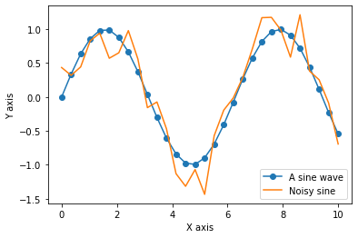
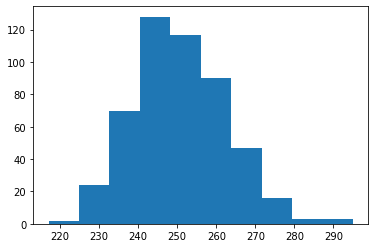

Do This Before Lab 1
====================

What python version do you have?

This is how you can see the version in the jupyter interface

```python--3e00b000-fabb-46eb-8889-4cd460e0aa3a
import sys
print(sys.version)
```

```output--3e00b000-fabb-46eb-8889-4cd460e0aa3a
3.9.1 | packaged by conda-forge | (default, Jan 10 2021, 02:51:11) 
[Clang 11.0.0 ]

```

If you've successfully completed the above install, skip to below the troubleshooting section. All of the statements there should run.

Python Libraries
----------------

Some of this code ought to be installed on your system. Check the others (commented), else we will need to install these soon!

```python--0516b7a8-017e-4599-8569-1d27fe2a117c
#IPython is what you are using now to run the notebook
import IPython
print("IPython version:      %6.6s" % IPython.__version__)

# Numpy is a library for working with Arrays
import numpy as np
print("Numpy version:        %6.6s" % np.__version__)

# SciPy implements many different numerical algorithms
import scipy as sp
print("SciPy version:        %6.6s" % sp.__version__)

# Pandas makes working with data tables easier
import pandas as pd
print("Pandas version:       %6.6s" % pd.__version__)

# Module for plotting
import matplotlib
print("Matplotlib version:    %6.6s" % matplotlib.__version__)

# SciKit Learn implements several Machine Learning algorithms
import sklearn
print("Scikit-Learn version: %6.6s" % sklearn.__version__)

# # Requests is a library for getting data from the Web
# import requests
# print("requests version:     %6.6s" % requests.__version__)

# #BeautifulSoup is a library to parse HTML and XML documents
# import bs4
# print("BeautifulSoup version:%6.6s" % bs4.__version__)

# import seaborn
# print("Seaborn version:%6.6s" % seaborn.__version__)
```

```output--0516b7a8-017e-4599-8569-1d27fe2a117c
IPython version:      7.19.0
Numpy version:        1.19.5
SciPy version:         1.6.0
Pandas version:        1.2.0
Matplotlib version:     3.3.3
Scikit-Learn version: 0.24.0

```

If any of these libraries are missing you will need to install them and restart jupyter.

Kicking the tires
-----------------

Lets try some things, starting from very simple, to more complex.

### Hello World

The following is the incantation we like to put at the beginning of every notebook. It loads most of the stuff we will regularly use.

```python--3224908b-aa77-4b36-ba13-cdaaa8fdebd9
# The %... is an iPython thing, and is not part of the Python language.
# In this case we're just telling the plotting library to draw things on
# the notebook, instead of on a separate window.
%matplotlib inline 
#this line above prepares the jupyter notebook for working with matplotlib

# See all the "as ..." contructs? They're just aliasing the package names.
# That way we can call methods like plt.plot() instead of matplotlib.pyplot.plot().
# notice we use short aliases here, and these are conventional in the python community

import numpy as np # imports a fast numerical programming library
import scipy as sp #imports stats functions, amongst other things
import matplotlib as mpl # this actually imports matplotlib
import matplotlib.cm as cm # allows us easy access to colormaps
import matplotlib.pyplot as plt # sets up plotting under plt
import pandas as pd #lets us handle data as dataframes
```

### Hello matplotlib

The notebook integrates nicely with Matplotlib, the primary plotting package for python. This should embed a figure of a sine wave:

```python--99b6a813-5cc4-4694-a19b-18ad682ae91c
x = np.linspace(0, 10, 30)  #array of 30 points from 0 to 10
y = np.sin(x)
z = y + np.random.normal(size=30) * .2
plt.plot(x, y, 'o-', label='A sine wave')
plt.plot(x, z, '-', label='Noisy sine')
plt.legend(loc = 'lower right')
plt.xlabel("X axis")
plt.ylabel("Y axis")           
```

```output--99b6a813-5cc4-4694-a19b-18ad682ae91c
Text(0, 0.5, 'Y axis')
```



### Hello Numpy

The Numpy array processing library is the basis of nearly all numerical computing in Python. Here's a 30 second crash course. For more details, consult the [Numpy User's Guide](http://docs.scipy.org/doc/numpy-dev/user/index.html)

```python--7a1124f4-c805-4457-83d1-7f50a20c69cb
print("Make a 3 row x 4 column array of random numbers")
x = np.random.random((3, 4))
print(x,"\n")


print("Add 1 to every element")
x = x + 1
print(x,"\n")

print("Get the element at row 1, column 2")
print(x[1, 2])

# The colon syntax is called "slicing" the array. 
print("Get the first row")
print(x[0, :])

print("Last 2 items in the first row")
print(x[0, -2:])

print("Get every 2nd item in the first row")
print(x[0, ::2])
```

```output--7a1124f4-c805-4457-83d1-7f50a20c69cb
Make a 3 row x 4 column array of random numbers
[[4.50456710e-01 7.11193637e-01 3.17967979e-01 8.60627548e-01]
 [4.26163918e-01 1.47490543e-01 5.33391444e-01 3.20211076e-01]
 [4.85673722e-01 9.43301910e-01 8.87034272e-04 9.66653716e-01]] 

Add 1 to every element
[[1.45045671 1.71119364 1.31796798 1.86062755]
 [1.42616392 1.14749054 1.53339144 1.32021108]
 [1.48567372 1.94330191 1.00088703 1.96665372]] 

Get the element at row 1, column 2
1.5333914438638596
Get the first row
[1.45045671 1.71119364 1.31796798 1.86062755]
Last 2 items in the first row
[1.31796798 1.86062755]
Get every 2nd item in the first row
[1.45045671 1.31796798]

```

Print the maximum, minimum, and mean of the array. This does **not** require writing a loop. In the code cell below, type `x.m<TAB>`, to find built-in operations for common array statistics like this

```python--b89e6d67-e2e0-4b40-833c-b33150d9671b
print("Max is  ", x.max())
print("Min is  ", x.min())
print("Mean is ", x.mean())
```

```output--b89e6d67-e2e0-4b40-833c-b33150d9671b
Max is   1.966653715774674
Min is   1.000887034271962
Mean is  1.513668269776055

```

Call the `x.max` function again, but use the `axis` keyword to print the maximum of each row in x.

```python--cf030bc6-7f0c-4985-8399-f9ae5df5223a
print(x.max(axis=1))
```

```output--cf030bc6-7f0c-4985-8399-f9ae5df5223a
[1.86062755 1.53339144 1.96665372]

```

Here's a way to quickly simulate 500 coin "fair" coin tosses (where the probabily of getting Heads is 50%, or 0.5)

```python--360880bf-9a13-4a6a-83ea-73f369bfa374
x = np.random.binomial(500, .5)
print("number of heads:", x)
```

```output--360880bf-9a13-4a6a-83ea-73f369bfa374
number of heads: 267

```

Repeat this simulation 500 times, and use the [plt.hist() function](http://matplotlib.org/api/pyplot_api.html#matplotlib.pyplot.hist) to plot a histogram of the number of Heads (1s) in each simulation

```python--0541db56-b82e-494c-ba98-a9cbc8a24df1
# 3 ways to run the simulations

# loop
heads = []
for i in range(500):
    heads.append(np.random.binomial(500, .5))

# "list comprehension"
heads = [np.random.binomial(500, .5) for i in range(500)]

# pure numpy, preferred
heads = np.random.binomial(500, .5, size=500)

histogram = plt.hist(heads, bins=10)
```

